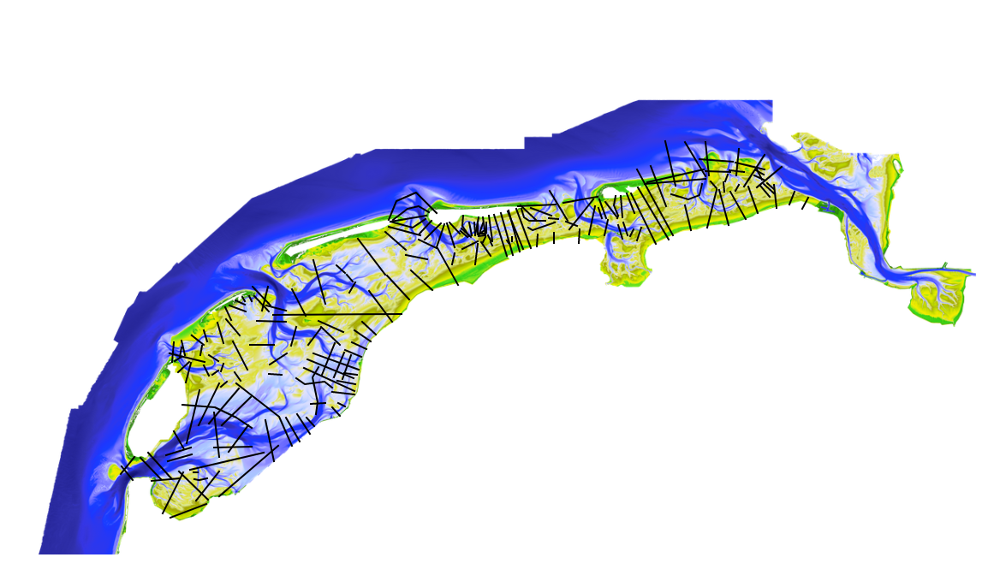
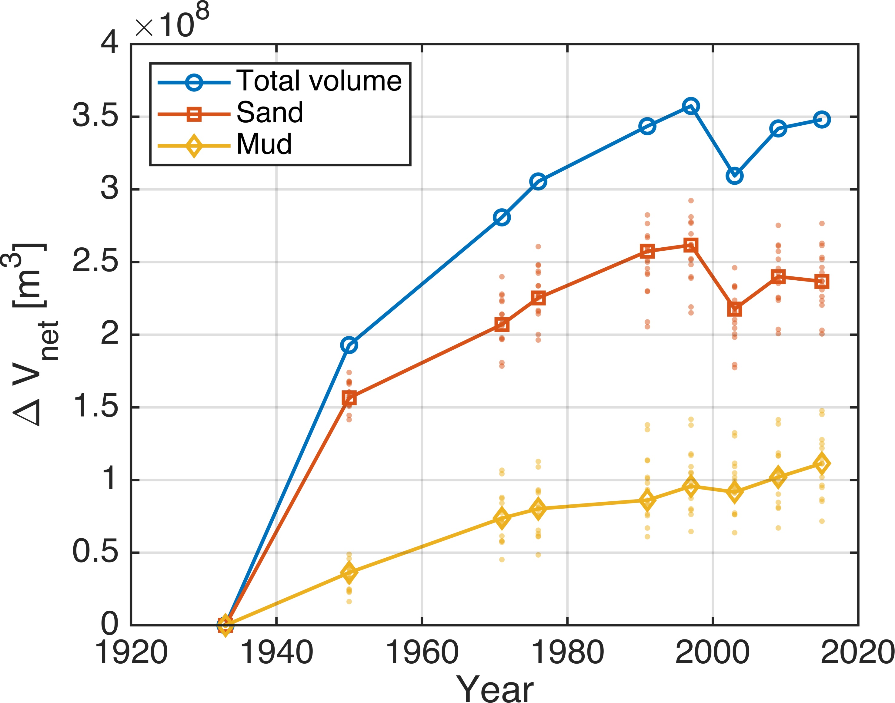
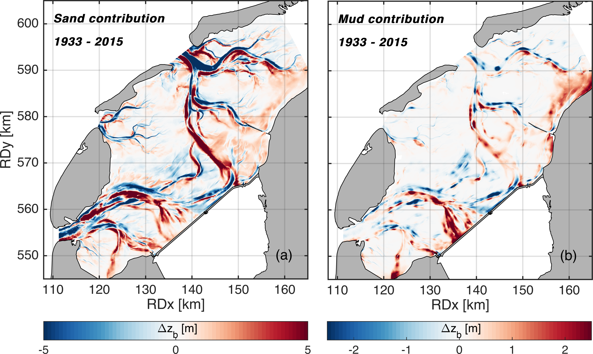
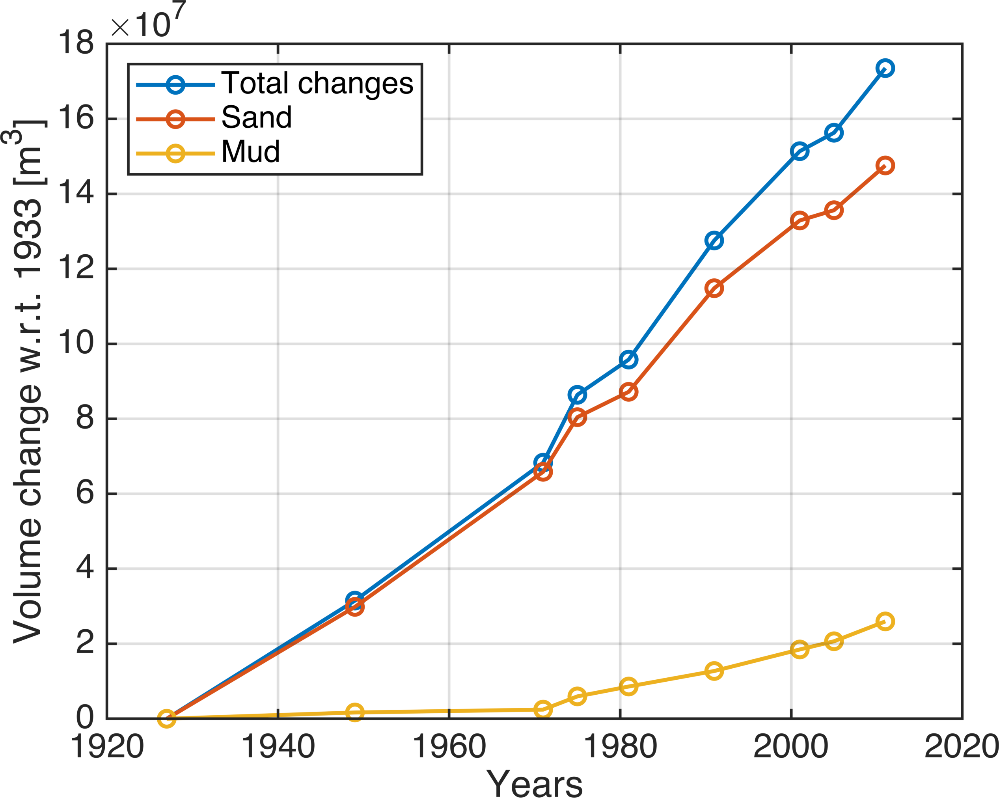
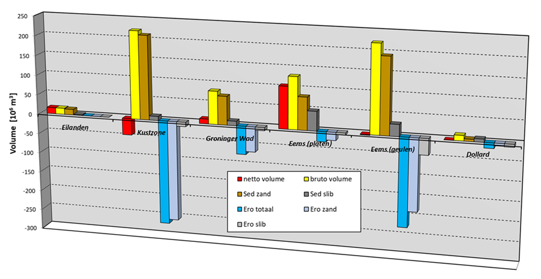
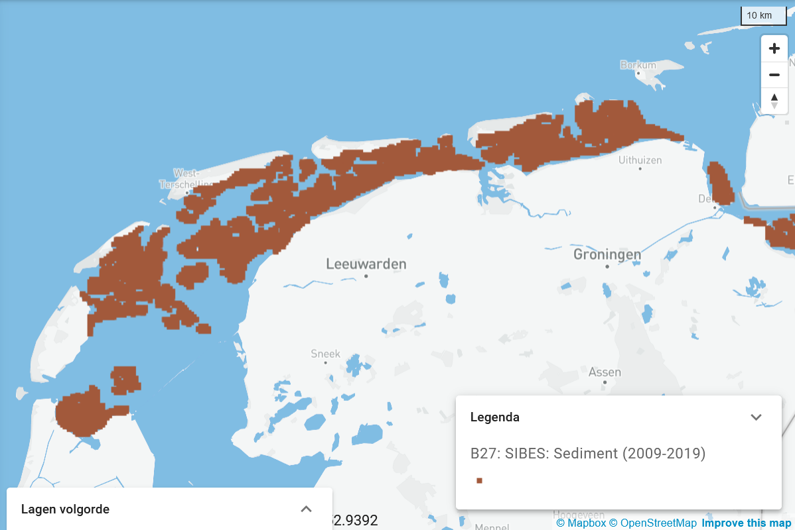

\newpage

# Morfologie {#morfologie}

```{r setupBathymetrie, include=FALSE}
require(raster)
doeljaren <- c("1927","1949","1971","1975","1991","2003","2009","2015", "2019")

laagwaterlijn = -1 # of -2 (allebei is voorbereid)
namen_west_oost <- c("Marsdiep","Eijerlandse Gat","Vlie","Borndiep","Pinkegat","Zoutkamperlaag","Eilanderbalg","Lauwers","Schild")

remove_seventies_easternWadden <- TRUE 


fac = 10 
mosaicdir = "p:/11202493--systeemrap-grevelingen/1_data/Wadden/RWS/bathymetrie/processing_tiles/mosaic"
```

## Afbakening, definitie en herkomst

**Belang**

De noemer 'Morfologie' wordt in deze rapportage gebruikt om een aantal geomorfologische indicatoren onder te scharen: ten eerste de bodemligging of bathymetrie zelf, die sterk bepalend is voor stromingen, golven, waterstanden, scheepvaart en ecologie. Om veranderingen in bodemligging, onder andere van belang om te kunnen beoordelen of ecologisch waardevolle intergetijdengebieden mee kunnen groeien met zeespiegelstijing, beter te kunnen duiden zijn een aantal afgeleide morfologische indicatoren opgenomen, namelijk de hypsometrie (de verdeling van de hoogteligging naar oppervlakte), de arealen geul/subtidaal/intratidaal/supratidaal, plaathoogte en -volume en geuldiepte en -volume. Daarnaast is de ontwikkeling in de tijd van de daadwerkelijke geuldoorsnedes op kenmerkende plaatsen opgenomen, zoals deze in de komberingsrapportages gebruikt worden om bijvoorbeeld geulmigratie te duiden. Ook de netto erosie- en sedimentatie en de bijbehorende sedimentbalans zijn weergegeven.

<!-- Ook is de lengte van de laagwaterlijn opgenomen. Deze geeft aan of er veel kleine platen en geulen zijn, of juist vooral grotere en is indicatief voor het beschikbare foerageergebied voor steltlopers: hoe langer de laagwaterlijn, hoe meer gebied beschikbaar is. -->

Het bodemslibgehalte (relevant voor het voorkomen van biota en de erosiesnelheid van de bodem) en erosieresistente lagen zijn eveneens opgenomen. Erosieresistente of harde lagen bestaan over het algemeen uit geconsolideerde klei, veen of Holocene afzettingen en vertragen geulmigratie door hun moeilijke erodeerbaarheid. Ze zijn dus mede bepalend voor de lange-termijn morfologische ontwikkeling.

Tot slot is de Ecotopenkaart (2017) van de Waddenzee opgenomen. Deze is een aggregatie van elders in deze rapportage opgenomen of nog op te nemen kaarten. Deze is een aggregatie van elders in deze rapportage opgenomen kaarten en specifieke modelstudies, en dus geen gemeten data. Daar moet men rekening mee houden bij verder gebruik. De reden om deze toch op te nemen is dat de kaart vlakdekkende informatie geeft die voor veel gebruikers zeer informatief is.

**Afbakening**

De morfologische indicatoren worden meestal getoond per kombergingsgebied, ook wel bekken genoemd. Figuur \@ref(fig:gebiedenWaddenzee) toont de begrenzing en benaming van de verschillende bekkens. Deze begrenzing is overgenomen van de Geoserver van <abbr title="Wageningen Marine Research">WMR</abbr>[^060_bathymetrie_en_morfodynamiek-1]. De begrenzing van de bekkens is relevant, omdat er evenwichtsrelaties bekend zijn voor de verhouding tussen geulen en platen afhankelijk van de bekkenoppervlakte. De begrenzing tussen de bekkens wordt gevormd door de zogenaamde 'wantijen'. Dit zijn gebieden achter de eilanden waar de getijgolven die door de zeegaten naar binnen komen elkaar ontmoeten. De stroomsnelheden zijn daar lager, waardoor sediment kan worden afgezet. Deze gebieden hebben vaak een hogere bodemligging en zijn slibrijk. Door de morfologische ontwikkeling van de Waddenzee en de morfodynamiek hebben de wantijen geen vaste positie, ze kunnen bijvoorbeeld van ligging veranderen als gevolg van afsluitingen (Zuiderzee, Lauwerszee). Bovendien moeten ze ook meer worden gezien als overgangszone dan als een vaste lijn zoals gebruikt wordt voor de begrenzing.

[^060_bathymetrie_en_morfodynamiek-1]: <https://opengeodata.wmr.wur.nl/geoserver/WS3shp/ows?service=WFS&version=1.0.0&request=GetFeature&typeName=WS3shp%3Aws3_tidalbasins>

NB In deze rapportage wordt (nog) geen rekening gehouden met de verschuivende positie van de wantijen en wordt onderstaande 'vaste' indeling gebruikt. Hiervoor zijn de vaste verticale begrenzingen deels gebaseerd op de voor de Westerschelde ontwikkelde methodiek. Deze methode doet niet volledig recht aan de de morfologische of ecologische karakteristiek van een eenheid, aangezien die immers afhankelijk is van de echte getijslag. Het is echter wel een robuuste en eenvoudige methode, die toch enig inzicht biedt in trends in arealen en volumes. Bovendien was er geen wetenschappelijk onderbouwde alternatieve methode beschikbaar. Omdat het wel wenselijk is dat morfologische indicatoren beter recht doen aan de echte morfologische ontwikkelingen, is na een overleg tussen morfologisch experts van Rijkswaterstaat en Deltares in maart 2024 besloten om, naast de bestaande 'vaste' methode, een nieuwe manier van bepalen te ontwikkelen die dat wel doet. Hiervoor wordt in de loop van 2024 een proof of concept uitgewerkt voor het Vlie; een bekken met zowel Westelijke- als oostelijke Waddenzee kenmerken. De verwachting is dat deze methode in 2025 voor de gehele Waddenzee kan worden toegepast naast de bestaande methode.

```{r gebiedenWaddenzee, fig.cap="Indeling van de Waddenzee in verschillende kombergingsgebieden of bekkens voor het gebruik in morfologische indicatoren. "}

refreshpolygon = F

if(refreshpolygon){
  polygonpath <- "https://opengeodata.wmr.wur.nl/geoserver/WS3shp/ows?service=WFS&version=1.0.0&request=GetFeature&typeName=WS3shp%3Aws3_tidalbasins&outputFormat=application/json"
  # selection of relevant polygons done by hand in QGIS
  polygonsInRaster <- c(35, 36, 37, 29, 30, 31, 32, 38, 33)
  
  poly <- sf::st_read(polygonpath, quiet = T) %>%
    filter(fid %in% polygonsInRaster) %>%
    st_transform(28992)
  
  try(sf::st_write(poly, file.path(datadir, "vakken", "wmr_vakken.geojson")))
}

poly <- sf::st_read(file.path(datadir, "vakken", "wmr_vakken.geojson"), quiet = T)

leaflet(poly %>% st_transform(4326)) %>%
  addTiles() %>%
  addPolygons(label = ~name, labelOptions = labelOptions(noHide = T))


```

Daarnaast kunnen binnen deze bekkens ook nog verschillende kombergingen worden aangewezen. In deze rapportage wordt voorlopig alleen het Marsdiep onderverdeeld in verschillende deelgebieden. De volgende deelgebieden worden gehanteerd: Balgzand, Boontjes, Doovebalg, Scheurrak, Texelstroom en Zwanenbalg, zoals te zien in Figuur \@ref(fig:deelgebiedenWaddenzee). Hierin is ook te zien dat de grenzen van deze gebieden niet helemaal overeen komen met het bekken Marsdiep op de Geoserver van WMR (in rood). Voor overige bekkens moeten grenzen voor de deelgebieden nog bepaald worden (naar verwachting in de loop van 2024).

```{r deelgebiedenWaddenzee, fig.cap="Indeling van het Marsdiep in verschillende kombergingsgebieden voor het gebruik in morfologische indicatoren. "}
deelgebieden <- c('Balgzand', 'Boontjes', 'DooveBalg', 'Scheurrak', 'Texelstroom', 'Zwanenbalg')
deelgebieden_df <- data.frame()

for (deelgebied in deelgebieden){
  df <- read_table(
    paste0("N:/Projects/11209000/11209267/B. Measurements and calculations/01. Kombergingsrapportage/",
           as.character(deelgebied),".pol"),skip = 7) %>% as.data.frame()
  colnames(df) <- c('x', 'y')
  sf <- df %>% st_as_sf(coords=c('x', 'y'), crs= 28992) %>% 
    st_combine() %>% st_cast("POLYGON") 
  sf <- data.frame(var = 1, deelgebied = deelgebied, geometry = st_geometry(sf))
  deelgebieden_df <- rbind(deelgebieden_df, sf)
}

deelgebieden_sf <- st_as_sf(deelgebieden_df) 

leaflet() %>%
  addTiles() %>%
  addPolygons(data= poly %>% filter(name=='Marsdiep') %>% st_transform(4326), labelOptions=labelOptions(noHide = T), color= 'red') %>% 
  addPolygons(data = deelgebieden_sf %>% st_transform(4326), label = ~deelgebied, labelOptions = labelOptions(noHide = T))
  

```

Een overzicht van de voor dit hoofdstuk gebruikte brondata, en de berekeningswijze van de getoonde indicatoren is terug te vinden in Appendix \@ref(Appmorfologie).

## Bodemligging {#bodemligging}

De bodemliggingen voor de gehele Waddenzee over zes cycli in de periode 1985-2020 zijn weergegeven in figuur \@ref(fig:WaddenBathymetrieLeaflet2). Deze zes bodemliggingen zijn een mozaïek van de verschillende vaklodingen[^060_bathymetrie_en_morfodynamiek-2]. Hiermee is de ontwikkeling van het geulensysteem te volgen.

[^060_bathymetrie_en_morfodynamiek-2]: <https://puc.overheid.nl/rijkswaterstaat/doc/PUC_116617_31/>

Voor een schermvullende interactieve weergave van bathymetrie zoals getoond in figuur \@ref(fig:WaddenBathymetrieLeaflet2) verwijzen we naar deze [viewer](https://deltares.shinyapps.io/bathymetrywadden/).

```{r WaddenBathymetrieLeaflet2, fig.cap = "Bathymetrie van de Waddenzee, samengesteld uit lodingen tussen 1985 en 2020. De kaart laat bodemligging zien voor het gekozen interval, wat in het drop-down menu aangegeven wordt met het laatste jaar van de metingen in een cyclus. Bijvoorbeeld: de menu keuze '2020' laat de gebiedsdekkende kaart zien waarvoor de metingen in 2015 in het Marsdiep begonnen zijn en in 2020 in Eems-Dollard geeindigd zijn."}

knitr::include_url("https://deltares.shinyapps.io/bathymetrywadden/", height = "600px")

```

Zoals uitgebreider beschreven is in de Appendix \@ref(Appmorfologie), zijn de verschillende bodemkaarten van de Waddenzee een samenslag van lodingen (onder water) en hoogtemetingen (intertidaal en hoger) over de verschillende kombergingsgebieden waarvan er jaarlijks één bemeten wordt. Zo is elke 6 jaar door Rijkswaterstaat een kaart van de volledige Waddenzee geconstrueerd, op basis van de kaarten van deelgebieden over die periode. De eerste volledige kaart dateert van 1991, met data over de periode 1985-1991. Let wel, deze kennen missende punten en vooral de kwelders en ondiepe gebieden langs de eilandkusten zijn niet volledig. De serie bodems vanaf 1985 zijn begin 2024 door Deltares opnieuw gecombineerd, aangevuld en gecorrigeerd. Voor de bodems vóór 1985 geldt dat de lodingen minder systematisch plaats vonden en ontsloten werden, waardoor de samengestelde bodems minder duidelijk terug te voeren zijn op een bepaalde periode. Een reconstructie van deze bodems (1926-1985), waarin duidelijk wordt waar deze precies op gebaseerd zijn, wordt in 2025 verwacht.

## Netto erosie en sedimentatie

Figuur \@ref(fig:diffmaps) geeft de netto erosie en sedimentatie tussen twee opeenvolgende vaklodingencycli aan, gebaseerd op dezelfde bathymetriegegevens als figuur \@ref(fig:WaddenBathymetrieLeaflet2). Ook deze kaarten geven inzicht in de ontwikkeling van het geulensysteem en de hoogteligging van de platen. Er is ook een [schermvullende versie](https://deltares.shinyapps.io/miniDiffMaps/) beschikbaar. Net als bij #bodemligging is de verwachting dat eerdere (verschil)kaarten in 2025 beschikbaar worden.

```{r diffmaps, fig.cap= "Interactieve verschilkaarten voor bodemligging. Verschillende verschilperioden kunnen gekozen worden. De kleurenschaal is aanpasbaar. Let op: Verschillen buiten de gekozen kleurenschaal worden niet weergegeven (transparant). " }
knitr::include_url("https://deltares.shinyapps.io/miniDiffMaps/", height = "600px")
```

Voor ontwikkelingen op de langere termijn laat Figuur \@ref(fig:Wang2018Sedero) zien dat de grootste bodemveranderingen over de periode 1927-2016 hebben plaatsgevonden in de Westelijke Waddenzee. Hier is de invloed van de afsluiting van de Zuiderzee dominant: de snelle opvulling van afgesloten geulen en sedimentatie langs de vastelandskust. Deze sedimentatie verloopt tot nu toe sneller dan de zeespiegelstijging.

```{r Wang2018Sedero, fig.cap= "Veranderingen in platen en geulen in de Waddenzee over de periode 1927-2016. Boven: Bodemligging voor de sluiting van de Zuiderzee (1027-1935). Midden: Recente bodemligging, gebaseerd op surveys tussen 2011-2016. Onder: Sedimentatie-erosiepatroon over de periode 1927-2016. Bron: [Wang et al., 2018](https://www.cambridge.org/core/services/aop-cambridge-core/content/view/43109B1810D68CF36D1C91405EA37F0A/S0016774618000082a.pdf/div-class-title-sediment-budget-and-morphological-development-of-the-dutch-wadden-sea-impact-of-accelerated-sea-level-rise-and-subsidence-until-2100-div.pdf)." }
knitr::include_graphics("images/Wangetal2018_Fig2BathyChange.png")
```

## Hypsometrie {#hypsometrie}

De hypsometrische curve geeft de verdeling van de hoogteligging in een bepaald gebied weer. Op de verticale as wordt de bodemhoogte uitgezet, en daarbij op de horizontale as het totale areaal met een bodemligging lager of gelijk aan die bodemhoogte. Voor kombergingsgebieden in de Waddenzee hebben hypsometrische curves een vergelijkbare vorm, omdat er relatief weinig diepe geulen zijn en relatief veel intergetijdengebied. Indien een bepaalde hoogteligging weinig aanwezig is, zal de hypsometrische curve hier een steil verloop laten zien, en indien een bepaalde hoogteligging veel voorkomt wordt de curve bijna vlak. Door in eenzelfde figuur de hypsometrische curve voor verschillende jaren (bodemopnames) te tonen, kan in één oogslag worden bekeken welk areaal (bijvoorbeeld geulareaal) er door de tijd is bijgekomen of verdwenen. In de Appendix \@ref(Appmorfologie) staan de brondata en berekeningswijze beschreven. Voor missende data in een bepaald jaar, is de meest recente oudere data gebruikt.

Figuur \@ref(fig:hypsometriePerGebied) toont de hypsometrische curves voor de bekkens in de Waddenzee. Voor de meeste bekkens (voor afbakening, zie figuur \@ref(fig:gebiedenWaddenzee)) is de zien dat de recente jaren een curve hebben met een hogere ligging, wat betekent dat de bodem omhoog is gekomen.

```{r prepareHypsometriearealen, eval = F}

require(raster)

mosaicdir <- file.path(datadir, "RWS", "bathymetrie", "processing_tiles", "mosaic")
mosaiclist <- list.files(mosaicdir)

# list of available years
years <- mosaiclist[grepl("_", mosaiclist)] %>%
lapply(., function(x) substring(x,8,11)) %>%
unlist(.) %>%
sort(.)

# select some years
# jaren
rasterlist <- mosaiclist[which(years %in% doeljaren)]

# read bathymetry and crop to polygons
bathymetries <- stack(file.path(mosaicdir,rasterlist))

polygonpath <- "https://opengeodata.wmr.wur.nl/geoserver/WS3shp/ows?service=WFS&version=1.0.0&request=GetFeature&typeName=WS3shp%3Aws3_tidalbasins&outputFormat=application/json"
# selection of relevant polygons done by hand in QGIS
polygonsInRaster <- c(35, 36, 37, 29, 30, 31, 32, 38, 33)

poly <- sf::st_read(polygonpath, quiet = T) %>%
  filter(fid %in% polygonsInRaster) %>%
  st_transform(raster::crs(bathymetries))

polynames = unlist(poly$name)

contours_allregions <- lapply(as.list(bathymetries), function(x)
  laagwaterlijn = st_as_sf(disaggregate(rasterToContour(x, level = laagwaterlijn)))  #%>%
  # st_set_crs(raster::crs(bathymetries)
             )

names(contours_allregions) <- paste0("", doeljaren)

Waddenpoly <- poly %>% 
  summarize() %>% 
  # st_buffer(10000) %>% 
  # st_buffer(-10000) %>%
  st_transform(raster::crs(bathymetries))

contours_allregions2 <- map(contours_allregions, function(x) st_intersection(x, poly)) %>%
  bind_rows(.id = "jaar") %>%
  mutate(jaar = as.integer(jaar))

save(
  contours_allregions2, 
  file = file.path(
    datadir, "RWS", "bathymetrie", paste0(
      "laagwater_", as.character(
        laagwaterlijn
      ), "mContourlijnen.Rdata"
    )
  )
)

# save(contours_allregions, file = file.path(datadir, "RWS", "bathymetrie", "laagwater_2mContourlijnen.Rdata"))

croppedRasters <- try(
  lapply(
    1:nrow(poly),
    function(x)   # croppedRasters <- lapply(1:nrow(poly), function(x)
      raster::mask(
        raster::crop(bathymetries, extent(poly[x,])), poly[x,]
      )
  )
)


## Deel totalen uit contours_allregions op per deelgebied. 
contour.df <- map(contours_allregions, function(x) st_intersection(x, poly)) %>%
  map(
    function(x) 
      # group_by(name) %>%
      tapply(st_length(x), x$name, sum)
      # summarize(length = st_length(.)) %>% 
      # st_drop_geometry
    ) %>%
  map(enframe, name = "gebied", value = "laagwaterlijnlengte_m") %>%
  rbindlist(idcol = "jaar")


#write_delim(contour.df, file.path(datadir, "RWS", "bathymetrie", "products", "laagwaterlijnlengte.csv"), delim = ";")

# find all valid data
valid.data <- lapply(croppedRasters, function(x) which(!is.na(getValues(max(x, na.rm=FALSE)))))

# extract valid values (no NA in any raster per year and area) for each raster and put in data.frame
valid.values <- map2(croppedRasters, valid.data, raster::extract)
valid.values.df <- map(valid.values, as_tibble) %>%
  map(pivot_longer, everything(), names_to = "jaar", values_to = "diepte") %>%
  set_names(polynames)%>%
  rbindlist(idcol = "naam") %>%
  mutate(jaar = as.integer(str_replace(jaar, "mosaic_", ""))) %>%
  mutate(naam = factor(naam, levels = namen_west_oost))

# rm(valid.data,valid.values)

save(valid.values.df, file = file.path(datadir, "RWS", "bathymetrie", "valid_values_df.Rdata"))

# Now we do the same for deelgebieden (Marsdiep)

croppedRastersMarsdiep <- try(
  lapply(
    1:nrow(deelgebieden_sf),
    function(x)   # croppedRasters <- lapply(1:nrow(poly), function(x)
      raster::mask(
        raster::crop(bathymetries, extent(deelgebieden_sf[x,])), deelgebieden_sf[x,]
      )
  )
)

valid.data.Marsdiep <- lapply(croppedRastersMarsdiep, function(x) which(!is.na(getValues(max(x, na.rm=FALSE)))))

valid.values.Marsdiep <- map2(croppedRastersMarsdiep, valid.data.Marsdiep, raster::extract)
valid.values.Marsdiep.df <- map(valid.values.Marsdiep, as_tibble) %>%
  map(pivot_longer, everything(), names_to = "jaar", values_to = "diepte") %>%
  set_names(deelgebieden)%>%
  rbindlist(idcol = "naam") %>%
  mutate(jaar = as.integer(str_replace(jaar, "mosaic_", ""))) 

save(valid.values.Marsdiep.df, file = file.path(datadir, "RWS", "bathymetrie", "valid_values_deelgebieden_df.Rdata"))

```

```{r hypsometriePerGebied, fig.cap="Hypsometrische curven voor verschillende bekkens in de Waddenzee en voor een selectie van bathymetrieën. "}

load(file = file.path(datadir, "RWS", "bathymetrie", "valid_values_df.Rdata"))

if (remove_seventies_easternWadden){
  valid.values.df <- valid.values.df %>% 
    filter(!(naam %in% c("Lauwers", "Eilanderbalg", "Schild") & jaar < 1972))
}

p <- valid.values.df %>%
  # filter(naam == "Pinkegat") %>%
  # mutate(class=case_when(
  #   diepte < -5 ~ "geul",
  #   diepte >= -5 & diepte < -1 ~ "subgetijdengebied",
  #   diepte >= -1 & diepte < 1 ~ "intergetijdengebied",
  #   diepte >= 1 ~ "supragetijdengebied"
  # )) %>%
  # mutate(class = factor(class, levels = c("geul", "subgetijdengebied", "intergetijdengebied", "supragetijdengebied"))) %>%
  mutate(jaar = as.factor(jaar)) %>%
  arrange(jaar, naam, diepte) %>%
    ## in order to check total surface areas per area. 
  group_by(naam, jaar) %>%
    # mutate(oppervlakte = 400/1e6) %>%  # nu in km2
    # summarize(oppervlakte = sum(oppervlakte)) %>% distinct(naam, oppervlakte)

  mutate(count = n(), cum = as.numeric(row_number())) %>%  #, rowNumber = row_number()
  mutate(oppervlakte = 400*cum/1e6) %>% #JV: blijkbaar hier 2x delen om van m2 naar km2 te gaan...
  sample_n(1000) %>%     # sample om de grafiek sneller te laten tekenen. heeft geen invloed op de positie, wel op de resolutie
  ggplot() +
  geom_line(aes(x = oppervlakte, y = diepte, color = jaar)) +
  facet_wrap(~ naam, scales = "free_x", ncol = 3) +
  xlab("Oppervlakte [km^2]") + ylab("Bodemligging t.o.v. NAP [m]") +
  coord_cartesian(ylim = c(-5, 3)) +
  theme(legend.position = "bottom")

if (knitr::is_html_output()) {
  ggplotly(
    p, width = 900, height = 900
  ) %>%
    config(displayModeBar = FALSE) %>%
    layout(
      xaxis = list(fixedrange = TRUE),
      yaxis = list(fixedrange = TRUE)
    )
} else {
  p
}


```

Figuur \@ref(fig:hypsometriePerDeelgebied) toont de hypsometrische curves voor de deelgebieden (voor afbakening, zie figuur \@ref(fig:deelgebiedenWaddenzee))in het Marsdiep. Sommige gebieden, zoals het Balgzand, Boontjes, Scheurrak en Zwanenbalg laten net als de bekkens een redelijk vlakke lijn zien, wat inhoudt dat het grooste deel van het areaal zich binnen een bepaalde range van diepte bevindt. In de DooveBalg en in mindere mate in de Texelstroom is de lijn meer lineair, wat betekent dat er een grotere variatie en eerlijkere verdeling is in het diepteprofiel. Vooral in de Boontjes en de Zwanenbalg is een duidelijke toename te zien in bodemhoogte over de jaren.

```{r hypsometriePerDeelgebied, fig.cap="Hypsometrische curven voor verschillende deelgebieden in het Marsdiep en voor een selectie van bathymetrieën. "}

load(file = file.path(datadir, "RWS", "bathymetrie", "valid_values_deelgebieden_df.Rdata"))

p <- valid.values.Marsdiep.df %>%
  mutate(jaar = as.factor(jaar)) %>%
  arrange(jaar, naam, diepte) %>%
  group_by(naam, jaar) %>%
  mutate(count = n(), cum = as.numeric(row_number())) %>%  
  mutate(oppervlakte = 400*cum/1e6) %>% #JV: blijkbaar hier 2x delen om van m2 naar km2 te gaan...
  sample_n(1000) %>%     # sample om de grafiek sneller te laten tekenen. heeft geen invloed op de positie, wel op de resolutie
  ggplot() +
  geom_line(aes(x = oppervlakte, y = diepte, color = jaar)) +
  facet_wrap(~ naam, scales = "free_x", ncol = 3) +
  xlab("Oppervlakte [km^2]") + ylab("Bodemligging t.o.v. NAP [m]") +
  coord_cartesian(ylim = c(-5, 3)) +
  theme(legend.position = "bottom")

if (knitr::is_html_output()) {
  ggplotly(
    p, width = 900, height = 900
  ) %>%
    config(displayModeBar = FALSE) %>%
    layout(
      xaxis = list(fixedrange = TRUE),
      yaxis = list(fixedrange = TRUE)
    )
} else {
  p
}

```

## Arealen {#arealen} 

Om een beter begrip te krijgen van de ontwikkelingen en trends in de Waddenzee kan de bodemligging worden ingedeeld in verschillende diepteklassen, zogenoemde ‘arealen’, zoals bijvoorbeeld geulen of intergetijdengebied. De oppervlakteverandering van de verschillende diepteklassen is indicatief voor hoe de Waddenzee, en de daarbinnen gelegen bekkens of lokale geulsystemen  zich morfologisch gedragen en hoe de gebieden zich aanpassen aan diverse veranderingen zoals bedijkingen, bodemdaling  en zeespiegelstijging.

In grote lijnen komen de diepteklassen overeen met de habitats zoals gedefinieerd binnen Natura2000 en de ecotopenkaart en zijn daarom ook indicatief voor veranderingen in het ecosysteem. Om het morfologische gedrag van het systeem te begrijpen is het echter belangrijk om ontwikkelingen op een langere tijdschaal (decennia) te beschouwen. De onderliggende grote jaarlijkse variatie is wel relevant voor de ecologie en functies als scheepvaart, maar bieden minder zicht op de morfologische veranderingen op lange termijn.  

De volgende diepteklassen worden onderscheiden:

-	**Het supragetijdegebied boven Gemiddeld Hoogwater (GHW)** overstroomt alleen tijdens springtij en/of stormopzet en biedt kansen voor vegetatiegroei (kwelder of duin).  
-	**Het intergetijdegebied tussen Gemiddeld Hoogwater (GHW)** en Gemiddeld Laagwater (GLW) valt tweemaal dagelijks droog en is een belangrijk leefgebied voor macrofauna en foerageergebied voor vogels. De hoogte en omvang van de wadplaten wordt bepaald door een complex samenspel van getij, golfwerking en biologische activiteit en is een belangrijke indicator voor het getijdevolume van een gebied.  
-	**Het subgetijdegebied tussen GLW en NAP -3 m** ligt onder normale omstandigheden onder water en kent door de geringe diepte beperkte stroomsnelheden waardoor het een relatief rustig gebied is en minder dynamisch dan de diepere geulen. 
-	**Geulen tussen NAP-3 m en NAP-5 m:** Deze kleinere geulen zorgen voor de verbinding tussen hoofdgeulen en ondiepere gebieden.
-	**Diepe geulen onder – 5 m NAP:** dit zijn de grootste geulen van de Waddenzee, met hoge stroomsnelheden en sedimenttransporten. Deze hoofdgeulen vormen de verbinding met de Noordzee. Het geuloppervlak is indicatief voor de transportcapaciteit van het systeem. 

In het berekenen van de arealen moeten keuzes gemaakt worden zodat de areaalontwikkeling representatief is voor de langjarige morfodynamiek. Bij het interpreteren is het belangrijk bewust te zijn dat de weergegeven trends afhankelijk zijn van de gekozen methodiek en begrenzingen. Daarnaast tonen de figuren een lange termijn-trend omdat de bodemhoogte in de Waddenzee maar eens per 6 jaar wordt opgemeten; jaar-op-jaar variaties, die groot kunnen zijn, kunnen we hierin dus niet zien.

-	**Verticale afbakening van de diepteklassen:** Het intergetijdegebied wordt begrensd door het gemiddeld hoogwater (GHW) en gemiddeld laagwater (GLW).  In veel studies wordt NAP +/- 1 m gebruikt als proxy voor GHW en GLW. Omdat de GHW en GLW over de Waddenzee variëren van +/- 0,7 m bij Den Helder tot +/- 1,3 m bij Eemshaven zijn voor deze berekening gebiedsdekkende GHW- en GLW-kaarten gemaakt.
-	**Temporele variaties:** Het gemiddeld hoog- en laagwater is niet constant maar kan van jaar tot jaar sterk (~10 cm) verschillen. Er is gekozen om langjarige, trendmatige veranderingen in waterstanden (zoals zeespiegelstijging en verandering van getijslag) mee te nemen en jaar-op-jaarvariaties (zoals meerjarige getijcomponenten of overheersende windrichting) uit te filteren. Daarom zijn de GHW en GLW kaarten gebaseerd op een lopend gemiddelde over 18,6 jaar (periode van de zgn. ‘nodale cyclus’). 
-	**Horizontale afbakening van de bekkens:** De kombergingsgebieden in de Waddenzee kennen elk hun eigen karakteristieke ontwikkeling en trends. De grenzen van een kombergingsgebied kunnen in de tijd verschuiven, bijvoorbeeld door het verplaatsen van wantijen of veranderingen in de kustligging. De arealen zijn berekend op basis van de kombergingsgrenzen uit het betreffende jaar: het totale oppervlak per bekken verandert dus met de tijd. Hiermee tonen we voor elk jaar het areaal dat in dat jaar feitelijk tot het bekken behoorde. 

De gemaakte afwegingen en consequenties zijn uitgebreider beschreven in het rapport < link naar rapport >  over de totstandkoming van deze methodiek. 

Figuur \@ref(fig:stackedAreas) toont de oppervlaktes van alle diepteklassen per bekken. In Figuur \@ref(fig:barPlotArealen) worden dezelfde oppervlaktes weergegeven als percentage van het bekkenoppervlak. Wanneer alle bekkens naast elkaar worden beschouwd (\@ref(fig:stackedAreas)) valt op dat de bekkens in de westelijke Waddenzee (Marsdiep en Vlie) relatief meer subgetijdegebied en geulen hebben, terwijl de bekkens in de oostelijke Waddenzee voor een groter gedeelte uit intergetijdengebied bestaan. Daarnaast valt op dat de verdeling in arealen binnen de bekkens sinds 1989 relatief constant is. Er zijn weinig sterke verschuivingen en de meeste veranderingen zijn in de orde van enkele procentpunten van het bekkenoppervlak (met als uitzondering de Eems-Dollard, waar het intergetijdengebied sterk is toegenomen). 

```{r leesAreaalData}

filenames <- c(
  "Arealen_ZKL_18.6jr.csv",
  "Arealen_PGAT_18.6jr.csv",
  "Arealen_AME_18.6jr.csv",
  "Arealen_VLIE_18.6jr.csv",
  "Arealen_ELD_18.6jr.csv",
  "Arealen_MD_18.6jr.csv",
  "Arealen_GRWAD_18.6jr.csv",
  "Arealen_ED_18.6jr.csv"
)

arealenfiles = file.path(datadir, "arealen", "arealen_processed", filenames) 

  arealen <- map(
    1:length(arealenfiles), 
    \(x) read_csv(arealenfiles[x], col_types = cols())
  ) %>% 
    bind_rows() %>%
    mutate(
      percentage = round(percentage,0),
      area = signif(area, 3)
    ) %>%
    mutate(diepteklasse_plotname = 
             str_replace_all(
               diepteklasse_plotname, 
               fixed(" \\n "), 
               "\n"
             )
    )
  
```


```{r areaalsettings}

colors <- c(
  "Geul\n(< -5 m NAP)" = "#16466E",
  "Geul\n(-3 tot -5 m NAP)" = "#3681BF",
  "Subgetijde\n(GLW tot -3 m NAP)" = "#87BCE8",
  "Intergetijde\n(GLW tot GHW)" = "#CFBA7C",
  "Supragetijde\n(> GHW)"  = "#61A13B"
)

diepteklassen <- c(
  "Geul\n(< -5 m NAP)",
  "Geul\n(-3 tot -5 m NAP)",
  "Subgetijde\n(GLW tot -3 m NAP)",
  "Intergetijde\n(GLW tot GHW)",
  "Supragetijde\n(> GHW)",
  "Totaal"
)

basins <- c(
  "Marsdiep",
  "Eijerlandse Gat",
  "Vlie",
  "Borndiep",
  "Pinkegat",
  "Zoutkamperlaag",
  "Groninger Wad",
  "Eems-Dollard"
)

```

```{r stackedAreas, fig.width=8, fig.height=8,  fig.cap = "Areaalontwikkeling van bekkens in de Waddenzee."}

plot_as_plotly = T

  p <- arealen %>%
    filter(diepteklasse != "Totaal") %>%
    mutate(diepteklasse_plotname = factor(diepteklasse_plotname, levels = rev(diepteklassen))) %>%
    mutate(diepteklasse = factor(diepteklasse, levels = str_replace(diepteklassen, fixed("\n"), ""))) %>%
    mutate(basin = factor(basin, levels = basins)) %>%
    ggplot(aes(jaar, area)) +
    geom_area(
      aes(fill = diepteklasse_plotname), 
      # position = position_fill(),
      alpha = 0.6
    ) +
    facet_wrap("basin", scales = "free") +
    scale_fill_manual(values = colors) +
    # scale_y_continuous(expand = c(0, 20)) +
    # scale_x_continuous(expand = c(0, 0)) +
    theme_bw() +
    theme(
      legend.position = "bottom",
      legend.title = element_blank(),
      panel.border = element_blank(),
      panel.spacing = unit(1, "lines")
    )

  if(plot_as_plotly){
  ggplotly(
    p + ylab("oppervlakte in km2")
      ) %>% 
      plotly::layout(
        legend = list(
          itemclick = FALSE,
          itemdoubleclick = FALSE,
          groupclick = FALSE,
          dragMode = FALSE),
        xaxis = list(
          
          fixedrange = TRUE
        ), 
        yaxis = list(
          fixedrange = TRUE
        )
      ) %>%
      plotly::config(
        modeBarButtonsToRemove = c('zoom2d','pan2d', 'zoomIn2d', 'zoomOut2d')
        # displayModeBar = FALSE
      )
  } else{
    p + 
      ylab(bquote("oppervlakte in  "(km^2)))
  }
  
```

-	Het **Marsdiep** heeft het kleinste aandeel intergetijdengebied van alle bekkens en ligt voor een relatief groot deel permanent onder water. Er is een toename van subgetijdengebied te zien, die de laatste jaren lijkt af te vlakken.
-	Tussen 1989 en 2005 is het intergetijdengebied in het **Eijerlandse Gat** toegenomen, ten koste van met name het subgetijdengebied. Sinds 2005 is deze ontwikkeling afgevlakt en is de verdeling in diepteklassen gelijk gebleven.
-	Het oppervlak van het **Vlie** als geheel is enkele procenten afgenomen door wantijmigratie (met name uitbreiding van het Marsdiep en Eijerlandse Gat). De verdeling van diepteklassen binnen het bekken is relatief gelijk gebleven.
-	In het **Borndiep** neemt het permanent onder water liggende areaal (geulen en subgetijdegebied) licht af, terwijl het kwelderoppervlak enkele procenten uitbreidt, met name door groei van de vastelandskwelders. 
-	In het **Pinkegat en Zoutkamperlaag**  (die samen het Friesche Zeegat vormen) is de verdeling van diepteklassen in het bekken relatief gelijk gebleven. 
-	Op het **Groninger Wad** is het aandeel intergetijdengebied afgenomen, met name door een uitbreiding van subgetijdegebied.
-	**Eems-Dollard:** hier is het intergetijdegebied behoorlijk toegenomen (van 46% naar 54%). Dit is ten koste gegaan van met name het subgetijdegebied (12 naar 8%) en de ondiepe geulen (van 8 naar 5%). Deze ontwikkeling kan worden verklaard door grootschalige sedimentatie op met name het Eemshornwad en Hond Paap, waar subgetijdegebied is veranderd in intergetijdegebied (zoals ook wordt beschreven in Elias et al., 2021). 


```{r barPlotArealen, fig.width = 8, fig.height = 8, fig.cap = "Relatieve areaalontwikkeling van bekkens in de Waddenzee."}

p <- arealen %>%
  filter(diepteklasse != "Totaal") %>%
  # determine order 
  mutate(diepteklasse_plotname = factor(diepteklasse_plotname, levels = diepteklassen)) %>%
  mutate(diepteklasse = factor(diepteklasse, levels = str_replace(diepteklassen, fixed("\n"), ""))) %>%
  mutate(basin = factor(basin, levels = basins)) %>%
  ggplot(aes(diepteklasse_plotname, percentage)) +
  geom_col(aes(fill = jaar), position = position_dodge2()) +
  facet_wrap("basin") +
  theme(
    axis.text.x = element_text(angle = 90, vjust = 1, hjust = 1)
    ) +
  ylab("relatief oppervlakte (%)") +
  xlab("")
# p

ggplotly(p)

```


## Plaathoogte

De hoogte van het intergetijdengebied (plaathoogte) is afhankelijk van de hydrodynamiek en het aanbod van sediment. Het getij voert sediment aan, dat kan worden afgezet op de platen. Golfwerking leidt tot erosie van de platen. De balans tussen erosie en sedimentatie resulteert in een bepaalde plaathoogte. Indien er veranderingen optreden in het getij, kan dit leiden tot veranderingen in de stroomsnelheden, met andere sedimentbeschikbaarheid tot gevolg. Veranderingen in GHW (bijvoorbeeld door zeespiegelstijging) leiden tot andere overstromingsduur en kunnen leiden tot veranderende invloed van de golven. Voor platen die in evenwicht zijn, zijn er evenwichtsrelaties afgeleid door [Eysink & Biegel (1992)](https://repository.tudelft.nl/islandora/object/uuid%3A3a321491-a1c9-4eb2-b536-d35cb81302d8).

Bij analyse van deelgebieden is de ruimtelijke begrenzing zeer van belang voor het berekenen van de plaathoogte. Indien een intergetijdengebied bijvoorbeeld migreert of opschuift, kan een stuk met lagere bodemligging (of zelfs geul) binnen de polygoon schuiven en daarmee de *gemiddelde* plaathoogte beïnvloeden. Op het niveau van bekkens speelt dit minder, omdat op de wantijen weinig geulen aanwezig zijn.

In deze rapportage is er voor gekozen om in eerste instantie de gemiddelde plaathoogte per bekken te berekenen. Hiervoor wordt het volume tussen de -1 m NAP en +1 m NAP grens bepaald, en gedeeld door de oppervlakte. NB, net als voor de indicator arealen geldt voor de plaathoogte dat er gewerkt wordt aan een morfologisch/ecologisch passender methode. 

De gemiddelde plaathoogte (figuur \@ref(fig:plaathoogteOld)) lijkt voor de grotere bekkens licht toe te nemen. Voor de Eilanderbalg, Lauwers en Schild zijn pas in de jaren '70 de eerste bodems opgenomen, en vertonen om die reden voor die tijd een horizontale lijn.

```{r DataPlaaghoogteGeuldiepte, eval=FALSE, include=FALSE }
# Eerst maken we nieuwe lagen voor de plaathoogte + plaatvolume en geuldiepte (geulvolume halen we uit geuldiepte)
bathy_lowres <- c()
for (jaar in doeljaren) {
  bathy <- raster::raster(file.path(mosaicdir, paste0('mosaic_', as.character(jaar), '.tif')))
  print(paste('lowering resolution for', jaar))
  bathy_lowres[[jaar]] <- aggregate(bathy, fact=fac)
}

lagen_lowres$plaathoogte <- list()
lagen_lowres$plaatvolume <- list()

for (i in 1:length(lagen_lowres$intertidal)){
  intertidal <- lagen_lowres$intertidal[[i]]
  intertidal[intertidal == 0] <- NA
  lagen_lowres$plaathoogte[[i]] <- intertidal*bathy_lowres[[i]]
  lagen_lowres$plaatvolume[[i]] <- intertidal*(bathy_lowres[[i]]-lagen_lowres$laagwater[[i]])
}

lagen_lowres$geuldiepte <- list()

for (i in 1:length(lagen_lowres$geul)){
  geul <- lagen_lowres$geul[[i]]
  geul[geul==0] <- NA
  lagen_lowres$geuldiepte[[i]] <- geul*bathy_lowres[[i]]
}

hoogtediepte_bekkens <- data.frame(jaar = integer(), gebied = integer(), oppervlakte = numeric())
for(i in 1:length(lagen_lowres$plaathoogte)) {
  for(j in 1:length(poly_sp)) {
    masked_ph <- mask(crop(lagen_lowres$plaathoogte[[i]], extent(poly_sp[j,])), poly_sp[j,])
    plaathoogte <- mean(masked_ph@data@values, na.rm=T)
    masked_gd <- mask(crop(lagen_lowres$geuldiepte[[i]], extent(poly_sp[j,])), poly_sp[j,])
    geuldiepte <- mean(masked_gd@data@values, na.rm=T)
    masked_pv <- mask(crop(lagen_lowres$plaatvolume[[i]], extent(poly_sp[j,])), poly_sp[j,])
    plaatvolume <- sum(masked_pv@data@values, na.rm=T)*200*200/1e6
    masked_gv <- mask(crop(lagen_lowres$geuldiepte[[i]], extent(poly_sp[j,])), poly_sp[j,])
    geulvolume <- abs(sum(masked_gv@data@values, na.rm=T)*200*200/1e6)
    hoogtediepte_bekkens <- rbind(hoogtediepte_bekkens, data.frame(jaar = doeljaren[i], gebied = bekkens[j], 
                                                                  plaathoogte = plaathoogte, geuldiepte = geuldiepte, 
                                                                  plaatvolume = plaatvolume, geulvolume = geulvolume))
  }
}

hoogtediepte_deelgebieden <- data.frame(jaar = integer(), gebied = integer(), oppervlakte = numeric())
for(i in 1:length(lagen_lowres$plaathoogte)) {
  for(j in 1:length(deelgebieden_sp)) {
    masked_ph <- mask(crop(lagen_lowres$plaathoogte[[i]], extent(deelgebieden_sp[j,])), deelgebieden_sp[j,])
    plaathoogte <- mean(masked_ph@data@values, na.rm=T)
    masked_gd <- mask(crop(lagen_lowres$geuldiepte[[i]], extent(deelgebieden_sp[j,])), deelgebieden_sp[j,])
    geuldiepte <- mean(masked_gd@data@values, na.rm=T)
    masked_pv <- mask(crop(lagen_lowres$plaatvolume[[i]], extent(deelgebieden_sp[j,])), deelgebieden_sp[j,])
    plaatvolume <- sum(masked_pv@data@values, na.rm=T)*200*200/1e6
    masked_gv <- mask(crop(lagen_lowres$geuldiepte[[i]], extent(deelgebieden_sp[j,])), deelgebieden_sp[j,])
    geulvolume <- abs(sum(masked_gv@data@values, na.rm=T)*200*200/1e6)
    hoogtediepte_deelgebieden <- rbind(hoogtediepte_deelgebieden, data.frame(jaar = doeljaren[i], gebied = deelgebieden[j], 
                                                                   plaathoogte = plaathoogte, geuldiepte = geuldiepte, 
                                                                   plaatvolume = plaatvolume, geulvolume = geulvolume))
  }
}


save(hoogtediepte_bekkens, file = file.path(datadir, "RWS", "bathymetrie", "hoogtediepte_bekkens.Rdata"))
save(hoogtediepte_deelgebieden, file = file.path(datadir, "RWS", "bathymetrie", "hoogtediepte_deelgebieden.Rdata"))

```

```{r plaathoogte, fig.cap= "Gemiddelde plaathoogte per bekken. ", eval=FALSE}
load(file = file.path(datadir, "RWS", "bathymetrie", "hoogtediepte_bekkens.Rdata"))

if (remove_seventies_easternWadden){
  hoogtediepte_bekkens <- hoogtediepte_bekkens %>% 
    filter(!(gebied %in% c("Lauwers", "Eilanderbalg", "Schild") & jaar < 1972))
}

hoogtediepte_bekkens$gebied <- factor(hoogtediepte_bekkens$gebied, levels = namen_west_oost)

ggplot(aes(jaar, plaathoogte), data= hoogtediepte_bekkens %>% 
         mutate(jaar = as.numeric(jaar))) +
    geom_line(aes()) +
    geom_point(aes(), shape = 21, fill = "white", size = 3) +
    # facet_grid(naam ~ areaal, scales = "free") + #free_y facet_wrap(~ interaction(areaal, naam), ncol = 4, scales = "free_y") + #
    facet_wrap(~ gebied, scales = "free") +
  coord_cartesian(xlim = c(1920, max(as.numeric(doeljaren))+2))+
   ylab("Plaathoogte t.o.v. NAP [m]") + xlab("Jaar") +
  ggtitle("Plaathoogte in m per bekken")

```

```{r plaathoogteOld, fig.cap = "Gemiddelde plaathoogte per bekken. ", include=TRUE}
valid.values.df %>% 
  filter(diepte >= -1 & diepte < 1) %>% #  
  group_by(naam, jaar) %>%
  mutate(oppervlakte = 400/1e6, volume = (diepte)*400/1e6) %>%
  summarize(plaathoogte = sum(volume)/sum(oppervlakte), plaathoogte2 = mean(diepte+1)-1) %>%
  ggplot(aes(jaar, plaathoogte)) +
  geom_line(aes()) +
  geom_point(aes(), shape = 21, fill = "white", size = 3) +
  facet_wrap(~ naam, scales = "free") +
  coord_cartesian(xlim = c(1920, 2020)) +
  ylab("Plaathoogte t.o.v. NAP [m]") + xlab("Jaar") +
  ggtitle("Plaathoogte in m per bekken")
```

De gemiddelde plaathoogte per deelgebied (figuur \@ref(fig:plaathoogteDeelgebiedenOld)) geeft een gevarieerd beeld. De plaathoogte is vrij laag voor alle deelgebieden. De plaathoogte is voor de meeste deelgebieden afgenomen tussen 1927 en 1949 of 1971, en vervolgens weer toegenomen. Het Scheurrak laat een tegenovergesteld beeld zien. Sinds 2003 is de plaathoogte redelijk stabiel, behalve in de Zwanenbalg, waar deze toeneemt.

```{r plaathoogteDeelgebieden, fig.cap = "Gemiddelde plaathoogte per deelgebied. ", eval=FALSE}
load(file = file.path(datadir, "RWS", "bathymetrie", "hoogtediepte_deelgebieden.Rdata"))

ggplot(aes(jaar, plaathoogte), data= hoogtediepte_deelgebieden %>% 
         mutate(jaar = as.numeric(jaar))) +
    geom_line(aes()) +
    geom_point(aes(), shape = 21, fill = "white", size = 3) +
    # facet_grid(naam ~ areaal, scales = "free") + #free_y facet_wrap(~ interaction(areaal, naam), ncol = 4, scales = "free_y") + #
    facet_wrap(~ gebied, scales = "free") +
  coord_cartesian(xlim = c(1920, max(as.numeric(doeljaren))+2))+
   ylab("Plaathoogte t.o.v. NAP [m]") + xlab("Jaar") +
  ggtitle("Plaathoogte in m per deelgebied")
```

```{r plaathoogteDeelgebiedenOld, fig.cap = "Gemiddelde plaathoogte per bekken. ", include=TRUE}
valid.values.Marsdiep.df %>% 
  filter(diepte >= -1 & diepte < 1) %>% #  
  group_by(naam, jaar) %>%
  mutate(oppervlakte = 400/1e6, volume = (diepte)*400/1e6) %>%
  summarize(plaathoogte = sum(volume)/sum(oppervlakte), plaathoogte2 = mean(diepte+1)-1) %>%
  ggplot(aes(jaar, plaathoogte)) +
  geom_line(aes()) +
  geom_point(aes(), shape = 21, fill = "white", size = 3) +
  facet_wrap(~ naam, scales = "free") +
  coord_cartesian(xlim = c(1920, 2020)) +
  ylab("Plaathoogte t.o.v. NAP [m]") + xlab("Jaar") +
  ggtitle("Plaathoogte in m per deelgebied")
```

## Geuldiepte

Geuldiepte is het volume beneden -5 m NAP gedeeld door het oppervlak beneden -5 m NAP (zie ook vergelijking \@ref(eq:geuldiepte)). NB, net als voor de indicator arealen geldt voor de geuldiepte dat er gewerkt wordt aan een morfologisch/ecologisch passender methode. Echter, voor diepe, duidelijk te definiëren geulen zal dit waarschijnlijk weinig uitmaken.  

De ontwikkeling van de geuldiepte door de jaren laat voor de westelijke bekkens (Marsdiep, Eierlandse Gat en Vlie) een toename door de tijd zien (figuur \@ref(fig:geuldiepteOld)). Verdere analyse is nodig om vast te stellen waar de sprongen in de tijdseries in sommige bekkens door worden veroorzaakt. Voor de Eilanderbalg, Lauwers en Schild zijn pas in de jaren '70 de eerste bodems opgenomen, en vertonen om die reden voor die tijd een horizontale lijn.

```{r geuldiepte, fig.cap="Geuldiepte door de jaren in de verschillende bekkens. Let op de verschillende verticale assen. ", eval=FALSE}
ggplot(aes(jaar, geuldiepte), data= hoogtediepte_bekkens %>% 
         mutate(jaar = as.numeric(jaar))) +
    geom_line(aes()) +
    geom_point(aes(), shape = 21, fill = "white", size = 3) +
    # facet_grid(naam ~ areaal, scales = "free") + #free_y facet_wrap(~ interaction(areaal, naam), ncol = 4, scales = "free_y") + #
    facet_wrap(~ gebied, scales = "free") +
  coord_cartesian(xlim = c(1920, max(as.numeric(doeljaren))+2))+
   ylab("Geuldiepte t.o.v. NAP [m]") + xlab("Jaar") +
  ggtitle("Geuldiepte in m per bekken")
```

```{r geuldiepteOld, fig.cap="Geuldiepte door de jaren in de verschillende gebieden. Let op de verschillende verticale assen. ", include=TRUE}

valid.values.df %>% 
  filter(diepte <= -5) %>%
  group_by(naam, jaar) %>%
  mutate(oppervlakte = 400/1e6, volume = diepte*400/1e6) %>%
  summarize(geuldiepte = sum(volume)/sum(oppervlakte)) %>%
  ggplot(aes(jaar, geuldiepte)) +
  geom_line(aes()) +
  geom_point(aes(), shape = 21, fill = "white", size = 3) +
  facet_wrap(~ naam, scales = "free")+
  coord_cartesian(xlim = c(1920, 2020)) +
  ylab("Geuldiepte [m] t.o.v. NAP") + xlab("Jaar") 
```

De ontwikkeling van de geuldiepte door de jaren laat voor de meeste deelgebieden, net als voor het Marsdiep bekken (figuur \@ref(fig:geuldiepteOld)), een sterke piek zien in 1949 en vervolgens een afname zien (figuur \@ref(fig:geuldiepteDeelgebiedenOld)). In de Boontjes is de daling van de geuldiepte pas later ingezet. De geuldiepte van van Texelstroom ligt een stuk dieper dan de geuldiepte in de andere gebieden. Voor dit deelgebied laat de geuldiepte ook een andere trend zien, deze werd dieper tot 1971 en is vervolgens ondieper geworden.

```{r geuldiepteDeelgebieden, fig.cap="Geuldiepte door de jaren in de verschillende bekkens. Let op de verschillende verticale assen. ", eval=FALSE}
ggplot(aes(jaar, geuldiepte), data= hoogtediepte_deelgebieden %>% 
         mutate(jaar = as.numeric(jaar))) +
    geom_line(aes()) +
    geom_point(aes(), shape = 21, fill = "white", size = 3) +
    # facet_grid(naam ~ areaal, scales = "free") + #free_y facet_wrap(~ interaction(areaal, naam), ncol = 4, scales = "free_y") + #
    facet_wrap(~ gebied, scales = "free") +
  coord_cartesian(xlim = c(1920, max(as.numeric(doeljaren))+2))+
    ggtitle("Geuldiepte per deelgebied")+
   ylab("Geuldiepte t.o.v. NAP [m]") + xlab("Jaar")
```

```{r geuldiepteDeelgebiedenOld, fig.cap="Geuldiepte door de jaren in de verschillende deelgebieden. Let op de verschillende verticale assen. ", include=TRUE}

valid.values.Marsdiep.df %>% 
  filter(diepte <= -5) %>%
  group_by(naam, jaar) %>%
  mutate(oppervlakte = 400/1e6, volume = diepte*400/1e6) %>%
  summarize(geuldiepte = sum(volume)/sum(oppervlakte)) %>%
  ggplot(aes(jaar, geuldiepte)) +
  geom_line(aes()) +
  geom_point(aes(), shape = 21, fill = "white", size = 3) +
  facet_wrap(~ naam, scales = "free")+
  coord_cartesian(xlim = c(1920, 2020)) +
  ylab("Geuldiepte [m] t.o.v. NAP") + xlab("Jaar") 
```

## Plaatvolume

Het plaatvolume is per bekken gevisualiseerd in figuur \@ref(fig:plaatvolumeOld). Het verloop is grotendeels vergelijkbaar met de plaatoppervlaktes; kleine verschillen worden verzoorzaakt door geulmigratie van het ene naar het andere bekken. In veel bekkens is het plaatvolume de afgelopen 80 jaar netto toegenomen, vaak wel met tijdelijke afnames. Lauwers, Zoutkamperlaag en Schild kennen na een piek in 2003 juist een duidelijke afname. Verdere analyse is nodig om preciezer vast te stellen wat de veranderingen in de tijd heeft veroorzaakt.

```{r plaatvolume, fig.cap = "Plaatvolume in  m^3^ per gebied over de tijd. Het volume is bepaald voor dat deel van de bodem dat tussen -1 m NAP en +1 m NAP ligt. ", eval=FALSE }
ggplot(aes(jaar, plaatvolume), data= hoogtediepte_bekkens %>% 
         mutate(jaar = as.numeric(jaar))) +
    geom_line(aes()) +
    geom_point(aes(), shape = 21, fill = "white", size = 3) +
    # facet_grid(naam ~ areaal, scales = "free") + #free_y facet_wrap(~ interaction(areaal, naam), ncol = 4, scales = "free_y") + #
    facet_wrap(~ gebied, scales = "free") +
  coord_cartesian(xlim = c(1920, max(as.numeric(doeljaren))+2))+
    ggtitle("Plaatvolume per bekken")+
  ylab("Plaatvolume [miljoen m^3^]") + xlab("Jaar") 
```

```{r plaatvolumeOld, fig.cap = "Plaatvolume in  m^3^ per gebied over de tijd. Het volume is bepaald voor dat deel van de bodem dat tussen -1 m NAP en +1 m NAP ligt. ", include=TRUE }

valid.values.df %>% 
  filter(diepte >= -1 & diepte < 1) %>%
  mutate(plaathoogte = diepte+1) %>%    # nu volume t.o.v NAP. Kan ook negatief zijn. 
  group_by(naam, jaar) %>%
  mutate(volume = plaathoogte*400/1e6) %>% # elk rastersegment is 20x20 m
  summarize(plaatvolume = sum(volume)) %>%
  ggplot(aes(jaar, plaatvolume)) +
  ggtitle("Plaatvolume in miljoen m^3^") +
  geom_line(aes()) +
  geom_point(aes(), shape = 21, fill = "white", size = 3) +
  facet_wrap(~ naam, scales = "free")+
  coord_cartesian(xlim = c(1920, 2020)) +
  ylab("Plaatvolume [miljoen m^3^]") + xlab("Jaar") 
```

Het plaatvolume is per deelgebied in het Marsdiep is gevisualiseerd in Figuur \@ref(fig:plaatvolumeDeelgebiedenOld). Het verloop is grotendeels vergelijkbaar met de plaatoppervlaktes en plaathoogte. In het Balgzand, de Boontjes, Doovebalg en Zwanenbalg is het plaatvolume sinds de jaren 50 toegenomen. In de Texelstroom en het Scheurrak is het plaatvolume juist afgenomen. Verdere analyse is nodig om preciezer vast te stellen wat de veranderingen in de tijd heeft veroorzaakt.

```{r plaatvolumeDeelgebieden, fig.cap = "Plaatvolume in  m^3^ per deelgebied over de tijd. Het volume is bepaald voor dat deel van de bodem dat tussen -1 m NAP en +1 m NAP ligt. ", eval=FALSE }
ggplot(aes(jaar, plaatvolume), data= hoogtediepte_deelgebieden %>% 
         mutate(jaar = as.numeric(jaar))) +
    geom_line(aes()) +
    geom_point(aes(), shape = 21, fill = "white", size = 3) +
    # facet_grid(naam ~ areaal, scales = "free") + #free_y facet_wrap(~ interaction(areaal, naam), ncol = 4, scales = "free_y") + #
    facet_wrap(~ gebied, scales = "free") +
  coord_cartesian(xlim = c(1920, max(as.numeric(doeljaren))+2))+
    ggtitle("Plaatvolume per deelgebied")+
  ylab("Plaatvolume [miljoen m^3^]") + xlab("Jaar") 
```

```{r plaatvolumeDeelgebiedenOld, fig.cap = "Plaatvolume in  m^3^ per deelgebied over de tijd. Het volume is bepaald voor dat deel van de bodem dat tussen -1 m NAP en +1 m NAP ligt. ", include=TRUE }

valid.values.Marsdiep.df %>% 
  filter(diepte >= -1 & diepte < 1) %>%
  mutate(plaathoogte = diepte+1) %>%    # nu volume t.o.v NAP. Kan ook negatief zijn. 
  group_by(naam, jaar) %>%
  mutate(volume = plaathoogte*400/1e6) %>% # elk rastersegment is 20x20 m
  summarize(plaatvolume = sum(volume)) %>%
  ggplot(aes(jaar, plaatvolume)) +
  ggtitle("Plaatvolume in miljoen m^3^") +
  geom_line(aes()) +
  geom_point(aes(), shape = 21, fill = "white", size = 3) +
  facet_wrap(~ naam, scales = "free")+
  coord_cartesian(xlim = c(1920, 2020)) +
  ylab("Plaatvolume [miljoen m^3^]") + xlab("Jaar") 
```

## Geulvolume

Het geulvolume is in de westelijke bekkens (Marsdiep, Eierlandse Gat, Vlie) toegenomen, terwijl deze in het Friesche Zeegat (Pinkegat en Zoutkamperlaag) is afgenomen (figuur \@ref(fig:geulvolumeOld)). De scherpe afname van het volume van Zouterkamperlaag begin jaren zeventig komt door de sluiting van de Lauwerszee in 1968, waardoor er sterke sedimentatie in de geulen optrad.

```{r geulvolume, fig.cap = "Geulvolume in miljoen m^3^ per bekken over de tijd. Het volume is bepaald voor dat deel van het bekken dat onder de NAP -5 m NAP ligt. ", eval=FALSE }
ggplot(aes(jaar, geulvolume), data= hoogtediepte_bekkens %>% 
         mutate(jaar = as.numeric(jaar))) +
    geom_line(aes()) +
    geom_point(aes(), shape = 21, fill = "white", size = 3) +
    # facet_grid(naam ~ areaal, scales = "free") + #free_y facet_wrap(~ interaction(areaal, naam), ncol = 4, scales = "free_y") + #
    facet_wrap(~ gebied, scales = "free") +
  coord_cartesian(xlim = c(1920, max(as.numeric(doeljaren))+2))+
    ggtitle("Geulvolume per bekken")+
  ylab("Geulvolume [miljoen m^3^]") + xlab("Jaar") 
```

```{r geulvolumeOld, fig.cap = "Geulvolume in miljoen m^3^ per bekken over de tijd. Het volume is bepaald voor dat deel van het bekken dat onder de NAP -5 m NAP ligt. ", include =TRUE }
valid.values.df %>% 
  filter(diepte < -5) %>%
  mutate(volumediepte = -(diepte+5)) %>%
  group_by(naam, jaar) %>%
  mutate(volume = volumediepte*400) %>%
  summarize(geulvolume = sum(volume)/1e6) %>%
  ggplot(aes(jaar, geulvolume)) +
  ggtitle("Geulvolume in miljoen m3") +
  geom_line(aes()) +
  geom_point(aes(), shape = 21, fill = "white", size = 3) +
  facet_wrap(~ naam, scales = "free")+
  coord_cartesian(xlim = c(1920, 2020)) +
  ylab("Geulvomume [miljoen m^3^]") + xlab("Jaar") 
```

Het geulvolume van de verschillende deelgebieden binnen het Marsdiep laat een eentonig beeld zien, vergelijkbaar met het geulvolume voor het gehele bekken (figuur \@ref(fig:geulvolumeDeelgebiedenOld)). Sinds de jaren 50 of 70 is het geulvolume gestaag toegenomen.

```{r geulvolumeDeelgebieden, fig.cap = "Geulvolume in miljoen m^3^ per deelgebied over de tijd. Het volume is bepaald voor dat deel van het deelgebied dat onder de NAP -5 m NAP ligt. ", eval=FALSE }
ggplot(aes(jaar, geulvolume), data= hoogtediepte_deelgebieden %>% 
         mutate(jaar = as.numeric(jaar))) +
    geom_line(aes()) +
    geom_point(aes(), shape = 21, fill = "white", size = 3) +
    # facet_grid(naam ~ areaal, scales = "free") + #free_y facet_wrap(~ interaction(areaal, naam), ncol = 4, scales = "free_y") + #
    facet_wrap(~ gebied, scales = "free") +
  coord_cartesian(xlim = c(1920, max(as.numeric(doeljaren))+2))+
    ggtitle("Geulvolume per deelgebied")+
  ylab("Geulvolume [miljoen m^3^]") + xlab("Jaar") 
```

```{r geulvolumeDeelgebiedenOld, fig.cap = "Geulvolume in miljoen m^3^ per deelgebied over de tijd. Het volume is bepaald voor dat deel van het deelgebied dat onder de NAP -5 m NAP ligt. " , include = TRUE}
valid.values.Marsdiep.df %>% 
  filter(diepte < -5) %>%
  mutate(volumediepte = -(diepte+5)) %>%
  group_by(naam, jaar) %>%
  mutate(volume = volumediepte*400) %>%
  summarize(geulvolume = sum(volume)/1e6) %>%
  ggplot(aes(jaar, geulvolume)) +
  ggtitle("Geulvolume in miljoen m3") +
  geom_line(aes()) +
  geom_point(aes(), shape = 21, fill = "white", size = 3) +
  facet_wrap(~ naam, scales = "free")+
  coord_cartesian(xlim = c(1920, 2020)) +
  ylab("Geulvomume [miljoen m^3^]") + xlab("Jaar") 
```

## Geuldoorsnede

Naast de meer geaggregeerde indicatoren als arealen en volumes, is voor geulen ook de daadwerkelijke diepte en ligging van belang om te kunnen beoordelen of een geul bijvoorbeeld verondiept, wat de bevaarbaarheid beïnvloedt, of migreert, wat de stabiliteit van platen of land in gevaar kan brengen. Ook kunnen verschuivingen in geulpatronen verklarend zijn voor andere morfologische veranderingen.

Bovenstaande wordt beoordeeld en geduid in de kombergingsrapportages aan de hand van een aantal (bijna 200 voor de gehele Waddenzee) geuldoorsnedes (profielen) op vaste locaties, wat een vergelijking tussen verschillende jaren mogelijk maakt. Klikken op een profiellijn in Figuur \@ref(fig:geul-kaart) geeft een figuur met de geuldoorsnedes voor de vaklodingen tussen 1949 en nu. De data na 1991 zijn gecombineerde bathymetriën van de vaklodingen die per kombergingsgebied per jaar plaatsvinden, de data daarvoor zijn ook combinaties van bathymetrieën van meerdere jaren maar de precieze herkomst is niet altijd duidelijk (dit wordt waarschijnlijk in 2025 verbeterd). Ze refereren dus naar een geuldoorsnedes per periode. De data van de gecombineerde bathymetriën is ook te vinden op Datahuis Wadden.

NB Het is de bedoeling de profieldata ook nog downloadbaar te maken zodat de gebruiker zelf figuren kan maken. Omdat de dataset (vaklodingen) groot is kost de berekening te veel tijd om online te doen, en de vooraf offline berekende niet-geogerefeerde profieldata past niet in de bestaande opslagstructuur; daar moet nog een oplossing voor gevonden worden.

(ref:geul-kaartLabel) Interactieve kaart van geuldoorsnedes van profielen over de tijd in het Waddengebied. Klikken op een profiel laat de verandering in de geuldiepte over de tijd zien. NB Het best te bekijken in een apart schermvullend tabblad, anders is een deel van de profielfiguur niet zichtbaar. ([Link naar Schermvullende versie](https://www.testsysteemrapportage.nl/Concept_webgis_geuldoorsnedes/index.html)).

```{r geul-kaart, fig.cap= "(ref:geul-kaartLabel)"}

if(knitr::is_html_output())knitr::include_url("../Concept_webgis_geuldoorsnedes/index.html#10/53.2167/5.6978", height = "600px") else{
  
}
```

## Sedimentbalans

De sedimentbalans van de Waddenzee is van groot belang om te kunnen beoordelen of de Waddenzee in staat is zich aan te passen aan grootschalige veranderingen zoals zeespiegelstijging en de afsluiting van getijdebekkens. Voor deze aanpassingen zijn grote hoeveelheden sediment nodig. Omdat in de Waddenzee zelf niet gesuppleert wordt, informeert de sedimentbalans dus ook hoeveel sediment aan de Noordzeekant gesuppleerd dient te worden. De algemene sedimentbalans inventariseert op basis van de ontwikkeling van de bodemligging hoeveel sediment de Waddenzee in- en uitgaat en hoe dit verdeeld is over de verschillende kombergingen. Omdat de transportmechanismen en herkomst van zand en slib verschillen, en omdat dit de bodemsamenstelling in de verschillende kombergingsgebieden verandert met alle gevolgen voor morfologische ontwikkelingen en biotiek, is ook inzicht in de aard van het materiaal van belang. Daarom is niet alleen de totale sedimentbalans gemaakt door ([Wang et al. (2018)](https://www.cambridge.org/core/services/aop-cambridge-core/content/view/43109B1810D68CF36D1C91405EA37F0A/S0016774618000082a.pdf/div-class-title-sediment-budget-and-morphological-development-of-the-dutch-wadden-sea-impact-of-accelerated-sea-level-rise-and-subsidence-until-2100-div.pdf)) opgenomen, maar ook een recentere van ([Colina Alonso et al. (2021)](https://www.sciencedirect.com/science/article/pii/S0025322721001262)) die onderscheid maakt tussen beide sedimenttypes.

### Algemene sedimentbalans

De sedimentbalans is opgemaakt op basis van de volumeveranderingen tussen vaklodingen over verschillende periodes, daarbij rekening houdend met bodemdaling door gas- en zoutwinning, transport over de wantijen, bagger- en stortvolumes, zand- en schelpenwinning, en transporten naar de kwelders en door de zeegaten. De transporten over de wantijen en door de zeegaten zijn niet goed bekend en berusten daarom op aannames, als beschreven in ([Elias, 2019](https://publicwiki.deltares.nl/display/BOK/III.+Producten+-+Zeegaten?preview=%2F131138846%2F153780935%2F11203683-001-ZKS-0002_v0.2-Een+actuele+sedimentbalans+van+de+Waddenzee+-+Definitief.pdf)). Omdat het maken van een sedimentbalans complex is, en nog niet afgerond is (verwachting: 2025), zijn de opgenomen netto erosie/sedimentatie en de sedimentbalans gebaseerd op een eerdere studie van [Wang et al. (2018)]; de resultaten zijn daarom slechts als figuren beschikbaar en niet interactief bevraagbaar.

In alle Waddenzeebekkens is over de periode 1926-2005 netto sedimentatie opgetreden ([Wang et al. (2018)](https://www.cambridge.org/core/services/aop-cambridge-core/content/view/43109B1810D68CF36D1C91405EA37F0A/S0016774618000082a.pdf/div-class-title-sediment-budget-and-morphological-development-of-the-dutch-wadden-sea-impact-of-accelerated-sea-level-rise-and-subsidence-until-2100-div.pdf); figuur \@ref(fig:Wang2018Sedbalans)). De gemiddelde aangroeisnelheden per bekken over deze periode zijn allemaal beduidend hoger dan de relatieve zeespiegelstijging. De import van sediment is sterk beïnvloed door menselijke activiteiten (zie [Elias et al., 2012](https://d1wqtxts1xzle7.cloudfront.net/36002145/Elias_et_al_2012_development_and_budget_Dutch_Wadden_Sea-libre.pdf?1418983436=&response-content-disposition=inline%3B+filename%3DMorphodynamic_development_and_sediment_b.pdf&Expires=1680536267&Signature=KRo-ouBWTph9Vph3e4OtMYlej6tu8a3t5x9FGNQ16fOERdI0Zgf7ALP02yQMpMlv5i~zTqnEiEE-piME3pig-3H~HwshnlmPzMcz65TQCV2iY41SrdANMO5Ei2vzdIVYQfZCH0Jyrna53E7GfZiGbn3ZqDBWBV9Rg5pbjEWPMiH~LxWopsm41rlXRrcaE9CAhSkW5dYLwV2cnxLGh1bLWgZFGVSEVQPli~dO7nTHAtFbuWhpEhGSwi6dMJNpT9jNlyP2QdpTrWOLdwtVotL5Js4rBps-r4z1bHtr~mNSNzZdvbJIp72M4IZlJ3hrQ3XqzjBgCI-DTQEndcS0-VJnnA__&Key-Pair-Id=APKAJLOHF5GGSLRBV4ZA) voor meer informatie). Texel en Vlie (met 4.69 mm/jaar) laten een reactie zien op de sluiting van de Zuiderzee in 1932, en het Friese Gat (6.66 mm/jaar) reageert op de sluiting van de Lauwerszee in 1969. Het bekken bij Ameland kent geen ingrepen en laat de laagste sedimentatiesnelheid (2.52 mm/jaar) zien. Langs de Noordzeekust, dus buiten de bekkens, vindt juist erosie plaats in dezelfde periode. Het totale volume hiervan is ongeveer gelijk aan de totale sedimentatie in de bekkens.

```{r Wang2018Sedbalans, fig.cap = "Sedimentatie (+) en erosie (-) snelheden over de periode 1935-2005, gebaseerd op de resultaten van Elias et al. (2012), uitgedrukt in miljoen m^3^/jaar (het eerste getal in een polygoon). Het tweede getal geeft de verticale aangroeisnelheid (in mm/jaar) in de bekkens of erosiesnelheden aan de Noordzee-zijde van de eilanden weer (begrensd door de -20 m NAP contour). Bron: [Wang et al. (2018)](https://www.cambridge.org/core/services/aop-cambridge-core/content/view/43109B1810D68CF36D1C91405EA37F0A/S0016774618000082a.pdf/div-class-title-sediment-budget-and-morphological-development-of-the-dutch-wadden-sea-impact-of-accelerated-sea-level-rise-and-subsidence-until-2100-div.pdf)." }
knitr::include_graphics("images/Wangetal2018_Fig4SedBalance1935-2005.png")
```

NB Zoals al opgemerkt in de inleiding van deze sectie Morfologie, is het bepalen van bruto- en netto erosie en een sedimentbalans geen sinecure vanwege onder meer de verschuiving van geulen en bekkens in de tijd. In 2023 is een sedimentbalansonderzoek gestart voor de gehele Waddenzee volgens een nieuwe methode die daar beter recht aan doet in het NWO perspectief project WadSED. Deze methode is in pilotvorm al toegepast rondom Ameland en inmiddels uitgevoerd voor de Noordzeekant van de westelijke eilanden. De balans voor het Waddenzeebekken wordt eind 2024/begin 2025 verwacht.

### Zand- en slibbalans

Ook de zand- en slibbalans maakt gebruik van de vaklodingen, met daarnaast historische data van de bodemsamenstelling zoals een kaart van Lely uit 1892, de atlas van de Glopper (1967), de sedimentatlas (1998) en de SIBES dataset voor het sediment bij de oppervlakte; zie paragraaf \@ref(bodemsamenstelling). Vanwege de beperkte ruimtelijke dekking van oude bronnen en verschillen in bewerkingsmethoden, en vanwege het feit dat de sedimentsamenstelling maar beperkt verandert na een snelle initiële aanpassing aan structurele morfologische verandering, is de sedimentsamenstelling verticaal homogeen verondersteld. Voor de samenstelling van de ondergrond is data gebruikt van boorkernen uit het DINOLoket (Data en Informatie van de Nederlandse Ondergrond) van TNO, Geologische Dienst Nederland.

**Westelijke Waddenzee**

In de periode 1933-2018 is ongeveer 348 miljoen m^3^ sediment in de bekkens van de Westelijke Waddenzee (Marsdiep, Eierlandse Gat en Vlie) geïmporteerd. Daarvan bestaat ongeveer 237 miljoen m^3^ uit zand (68%) en 111 miljoen m^3^ uit slib (32%). De doorgetrokken streep in Figuur \@ref(fig:SandMudTimeVolumeWestWad) geeft de resultaten weer van de best estimate, de stippen geven de onzekerheidsmarge aan van deze berekening. Deze resultaten tonen dat de bijdrage van slib aan de totale opvulling veel groter is dan het gemiddelde slibgehalte in de toplaag van de bodem.

```{r SandMudTimeVolumeWestWad, fig.cap = "Netto sedimentvolumeveranderingen in de Westelijke Waddenzee onderverdeeld in zand en slib, sinds 1933. Bron: Colina Alonso, et al. (2021). " }



```

Hoewel beide sedimenttypes hebben bijgedragen aan de morfologische respons op de afsluiting, zijn er grote verschillen tussen de bijbehorende ruimte- en tijdschalen (\@ref(fig:SandMudMapWestWad)). De bijdrage van slib aan de sedimentatie heeft met name plaatsgevonden in de verlaten geulen van het Balgzand en voor de Afsluitdijk, en in het intergetijdegebied rond Oostbierum en het Terschellingerwad. In grote delen hiervan is sinds 1933 meer dan 1,5 m slib bezonken. Er is slib geërodeerd uit de Doove balg en uit de Waarden, maar dit is significant kleiner dan het volume dat is gesedimenteerd. De netto respons van de zandfractie lijkt sinds de jaren '90 sterk te zijn gedempt. Hoewel er nog grote zandverplaatsingen plaatsvinden ten gevolge van migrerende geulen, leidt dit niet tot netto volumeveranderingen. De sedimentatie van slib lijkt nog wel gestaag door te zetten.

```{r SandMudMapWestWad, fig.cap = "Ruimtelijke bijdrage van zand en slib aan de morfologische ontwikkeling van de Westelijke Waddenzee in de periode 1933-2015. Bron: Colina Alonso, et al. (2021). " }



```

**Oostelijke Waddenzee en Eems-Dollard**

De zand-slib volumebalans voor de oostelijke Waddenzee en Eems-Dollard is nog in ontwikkeling. De resultaten hier zijn voorlopig en zullen de komende jaren nog worden vebeterd.

De gemiddelde bijdrage van slib aan de langetermijnsedimentatie in de bekkens van het Amelander en Friesche zeegat (bestaande uit de bekkens Pinkegat en Zoutkamperlaag) ligt een stuk lager (\~15%, \@ref(fig:SandMudTimeVolumeEastWad)), maar deze bijdrage wordt een stuk hoger wanneer de sedimentatie in de niet-gekubeerde kwelders wordt meegerekend (waar ongeveer 0.66 miljoen m3 slib per jaar bezinkt; Cleveringa, 2018; Herman et al, 2020). Daarnaast zien we een sterke toename in de slibsedimentatie na de afsluiting van de Lauwerszee en is de relatieve bijdrage van slib aan de totale sedimentatie toegenomen tot 30%.

```{r SandMudTimeVolumeEastWad, fig.cap = "Netto sedimentvolumeveranderingen in de Oostelijke Waddenzee (Borndiep en Friesche Zeegat bekkens) onderverdeeld in zand en slib, sinds 1926. Bron: Colina Alonso, (2020). " }

```

De sedimentbalans van de Eems-Dollard in de periode 1989-2020 vertoont een netto sedimentatie van 91 miljoen m^3^ (Elias et al., 2021). Het grootste deel van deze sedimentatie bestaat uit de zand fractie (85%) terwijl de slibvolumes voor 15 % bijdragen. De zandfractie domineert de volumeveranderingen in het merendeel van het gebied (\@ref(fig:SandMudED); bruine balken). Alleen in de Bocht van Watum en in het Dollard estuarium is een groter aandeel van de volumeverandering gerelateerd aan slib (donkergrijze balken). Gemiddeld over het Dollard estuarium representeert slib 54% van de bruto erosie volumes en 59% van de sedimentatievolumes. Deze cijfers zijn exclusief sedimentatie in de kwelders.

```{r SandMudED, fig.cap = "Grootschalige netto en bruto volumeveranderingen geaggregeerd per deelgebied van het Eems-Dollard estuarium, onderverdeeld in totaal-, zand- en slibvolume van de erosie en sedimentatievolumes. " }

```

Op dit moment worden de laatste berekeningen uitgevoerd van de totale huidige slibbalans van de Waddenzee. Deze bevat de grootste mariene bronnen (getransporteerd door de North Sea Continental Flow) en fluviatiele bronnen (afkomstig uit IJsselmeer en Eems, Weser en Elbe). Daarnaast wordt een onderverdeling gemaakt in 4 types slibsedimentatie:

1.  Sedimentatie in de bekkens
2.  Sedimentatie op de kwelders
3.  Slibonttrekkingen
4.  Offshore sedimentatie, met name rondom Helgoland.

De huidige resultaten van de slibbalans is op dit moment under review bij een wetenschappelijk tijdschrift en daarom ook onder embargo. Zodra de slibbalans gepubliceerd is (naar verwachting in de loop van 2024), zullen deze resultaten aan de Digitale Systeemrapportage Wadden worden toegevoegd.

<!-- ## Lengte laagwaterlijn -->

<!-- De lengte van de laagwaterlijn geeft een indruk van de lengte van de plaatrand. Deze is hier bepaald aan de hand van de `r laagwaterlijn` m NAP contourlijn (zie figuur @ref(fig:laagwaterlijnen)). -->

<!-- (ref:laagwaterlijnen-label) Laagwaterlijnen door de tijd. De lijnen zijn berekend aan de hand van de meest recente lodingen voor het aangegeven jaar, en een vaste diepte van `r laagwaterlijn` m NAP. -->

<!-- ```{r laagwaterlijnen, eval=T, fig.height=8, fig.width=8, fig.cap= "(ref:laagwaterlijnen-label)"} -->

<!-- doeljaren <- c("1927","1949","1971","1975","1991","2003","2009","2015") -->

<!-- load(file = file.path(datadir, "RWS", "bathymetrie", paste0("laagwater_", laagwaterlijn, "mContourlijnen.Rdata"))) -->

<!-- # convert to leaflet map with different layers, on top of bathymetries -->

<!-- #  -->

<!-- # labels = names(contours_allregions) -->

<!-- # bbox = st_bbox(contours_allregions[[1]]) -->

<!-- #  -->

<!-- # maps <- map2( -->

<!-- #   contours_allregions, list((poly)), -->

<!-- #   function(x,y) -->

<!-- #     ggplot() + -->

<!-- #     geom_sf(data = x) + -->

<!-- #     geom_sf(data = y, fill = "transparent", color = "blue") + -->

<!-- #     coord_sf( -->

<!-- #       xlim = bbox[c(1,3)], ylim = bbox[c(2,4)] -->

<!-- #     ) -->

<!-- # ) -->

<!-- #  -->

<!-- # cowplot::plot_grid(plotlist = maps, labels = labels, label_size = 10, ncol = 2) -->

<!-- ggplot() + -->

<!--   geom_sf(data = contours_allregions2) + -->

<!--   geom_sf(data = poly, aes(color = name), fill = "transparent", linewidth = 1) + -->

<!--   facet_wrap(~ jaar) + -->

<!--   guides(color = "none") + -->

<!--   theme_void() -->

<!-- ``` -->

<!-- De totale lengte van de laagwaterlijnen is bepaald voor dezelfde jaren als de andere indicatoren, en weer voor elk bekken. In figuur @ref(fig:plotAllregions) is de cumulatieve lengte voor de hele Waddenzee (excl. Eems-estuarium) te zien. Voor de afzonderlijke bekkens geldt dat de lengte in de meeste gevallen is toegenomen over de tijd, of op zijn minst ongeveer gelijk gebleven (figuur @ref(fig:lengteLaagwaterLijn)). -->

<!-- (ref:plotAllregions-label) Ontwikkeling van de laagwaterlijn, bepaald op een vaste diepte van `r laagwaterlijn`m NAP, voor de gehele Waddenzee exclusief het Eems-estuarium. -->

<!-- ```{r plotAllregions, eval=T, fig.height=4, fig.width=7, fig.align='center', fig.cap="(ref:plotAllregions-label)"} -->

<!-- library("units") -->

<!-- doeljaren <- c("1927","1949","1971","1975","1991","2003","2009","2015") -->

<!-- contours_allregions2 %>%  -->

<!--   mutate(laagwaterlijnlengte_m = st_length(.)) %>% -->

<!--   drop_units() %>% -->

<!--   group_by(jaar, name) %>% -->

<!--   summarize(`laagwaterlijnlengte (km)` = sum(laagwaterlijnlengte_m)/1000) %>% -->

<!--   ungroup() %>% -->

<!--   st_drop_geometry() %>% -->

<!--   mutate(gebied = factor(name, levels = namen_west_oost)) %>% -->

<!--   ggplot(aes(jaar, `laagwaterlijnlengte (km)`)) + -->

<!--   ggtitle("Laagwaterlijn in km") + -->

<!--   geom_area(aes(fill = gebied)) + -->

<!--   geom_line( -->

<!--     data = . %>%  -->

<!--       group_by(jaar) %>%  -->

<!--       summarize( -->

<!--         `laagwaterlijnlengte (km)` = sum(`laagwaterlijnlengte (km)`) -->

<!--       ) -->

<!--   ) + -->

<!--   geom_point( -->

<!--     data = . %>%  -->

<!--       group_by(jaar) %>%  -->

<!--       summarize( -->

<!--         `laagwaterlijnlengte (km)` = sum(`laagwaterlijnlengte (km)`) -->

<!--       ), -->

<!--     shape = 21, fill = "white", size = 3 -->

<!--     ) + -->

<!--   coord_cartesian(xlim = c(1920, 2020)) + -->

<!--   scale_y_continuous(limits = c(0, NA)) + -->

<!--   ylab(paste("Laagwaterlijn [km] berekend aan NAP", laagwaterlijn, "m vlak")) + xlab("Jaar")  -->

<!-- ``` -->

<!-- (ref:lengteLaagwaterLijn-label) Ontwikkeling van de lengte van de laagwaterlijn door de tijd, berekend uit de contour op `r laagwaterlijn`m NAP. -->

<!-- ```{r lengteLaagwaterLijn, fig.cap="(ref:lengteLaagwaterLijn-label)" } -->

<!-- contours_allregions2 %>%  -->

<!--   mutate(laagwaterlijnlengte_m = st_length(.)) %>% -->

<!--   drop_units() %>% -->

<!--   group_by(jaar, name) %>% -->

<!--   summarize(`laagwaterlijnlengte (km)` = sum(laagwaterlijnlengte_m)/1000) %>% -->

<!--   ungroup() %>% -->

<!--   st_drop_geometry() %>% -->

<!--   mutate(gebied = factor(name, levels = namen_west_oost)) %>% -->

<!--   ggplot(aes(jaar, `laagwaterlijnlengte (km)`)) + -->

<!--   ggtitle("Laagwaterlijn in km") + -->

<!--   geom_line() + -->

<!--   geom_point(aes(), shape = 21, fill = "white", size = 3) + -->

<!--   facet_wrap(~ gebied, scales = 'free') + -->

<!--   coord_cartesian(xlim = c(1940, 2020)) + -->

<!--   scale_y_continuous(limits = c(0, NA)) + -->

<!--   ylab(paste("Laagwaterlijn [km] berekend aan NAP", laagwaterlijn, "m vlak")) + xlab("Jaar")  -->

<!-- ``` -->

## Bodemsamenstelling {#bodemsamenstelling}

Synoptic Intertidal Benthic Survey (SIBES) is een lange-termijn inventarisatie macrozoobenthos (wormen, schelpdieren, kreeftachtigen) en sediment korrelgrootte in de droogvallende delen van de Nederlandse Waddenzee. Deze systematische (sinds 2008), jaarlijkse, data zijn essentieel om het voorkomen, het gedrag en de gezondheid van dieren hoger in de voedselketen (vogels, vissen) te kunnen duiden en daarmee de draagkracht van de Waddenzee te kunnen bepalen. Ook kunnen hiermee invasieve exoten gesinaleerd worden. Daarnaast is de bodemsamenstelling, maar waarschijnlijk ook het bodemleven, van groot belang voor het parameteriseren en calibreren van modellen voor morfologische veranderingen. Beide aspecten zijn cruciaal om de respons op veranderingen zoals gaswinning, pierensteken of zeespiegelstijging in te schatten.

De data wordt verzameld door het NIOZ, onder financiering van NIOZ, Nederlandse Aardolie Maatschappij (NAM) en Rijkswaterstaat. De data is beschikbaar van 2008 tot 2019. De hier opgenomen data betreft alleen de abiotiek, dus de korrelgrootteverdeling: de D50 korrelgrootte en het percentage silt. Deze is in de zomer bemonsterd op een regelmatig grid van 500x500 m, met een steekbuis tot een diepte van 4 cm en geanalyseerd met een particle analyzer.

De SIBES-dataset is te bekijken en te downloaden via [Datahuis Wadden Waddenviewer](https://viewer.openearth.nl/wadden-viewer/?folders=93790295%2C93793330%2C107902964&layers=123516301&layerNames=B27%3A+SIBES%3A+Sediment+%282009-2019%29+). Meer informatie is te vinden via het [Waddenregister](https://datahuiswadden.openearth.nl/geonetwork/srv/dut/catalog.search#/metadata/123516301).

```{r SIBES, fig.cap="Kaart van de locaties van de sediment korrelgrootte en samenstelling van de droogvallende delen van de gehele Nederlandse Waddenzee."}

```

Naast SIBES bestaan verschillende historische kaarten met het bodemslibgehalte (Lely \~1890, De Glopper \~1960, Sedimentatlas \~1989). De sedimentatlas is digitaal beschikbaar en geeft een volledig dekkende kaart van de bodemsamenstelling in de Waddenzee inclusief het Eems-estuarium. Het bodemslibgehalte op basis van deze sedimentatlas is getoond in figuur \@ref(fig:sedimentatlasSlib).

```{r readKorrelgrootteData}
# korrel.df <- read_delim(file.path(datadir, "ddl", "standard", paste0("korrelgrootte", "2021-07-16", ".csv")), delim = ";")
# 
# Er zijn meer data beschikbaar, van macrobenthos, en chemische metingen. Ook is er nog extra gemeten in de Eems-Dollard in 2013. 
# 

# gemeentegrenzen <- sf::read_sf(file.path(datadir, "../administratief/NL_gemeentegrenzen\\Gemeentegrenzen_2017_zonder_water_gen.geojson"))
# gemeentegrenzen <- gemeentegrenzen %>% sf::st_transform(crs = 4326)

```

```{r sedimentatlasSlib, eval=T, fig.cap="Slibgehalte in de Waddenzee zoals opgenomen in de sedimentatlas."}

url = "http://opendap.deltares.nl/thredds/dodsC/opendap/rijkswaterstaat/sedimentatlas_waddenzee/korrel.nc"
con = RNetCDF::open.nc(url)

lats <- RNetCDF::var.get.nc(con, "lat")
lons <- RNetCDF::var.get.nc(con, "lon")
diameters <- RNetCDF::var.get.nc(con, "diameter")
sedimentatlas <- reshape2::melt(RNetCDF::var.get.nc(con, "phi")) %>%
mutate(
  diam = diameters[Var1],
  lng = lons[Var2],
  lat = lats[Var2]
) %>%
  select(diam, lng, lat, phi = value)

RNetCDF::close.nc(con)


slib <- sedimentatlas %>% 
  group_by(lng, lat) %>%
  summarize(
    slibgehalte = sum(phi[diam < 63.0]),
    rest = sum(phi[diam >= 63.0])
    ) %>% 
  filter(slibgehalte < 100) %>% ungroup()

# slib %>%
#   ggplot(aes(lng, lat)) +
#   geom_point(aes(color = slibgehalte))

pal = leaflet::colorNumeric(jet.colors(n = 7), slib$slibgehalte)

leaflet(slib) %>%
  leaflet::addTiles('http://{s}.tile.openstreetmap.org/{z}/{x}/{y}.png') %>% 
  # addCircleMarkers(stroke = F, fillColor = ~pal(slibgehalte), fillOpacity = 1)
  addCircles(color = ~pal(slibgehalte), fillOpacity = 1,
    radius = ~sign(slibgehalte) * 30, label = ~trunc(slibgehalte)) %>%
  leaflet::addLegend(position = "bottomright", pal = pal, values = slib$slibgehalte, opacity = 1)
```

## Ecotopenkaart {#ecotopenkaart}

Voor een goed beheer van gebieden zoals de Waddenzee is een consistent, eenduidig en langjarig inzicht in de veranderingen van de diverse landschappelijke eenheden van groot belang. Eén van de manieren om veranderingen in ecosystemen en landschappen inzichtelijk te maken is met een ecotopenkaart. Ecotopen zijn "ruimtelijk te begrenzen ecologische eenheden, waarvan de samenstelling en ontwikkeling worden bepaald door abiotische, biotische en antropogene condities ter plaatse".

De ecotopenkaart helpt beheerders om duidelijk te krijgen waar welke natuur zit in het Waddengebied. Zo kunnen beheerders inspelen op bepaalde situaties. Hoge zandruggen naast diepe geulen zijn bijvoorbeeld vaak een rustplaats voor zeehonden. Als in het veld blijkt dat die zeehonden daar toch niet liggen dan kan dit een indicatie zijn dat er wat aan de hand is. Daarnaast geeft de ecotopenkartering, door de regelmatige uitvoering, een goed inzicht in veranderingen van het Waddenlandschap.

Elk kombergingsgebied wordt eens in de zes jaar geüpdate, waardoor er elke zes jaar een volledig nieuwe ecotopenkaart wordt opgeleverd. Dit zal gedurende een langjarige periode (+/- 30 jaar) een duidelijke verandering van de Waddenzee weergeven.

De arealen van de verschillende ecotopen (2017) en beschrijving van de methodieken van de verschillende ecotopen kunnen geëxtraheerd worden via de beschrijving in de [Toelichting op de zoute ecotopenkaart](https://puc.overheid.nl/rijkswaterstaat/doc/PUC_629120_31/1/).

### Ecotopenkaart 2017

Hieronder is de ecotopenkaart (2017) weergegeven zoals opgenomen in het [Nationaal Georegister](https://www.nationaalgeoregister.nl/geonetwork/srv/dut/catalog.search;jsessionid=0B4745908C502557E461385BDB69FE9F#/metadata/291d329a-a421-41f4-b219-a904756e7aa5). De ecotopenkaart is ook te bekijken in de [Datahuis Wadden Waddenviewer](https://rws-viewer.netlify.app/wadden-viewer/?layers=100230540), samen met andere kaartlagen. Voor de Ecotopenkaart is ruimtelijk dekkend informatie van de stroomsnelheden, orbitaalsnelheden, droogvalduren en saliniteit berekend op basis van metingen en numerieke modellen. De onderliggende kaartlagen in de Waddenviewer geven onder andere deze informatie. De basislaag voor saliniteit is opgenomen in paragraaf \@ref(saliniteit).

```{r Ecotopen, fig.cap="Ecotopenkaart 2017 voor de Waddenzee."}
#Voorbeeld hier gevonden: https://inbo.github.io/tutorials/tutorials/spatial_wfs_services/
library(sf)
library(httr) 
library(tidyverse) 
library(ows4R)
library(leaflet)
library(leaflet.extras)

wms_ecotopen <- "https://geo.rijkswaterstaat.nl/services/ogc/gdr/ecotopen_zout/ows"

# uitgezet omdat de service op dit moment niet in de lucht is.
bwk_client <- WFSClient$new(wms_ecotopen,
serviceVersion = "1.3.0")

#bwk_client$getFeatureTypes(pretty = TRUE)

#Maak een leaflet legend request
url_ecotopen_cyclus_4 <- parse_url(wms_ecotopen)
url_ecotopen_cyclus_4$query <- list(service = "wms",
                  version = "1.3.0",
                  SLD_VERSION = "1.1.0",
                  request = "GetLegendGraphic",
                  FORMAT = "image/jpeg",
                  LAYER = "ecotopenkaart_waddenzee_2017",
                  STYLE="")
request_ecotopen_cyclus_4 <- build_url(url_ecotopen_cyclus_4)


#maak een figuur van de ecotopen relevant voor het VZM
leaflet() %>% 
  setView(lng = 6, lat = 53, zoom = 8) %>% 
  addTiles('http://{s}.tile.openstreetmap.org/{z}/{x}/{y}.png', group = "OSM") %>% 
  addProviderTiles(providers$Esri.WorldImagery, group = "Esri.WorldImagery") %>%
  addWMSTiles(
    wms_ecotopen,
    layers = "ecotopenkaart_waddenzee_2017",
    options = WMSTileOptions(format = "image/png", transparent = TRUE),
    group = "ecotopenkaart_waddenzee_2017"
  ) %>%
  addWMSLegend(
    uri = paste0(request_ecotopen_cyclus_4),
    position = "bottomright"
  ) %>%
  addLayersControl(
    baseGroups = c("OSM", "Esri.WorldImagery"),
    overlayGroups = c("ecotopenkaart_waddenzee_2017"
                      ),
    options = layersControlOptions(collapsed = FALSE)
  )
```
