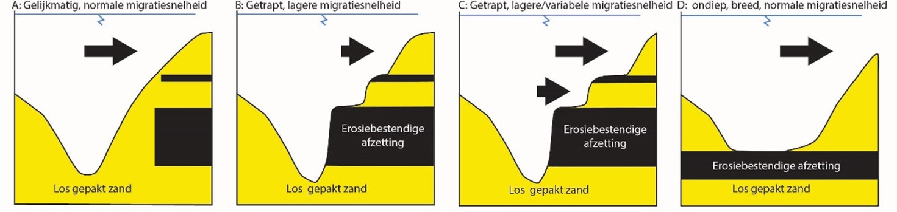
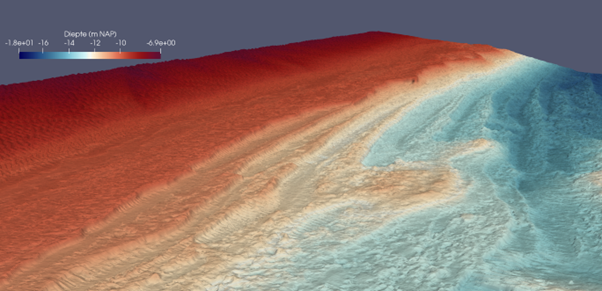
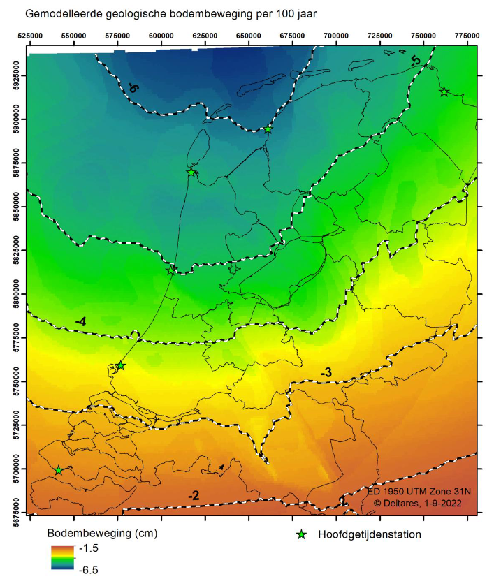

\newpage

# Geologie

```{r setupGeologie, include=FALSE}

```

(ref:erl-kaartLabel) Interactieve kaart van erosie-resistente lagen in het Waddengebied. Klikken op een (mogelijke) ERL laat de verandering in dwarsdoorsnede in de loop van de tijd zien ([Link naar Schermvullende versie](https://www.testsysteemrapportage.nl/ERL%20kaart%20NL%20v1.0/index.html#10/53.2167/5.6978)). Meer uitleg over erosie-resistente lagen is te vinden in paragraaf \@ref(erl-uitleg).

```{r erl-kaart, fig.cap= "(ref:erl-kaartLabel)"}

if(knitr::is_html_output())knitr::include_url("../ERL kaart NL v1.0/index.html#10/53.2167/5.6978", height = "600px") else{
  knitr::include_graphics(file.path(datadir, "deltares/geologie/erosieresistentelagen.png"))
}
```

## Geologische achtergrond Waddenzee {#geologie-achtergrond}

De ondiepe ondergrond van de Waddenzee is onder verschillende omstandigheden (zoals een hoge of lage zeespiegel, open mariene omgeving of in een delta/rivier) en door verschillende processen ontstaan.

Twee keer is dit gebied bedekt geraakt onder het landijs: tijdens het Elsterien glaciaal (465.000 -- 418.000 jaar geleden) en het Saalien glaciaal (238.000 - 126.000 jaar geleden). Uit het Elsterien komen in het oostelijke gedeelte van de Waddenzee proglaciale afzettingen voor. Het gaat om zanden die op uitspoelingvlaktes voor de terugtrekkende gletsjers werden afgezet, maar ook klei dat in grote smeltwatermeren werd afgezet. Deze klei wordt ook wel 'Potklei' genoemd en is zeer erosiebestendig. Voor de kust van Ameland ligt deze laag op de bodem van het Borndiep.

In het Holsteinien interglaciaal, dat tussen de Elsterien en Saalien ijstijden in ligt, stond het gebied onder water en werden er voornamelijk fijnkorrelige, schelphoudende zandlagen afgezet. Bij de terugkeer van het landijs in het Saalien werd onder de gletsjers keileem afgezet: een erosiebestendige klei/leemlaag waarin ook grind en grotere keien aanwezig zijn. Deze keileem laag is later deels weer geërodeerd, maar een deel ervan is bewaard gebleven en wordt voornamelijk in het westelijke gedeelte van de Waddenzee aangetroffen, bijvoorbeeld rond Texel.

In de daarop volgende warme periode, het Eemien (126.000 -- 116.000 jaar geleden), drong de zee weer delen van het Waddenzeegebied binnen en werden zand- en kleilagen afgezet in mariene en estuariene afzettingsmileus. In het daarop volgende jongste glaciaal, het Weichselien (116.000 -- 11.700 jaar geleden, de 'laatste ijstijd'), kwam het landijs niet verder dan Noord-Denemarken. De Waddenzee lag droog en veranderde in een toendralandschap. Er werd voornamelijk zand afgezet onder invloed van de wind, beken en smeltwater van de ten noorden gelegen ijskap.

Toen in het Holoceen (11.700 jaar geleden - heden) de zeespiegel steeg ontstond er kortstondig een veenmoeras door de verhoogde grondwaterstanden, waardoor er op de onderliggende zanden een laag veen ontstond die 'basisveen' wordt genoemd. Deze laag basisveen is op enkele plekken nog bewaard gebleven. Erboven wordt geregeld een kleilaag aangetroffen die onder de eerste mariene invloeden werd afgezet nadat de zeespiegel nog verder was gestegen. Deze opeenvolging van veen en klei vormt bijvoorbeeld de erosie-resistente laag in de geulwand van het Borndiep.

Naarmate de zee verder steeg en het getijdenbekken z'n huidige vorm kreeg zijn de oudere afzettingen geërodeerd en omgewerkt door migrerende getijdengeulen. Op veel plekken, met name waar de oudere lagen goed bestand zijn tegen erosie, zijn de lagen bewaard gebleven en kunnen ze nog steeds bepalend zijn voor de morfologische ontwikkeling van geulen.

## Erosie-resistente lagen {#erl-uitleg}

### Belang

De morfologie van natuurlijk gevormde (vaar)geulen in de Waddenzee wordt mede bepaald door de erosiegevoeligheid van het sediment waarin de geul zich verticaal insnijdt en lateraal beweegt. De geologie is om die reden onlosmakelijk verbonden aan de morfologie en morfologische ontwikkeling van geulen. In het kader van het kustbeheer, en het (vaar)geulbeheer in het bijzonder, is het van belang om inzicht te hebben in waar erosieresistente lagen (ERL's) zich bevinden en welk effect ze hebben (gehad) op de morfologische ontwikkeling.

### Afbakening

De ligging van deze ERL's is in een eerder onderzoek [@Onselen2021] bepaald en is weergegeven in Figuur \@ref(fig:sedimentatlasSlib). De ERL's zijn meestal kleilagen, maar ook veen, schelpen en grind kunnen moeilijk erodeerbaar zijn. De kaart toont plekken waar ERL's actief invloed uitoefenen op de morfologische ontwikkeling van de bodem en is dus geen kartering van de verbreiding van de lagen zelf. Voor meer informatie over het gebruik en de totstandkoming van deze kaart wordt naar het oorspronkelijke onderzoek verwezen.

### Conceptueel model effecten ERL's

De effecten van ERL's kunnen op verschillende manieren tot uiting komen in de morfologie, afhankelijk van de ligging van de lagen en de lokale hydrodynamische condities. In Figuur \@ref(fig:erl-morfologie zijn de verschillende situaties schematisch weergegeven, deze worden hieronder beschreven.

```{r erl-morfologie, fig.cap="Conceptueel model voor de mogelijke effecten van ERL\\'s op geulmorfologie."}


```

Een geul die zich in (losgepakt) zand insnijdt zal een v-vormig dwarsprofiel vormen (Figuur \@ref(fig:erl-morfologie) A). Als één of meerdere ERL's zich in de geulwand bevinden kan er een getrapt profiel ontstaan. Een dikke en/of sterk resistente ERL in de geulwand zal ervoor zorgen dat de laterale migratie van de geul in meer of mindere mate wordt vertraagd ter hoogte van deze laag (Figuur \@ref(fig:erl-morfologie) B, Figuur \@ref(fig:erl-multibeam)). Boven de bovenste ERL kan de erosiesnelheid juist toenemen (Figuur \@ref(fig:erl-morfologie) C). Als er een ERL op de bodem van de geul ligt en deze de verdieping van de geul verhinderd, kan er een 'platte' bodem ontstaan. De geul zal zich meer in de breedte ontwikkelen een u-vormig dwarsprofiel aannemen en voor een (tijdelijke) toegenomen erosiesnelheid zorgen (Figuur \@ref(fig:erl-morfologie) D). De twee laatst genoemde situaties C en D zorgen voor een vergroting van het geulareaal.

```{r erl-multibeam, fig.cap="In deze multibeam bathymetrie van de Westerscheldemonding is het ontstaan van het getrapte profiel duidelijk zichtbaar met 10 kleilagen die uit de geulwand steken. De kleilagen liggen in dit voorbeeld niet perfect horizontaal, maar steken schuin weg de geulwand in (hellen naar links in het figuur), waardoor ze een soort richels vormen in de geulwand."}


```

\newpage

## Geologische bodemdaling {#bodemdaling}

De bijdrage van geologische bodemdaling aan relatieve zeespiegel langs de Nederlandse kust wordt binnen de Bodemdalingsmonitor (2022) berekend door het sommeren van de tektonische en glacio-isostatische bodembeweging, de belangrijkste componenten van geologische bodemdaling. Hieronder worden deze componenten van geologische bodemdaling kort toegelicht, gevolgd door een kaart met de geologische bodemdaling in Nederland voor een periode van 100 jaar. De gemiddelde snelheid van geologische bodemdaling wordt constant beschouwd op een schaal van eeuwen, dus de geologische bodemdaling in de laatste 100 jaar is identiek aan de geologische bodemdaling in de komende 100 jaar.

Figuur \@ref(fig:bodemdalingsmonitor-geologie) geeft de meest recente kaart van geologische bodemdaling binnen de Bodemdalingsmonitor (2022). Er is een duidelijke trend zichtbaar van zuid naar noord, met minder bodemdaling in het zuiden (rond 2 cm/eeuw) en meer in het noorden (rond 6 cm/eeuw). Deze trend wordt bepaald door glacio-isostatische bodemdaling, terwijl de meer lokale/regionale afwijkingen van de hoofdtrend het gevolg zijn van tektonische bodembewegingen langs breuken. Deze data is binnenkort ook beschikbaar via Datahuis Wadden. 

```{r bodemdalingsmonitor-geologie, fig.cap="Gemodelleerde geologische bodemdaling voor een periode van 100 jaar. Voor geheel Nederland wordt bodemdaling gemodelleerd, toenemend van zuid naar noord van 2 tot 6 cm per eeuw. De zwart-witte lijnen zijn contourlijnen van geologische bodemdaling."}


```

