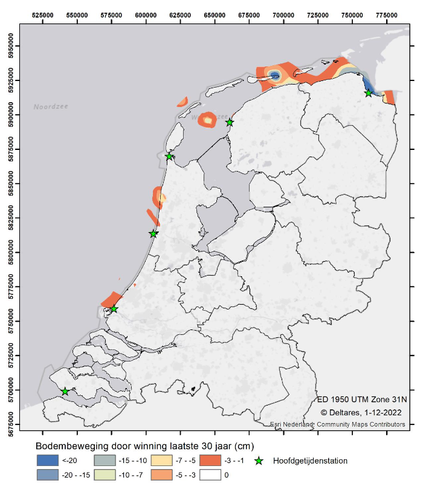

\newpage

# Ingrepen door de mens

Vooralsnog zijn er geen indicatoren voor menselijke activeiten opgenomen
in deze systeemrapportage omdat er maar weinig in direct bruikbare vorm
digitaal ontsloten is. De indicatoren die in 2023 toegevoegd gaan worden
worden aangegeven door de paragrafen in dit hoofdstuk.

## Bagger- en verspreidingswerken

Baggervolumes en -massa, locaties, sedimentsamenstelling. Deze data is
niet digitaal ontsloten.

## Zandsuppleties

Zandsuppleties worden alleen uitgevoerd aan de Noordzeezijde van de
eilanden en niet in de Waddenzee. Locaties en volumes zijn beschikbaar
via de [kustviewer](https://www.openearth.nl/coastviewer-static/).

## Bodemdaling {#winningbodemdaling}
**Afgelopen 30 jaar**

In de Bodemdalingsmonitor-rapporten (2018) zijn overzichten gegeven van de bodemdaling als gevolg van de winning van gas, olie, zout en water.De bodemdaling door het winnen van water bleek niet relevant voor hetkustfundament en is daarna niet meer meegenomen. In de Bodemdalingmonitor (2018) wordt de onzekerheid
(variatiecoëfficiënt) rondom de bodemdalingsgetallen voor het historisch verleden op ± 25%
geschat. Deze kaart is oorspronkelijk opgesteld voor de periode 1987-2017, de kaart
wordt ook representatief geacht voor de laatste 30 jaar, omdat gewerkt is met een legenda-
indeling in klassen en ook omdat de bodemdaling door winning in de laatste 5 jaar
grotendeels binnen de spreiding van ± 25% valt. Door de start van de zoutwinning bij de
Ballastplaat zal deze kaart zeer binnenkort niet meer representatief zijn voor de laatste 30
jaar en zal een nieuwe kaart opgesteld moeten worden.

```{r bodemdalingsmonitor_doorwinning, fig.cap="Bodembeweging door winning van gas, olie en zout in de laatste 30 jaar."}


```


## Zandwinning

Volume, locaties. Zandwinning is gestopt, maar de data is nog wel
relevant voor het begrijpen van de historische ontwikkeling.

## Schelpenwinning

Volume, locaties. Schelpwinning wordt afgebouwd, maar de data is nog wel
relevant voor het begrijpen van de historische ontwikkeling.

## Kunstwerken

Onder kunstwerken verstaan we menselijke bouwwerken die doorgaans niet
voor bewoning bestemd zijn. Onderstaande figuur toont de locaties van
verschillende kunstwerken rond de Waddenzee, waaronder sluizen, gemalen
en duikers. In de figuur wordt per locatie het type kunstwerk vermeld.

```{r kunstwerken, out.height="450px", fig.cap="Kunstwerken in de Waddenzee, Bron: https://nationaalgeoregister.nl/geonetwork/srv/dut/catalog.search#/metadata/b96f972a-c7e9-4059-9f85-540c830eec8d", out.width = "100%"}
Wadden <- sf::st_read('p:\\11202493--systeemrap-grevelingen\\1_data\\Wadden\\RWS\\menselijkhandelen\\Waddenzee_Noordzeekust\\Waddenzee_Noordzeekust.shp') %>% st_transform(4326)

kunstwerken <- sf::st_read("https://geo.rijkswaterstaat.nl/services/ogc/gdr/primaire_waterkering/ows?request=GetFeature&service=WFS&version=2.0.0&outputFormat=application%2Fjson&typeNames=primaire_waterkering:kunstwerken") %>% st_transform(4326)
 

leaflet(kunstwerken) %>%
  setView(lng = 5.8, lat = 53.3, zoom = 9) %>% 
  addTiles() %>%
  addCircleMarkers(label = ~kd_type_om, radius=3) 


```

## Kabels en leidingen

Er lopen verschillende kabels en leidingen tussen het vasteland en de
Waddeneilanden. Voor het overzicht is besloten om alleen het deel van de
kabels en leidingen te tonen welke binnen de Waddenzee en de
Noordzeekustzone gelegen zijn. Voor pijpleidingen wordt binnen de figuur
getoond welke stof (gas, olie, water, etc.) vervoerd wordt. Voor de
telecomkabels wordt voor zover bekend weergegeven wat voor soort kabel
het is (coaxiaal of glasvezel).

```{r kabelsEnLeidingen, echo =FALSE, out.height="450px", fig.cap="Pijpleidingen, telecomkabels en elektrakabels in de Waddenzee. NB: tussen Den Helder en Texel lopen zowel telecomkabels als pijpleidingen, Bron: https://nationaalgeoregister.nl/geonetwork/srv/dut/catalog.search#/metadata/b96f972a-c7e9-4059-9f85-540c830eec8d", out.width = "100%"}
Wadden <- sf::st_read('p:\\11202493--systeemrap-grevelingen\\1_data\\Wadden\\RWS\\menselijkhandelen\\Waddenzee_Noordzeekust\\Waddenzee_Noordzeekust.shp') %>% st_transform(4326)

wfs_geo <- 'https://geo.rijkswaterstaat.nl/services/ogc/gdr/kabels_en_leidingen_noordzee/ows?service=WFS&request=getcapabilities&version=2.0.0'

pijpleidingen.lay <- 'kabels_en_leidingen_noordzee:pijpleidingen_noordzee'
telecom_kabels.lay <- 'kabels_en_leidingen_noordzee:telecom_kabels_noordzee'
elektra_kabels.lay <- 'kabels_en_leidingen_noordzee:electra_kabels_noordzee'

pijpleidingen <- st_read(dsn = wfs_geo, layer = pijpleidingen.lay) %>% st_transform(4326)
pijpleidingenWadden <- st_intersection(pijpleidingen, Wadden)

telecom_kabels <- st_read(dsn = wfs_geo, layer = telecom_kabels.lay) %>% st_transform(4326)
telecom_kabelsWadden <- st_intersection(telecom_kabels, Wadden) 

elektra_kabels <- st_read(dsn=wfs_geo, layer = elektra_kabels.lay) %>% st_transform(4326)
elektra_kabelsWadden <- st_intersection(elektra_kabels, Wadden)

leaflet() %>%
  addTiles() %>%
  addPolylines(data=pijpleidingenWadden %>% filter(status == "Active"), 
               color = 'red', label = ~stofnaam) %>%
  addPolylines(data=telecom_kabelsWadden %>% filter(status == 'Ingebruik'), 
               color = 'blue', label = ~kabel_type) %>%
  addPolylines(data=telecom_kabelsWadden %>% filter(status == 'Verlaten'), 
               color = '#4682B4', label = ~kabel_type) %>%
  addPolylines(data=elektra_kabelsWadden %>% filter(status == 'Ingebruik'), 
               color = 'yellow', label = ~kabelsoort) %>% 
  addLegend(colors = c("red", "blue", "#4682B4", 'yellow'), 
            labels = c("Pijpleidingen", "Telecom Kabels (actief)","Telecom Kabels (verlaten)", 'Elektra Kabels'), opacity = 1, title = "Legenda")

```

## Gesloten gebieden voor bodemberoerende visserij

In de Waddenzee is in het Groninger Wad een gebied gesloten voor
bodemberoerende visserij. Dit is nog niet opgenomen op onderstaande
kaart.

```{r geslotenGebiedenVisserij, out.height="450px", fig.cap="Gesloten gebieden voor bodemberoerende visserij in de Noordzee. Bron: https://nationaalgeoregister.nl/geonetwork/srv/dut/catalog.search#/metadata/b96f972a-c7e9-4059-9f85-540c830eec8d", out.width = "100%"}

library(sf)
library(httr) 
library(tidyverse) 
library(ows4R)
library(leaflet)
library(leaflet.extras)

wms_geslotengebieden <- "https://geodata.nationaalgeoregister.nl/geslotenvisserij/wms?"

leaflet() %>% 
  setView(lng = 5.3, lat = 53.5, zoom = 8) %>%
  addTiles('http://{s}.tile.openstreetmap.org/{z}/{x}/{y}.png', 
           group = "OSM") %>%
  addWMSTiles(
    wms_geslotengebieden,
    layers = "GeslotenGebiedenVoorVisserij",
    options = WMSTileOptions(format = "image/png", transparent = TRUE), 
    group = "GeslotenGebiedenVoorVisserij"
  ) %>%
  addWMSLegend(
    uri = paste0("https://geodata.nationaalgeoregister.nl/geslotenvisserij/wms?SERVICE=WMS&language=dut&version=1.3.0&service=WMS&request=GetLegendGraphic&sld_version=1.1.0&layer=GeslotenGebiedenVoorVisserij&format=image/png&STYLE=geslotenvisserij:VISSERIJ_GESLOTEN_GEBIEDEN"),
    position = "bottomleft"
  ) %>%
  addLayersControl(
    baseGroups = c("OSM", "Esri.WorldImagery"),
    overlayGroups = c("GeslotenGebiedenVoorVisserij"
                      # "ecotopen_zout:ecotopenkaart_waddenzee_2017","ezout_2001","geslotengebieden","ecotopen_cyclus_5"
                      ),
    options = layersControlOptions(collapsed = FALSE)
  )
```

## Olie en gas gegevens

De volgende gegevens komen van het Nederlandse Olie- en Gasportaal. In het verleden hebben er wel boringen plaatsgevonden in de Waddenzee, maar op het moment zijn er geen lopende boringen in de Waddenzee. Alle boringen zijn weergegeven in de kaart hieronder. 

```{r NLOG, out.height="450px", fig.cap="Data van Nederlands Olie- en Gasportaal", out.width = "100%"}

# library(sf)
# library(httr) 
# library(tidyverse) 
# library(ows4R)
# library(leaflet)
# library(leaflet.extras)
# library(jpeg)
# 
# # URL of the WFS service
# wms_url <- "https://www.nlog.nl/arcgis/services/nlog/gdw_ng_wll_all_utm/MapServer/WMSServer?"
# 
# # Parameters for GetMap request
# params <- list(
#   service = "WMS",
#   request = "GetMap",
#   layers = "0",  # Adjust layer ID as needed
#   format = "image/png",
#   transparent = FALSE,
#   width = 600,
#   height = 400,
#   # bbox = "-180,-90,180,90",
#   version = "1.1.1",
#   srs = "EPSG:4326",
#   styles = 'esriSMSCircle'
# )
# 
# # Construct GetMap request URL
# get_map_url <- paste0(wms_url, paste(names(params), params, sep = "=", collapse = "&"))
# 
# # Make a request to retrieve map tiles
# response <- httr::GET(get_map_url)
# content(response, as = 'text')
# 
# leaflet() %>% 
#   setView(lng = 0, lat = 0, zoom = 2) %>%
#   addTiles() %>%
#   addWMSTiles(get_map_url, layers = "0", options = WMSTileOptions(format = "image/png", transparent = FALSE))

```


