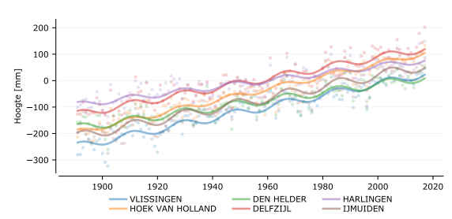

# Hydrodynamiek {#hydro}

```{r setupWaterkwantiteit, include = FALSE}
knitr::opts_chunk$set(
	message = FALSE,
	warning = FALSE,
	echo = FALSE,
	comment = FALSE,
	out.width = "100%"
)
require(sf)
require(leaflet)
require(tidyverse)
require(data.table)
require(oce)
require(ggthemes)
source("r/runThisFirst.R")


theme_hy <- theme_bw()

alt_theme_hy <- theme_tufte() + theme(axis.line=element_line()) #+ 
    # scale_x_continuous(limits=c(10,35)) + scale_y_continuous(limits=c(0,400))
```

## Afbakening, definitie en herkomst

**Belang**

Hydrodynamiek is sterk bepalend voor -en mede bepaald door- de morfologische en ecologische toestand en ontwikkeling van de Waddenzee. Waterstandsverschillen als gevolg van het getij drijven stromingen aan die voor grootschalig transport van sediment en nutriënten zorgen. Waterstanden bepalen ook de overstromings- of droogvalduur van wadplaten en kwelders, en daarmee welke soorten er wel of niet voor kunnen komen. Golven vergroten bodemschuifspanningen, vooral in ondiepe gebeiden. Daarmee beïnvloeden ze erosie en depositie van sediment, de concentraties van zwevende stof in de waterkolom (troebelheid), de korrelgrootteverdeling en verstoring van biota. Ook de hoeveelheid gespuid zoet water is, naast het directe effect op biota, mede bepalend voor de hydrodynamiek doordat het dichtheidsverschil stromingen aandrijft.

**Afbakening**

In dit hoofdstuk is de beschrijving van de hydrodynamiek beperkt tot de waterstanden (getij en zeespiegelstijging), golven en de grotere zoetwaterafvoeren. Deze parameters worden continu bemeten en de meetdata zijn goed ontsloten. Metingen van bijvoorbeeld stroomsnelheden zijn schaars en worden niet continu uitgevoerd. Daarom zijn deze (nog) niet opgenomen. Bovendien worden de stroomsnelheden sterk beïnvloed door de lokale bodemligging. Veranderingen in stroomsnelheden op een bepaald punt zijn sterk gekoppeld aan (lokale) veranderingen in de morfologie. Ook de debieten door de zeegaten zouden een informatieve indicator kunnen zijn maar deze zijn evenmin consistent bemeten en daarom ook niet opgenomen.

**Databronnen**

Een overzicht van alle voor dit hoofdstuk gebruikte brondata en rekenmethoden is te vinden in de Appendix: \@ref(Appwaterstanden)

**Beschrijving opgenomen parameters**

De waterstanden in de Waddenzee worden voor een groot deel bepaald door het astronomisch getij. De waterstanden worden verder beïnvloed door de wind (zie hoofdstuk \@ref(wind)) en luchtdruk. Het astronomisch getij ontstaat door de aantrekkende kracht van de maan en de zon op de aarde. De variaties in het getij ontstaan door de draaiïng van de aarde en de positie van de aarde ten opzichte van de maan en de zon en doordat de maan en de aarde zich in een baan rond de zon bewegen. Daarnaast wordt het getij vervormd door de bodemligging van zeeën en oceanen. Wiskundig gezien kan het getij worden ontleed in groot aantal gesuperponeerde sinusvormige golven met verschillende amplitudes en frequenties: de getijcomponenten. De M~2~-component ontstaat door de aantrekkingskracht van de maan en is een belangrijke getijcomponent in de Noordzee en de Waddenzee. De S~2~-component ontstaat door de aantrekkingskracht van de zon. Doordat deze een verschillende frequentie hebben onstaan periodieke variaties op verschillende tijdschalen. De belangrijkste periodieke variaties in het getij zijn de zogeheten dagelijkse ongelijkheid (een gevolg van declinatie van de maan), de springtij-doodtij cyclus (interactie tussen de M~2~ en S~2~-component; ca 14 dagen) en de 18,6-jarige cyclus (een gevolg van de hoek die de maan maakt met het equatorvlak van de aarde). Vanaf de zeegaten dringt het getij als een langgerekte golf de bekkens binnen. De geringer wordende diepte en de geometrie van het bekken vervormen het getij. Het getij wordt daardoor asymmetrisch, wat weer belangrijk is voor het residueel transport van zand en slib. De asymmetrie wordt vaak uitgedrukt met de verhouding en het faseverschil tussen de astronomische M~2~-component en de door geometrie bepaalde M~4~-component.

```{r getijVanRijn1994, fig.cap= "Getijdenniveaus plus waterbeweging in de tijd (eigen illustratie/Deltares 2022). LAT en HAT geven het laagste respectievelijk hoogste astronomisch getij aan. Meteorologische factoren kunnen tot nog lagere (laagste laagwater; LLW) of nog hogere (HHW) werkelijk optredende waterstanden leiden. GHWS is het gemiddeld hoogwater bij springtij, GHW het gemiddeld hoogwater en GHWD het gemiddeld hoogwater tijdens doodtij. Vergelijkbaar voor GLWD, GLW en GLWS. De getijslag geeft het verschil tussen GHW en GLW aan, en verschilt dus per locatie. De getijperiode, de tijd tussen twee hoogwaters is voor alle stations 12 uur 25 minuten (dubbeldaags getij). " }
knitr::include_graphics("images/getij.png")
```

Figuur \@ref(fig:getijVanRijn1994) illustreert de samenhang tussen de verschillende karakteristieke getijniveaus. Het Gemiddelde Hoog Water (GHW), Gemiddeld Hoog Hoogwater Spring (GHHWS), Gemiddelde Laag Water (GLW), Gemiddeld Laag Laagwater Spring (GLLWS) en de getijslag (verschil tussen GHW en GLW) zijn relevant voor de ecologie en de morfologische ontwikkeling. De hoogteligging van wadplaten en de vegetatiegroei is afhankelijk van het niveau van hoogwater en droogvalduur. De getijslag laat zien hoe het getij zich voortplant in het bekken. Veranderingen in de getijslag door de tijd leiden tot veranderingen in de stroomsnelheden en de droogvalduur van het intergetijdengebied en hebben daarmee invloed op de morfologie en de ecologie.

In de Waddenzee wordt veel zoetwater gespuid, waarmee saliniteits- en dichtheidsverschillen tussen het zoute zeewater en het zoetwater ontstaan, die invloed hebben op de stroming en daarmee het sedimenttransport. Ook heeft de saliniteit (opgenomen in paragraaf \@ref(saliniteit)) van het Waddenwater direct invloed op de ecologie, omdat sommige soorten alleen zoutwater tolereren en anderen juist alleen zoetwater. Het spuien gebeurt zowel via grote als kleine spuisluizen. De drie grootste afvoerpunten zitten in de Afsluitdijk (Den Oever en Kornwerderzand) en bij het Lauwersmeer. De data van kleinere afvoeren is minder goed bijgehouden en/of ontsloten, en worden daarom in deze rapportage buiten beschouwing gelaten.

## Zeespiegelstijging {#zeespiegelstijging}

ref:zeespiegelstijgingLabel Huidige zeespiegelstijging volgens het lineaire model met correctie voor wind. De zeespiegel is uitgedrukt ten opzichte van post-2005 NAP. De zwarte lijn is het gemiddelde over de 6 stations. De locaties van de stations zijn te vinden in \@ref(fig:kaartAbiotieklocaties).

```{r zeespiegelstijging, fig.cap='(ref:zeespiegelstijgingLabel)' }

# 

sealevelurl <- "https://raw.githubusercontent.com/openearth/sealevel/master/data/deltares/results/dutch-sea-level-monitor-export-2022-01-14.csv"

sealevel <- read_csv(sealevelurl,
                     comment = "#")


sealevelAllStationsurl <- "https://raw.githubusercontent.com/openearth/sealevel/master/data/deltares/results/dutch-sea-level-monitor-export-stations-2021-11-26.csv"

stations <- read_delim("https://raw.githubusercontent.com/openearth/sealevel/master/data/psmsl/NLstations.csv", delim = ";")


sealevelAllStations <- read_csv(sealevelAllStationsurl,
                     comment = "#")

  p <- sealevelAllStations %>% 
    left_join(stations %>% select(ID, StationName), by = c(station = "ID")) %>%
    mutate(`height in cm` = height / 10,
           `predicted_linear_with_wind in cm` = predicted_linear_with_wind / 10) %>%
    ggplot() +
    geom_point(aes(year, `height in cm`, color = StationName)) +
    geom_line(aes(year, `predicted_linear_with_wind in cm`, color = StationName)) +
    geom_line(data = sealevel, aes(x = year, y = predicted_linear_with_wind/10), color = "black") +
    theme_hy
  
  ggplotly(p) %>% 
    layout(
      legend = list(
        orientation = 'v',
        x = 0.05,
        y = 0.95
      ),
      yaxis = list(hoverformat = '.2f')
    ) 

```

In deze rapportage is de jaargemiddelde waterstand voor de zes hoofdstations langs de Nederlandse kust overgenomen uit de Zeespiegelmonitor (figuur \@ref(fig:zeespiegelstijging)). In deze studie is de stijging van de zeespiegel nauwkeurig onderzocht en berekend. De berekening en aanvullende én interactieve figuren kunnen worden ingezien via de [Jupyter Notebook Zeespiegelmonitorberekening](https://nbviewer.jupyter.org/github/openearth/sealevel/blob/master/notebooks/dutch-sea-level-monitor.ipynb).

De data voor figuur \@ref(fig:zeespiegelstijging) zijn verkregen via [PSMSL](https://psmsl.org/data/) als jaargemiddelde. Rijkswaterstaat levert elk jaar deze data na controle als maandgemiddelden en jaargemiddelden aan voor alle hoofdstations.

## Gemiddeld Hoogwater (GHW) {#gemiddeld-hoogwater-ghw}

De berekeningswijze van de Gemiddelde HoogWaterstanden is opgenomen in Appendix \@ref(Appwaterstanden).

De GHW (figuur \@ref(fig:Hoogwaters)) laten een stijging zien over de getoonde periode van 1985 tot heden. Ook de ruimtelijke verschillen over de Waddenzee zijn duidelijk terug te zien in de grafieken.

ref:HoogwatersLabel Jaargemiddeld hoogwater (GHW) per station. De doorgetrokken lijn is een lineaire regressie door de alle data rekening houdend met een cyclus van 18.6 jaar; de grijze band is het 95% predictie-interval van het regressiemodel. De locaties van de stations zijn te vinden in \@ref(fig:kaartAbiotieklocaties).

```{r Hoogwaters, fig.height=6, fig.width=6, fig.cap='(ref:HoogwatersLabel)'}

df.extrema <- read_delim(file.path(datadir, "RWS", "standard", paste0("extremaHLLL", "latest", ".csv")), delim = ";") %>%
  mutate(h = h * 100) # van meter naar cm


p <- df.extrema %>%
  filter(HL == "H") %>%
    mutate(
      jaar = year(time)
    ) %>% 
  group_by(locatie.naam) %>% mutate(across(h, remove_outliers)) %>%
  group_by(locatie.naam, jaar) %>% 
  summarise(jaargemiddelde = mean(h, na.rm = T)) %>%
    # filter(jaar != 2021 & jaar > 1970) %>%
    ggplot() +
  geom_point(aes(x = jaar, y = jaargemiddelde, color = locatie.naam), size = 1) +
  geom_smooth(aes(jaar, jaargemiddelde, color = locatie.naam), method = "lm", 
              formula = y ~ x + I(cos(2 * pi * as.numeric(x) / (18.6))) + I(sin(2 * pi * as.numeric(x) / (18.6))),
              size = 1) +
    # coord_cartesian(ylim = c(-160, -100)) +
    # facet_wrap(~locatie.naam, ncol = 2, scales = "free") + 
  # scale_x_continuous(limits = c(1970, 2020)) +
  # coord_cartesian(ylim = c(-175, 0)) +
  theme_hy +
  xlab("Jaar") + ylab("Jaargemiddelde gemeten hoogwater in cm")

ggplotly(p, height = 550, width = 700)
```

## Gemiddeld Laagwater (GLW) {#gemiddeld-laagwater-glw}

De berekeningswijze van de Gemiddelde Laag Waterstanden is vergelijkbaar met die van de GHW en opgenomen in Appendix \@ref(Appwaterstanden). De meeste waterstandstations liggen in geulen, behalve Wierumerwad1 en Uithuizerwad1. Deze twee stations tonen een veel hoger gemeten laagwater omdat ze een gedeelte van de tijd droogvallen.

De Gemiddelde Laag Waterstanden (figuur \@ref(fig:Laagwaters)) laten voor de meeste stations ook een stijging zien. Ook is te zien hoe de laagwaterniveaus variëren over de Waddenzee.

```{r Laagwaters, fig.height=8, fig.width=8, fig.cap="Jaargemiddeld laagwater (GLW) per station. De lijn is een linaire regressie door alle data rekening houdend met een cyclus van 18.6 jaar; de grijze band is het 95% predictie-interval van het regressiemodel."}

# versie waarbij de lijn door ALLE punten wordt bepaald, niet alleen door jaargemiddelden. 
# df.extrema %>%
#   filter(HL == "L") %>%
#     mutate(
#       jaar = year(time)
#     ) %>%
#     filter(jaar != 2021 & jaar > 1970) %>%
#   group_by(locatie.naam, jaar) %>% mutate(across(h, remove_outliers)) %>%
#     ggplot() +
#   geom_point(aes(time, h), alpha = 0.2) +
#   geom_point(
#     data = . %>% group_by(locatie.naam, jaar) %>% summarise(jaargemiddelde = mean(h)),
#     aes(
#       x = as_datetime(paste(jaar, "07", "01")),
#       y = jaargemiddelde)
#   ) +
#     geom_smooth(aes(time, h), method = "lm",
#                 formula = y ~ x + I(cos(2 * pi * as.numeric(x) / (18.6*31556995))) + I(sin(2 * pi * as.numeric(x) / (18.6*31556995)))) +
#     # coord_cartesian(ylim = c(-160, -100)) +
#     facet_wrap(~locatie.naam, scales = "free_y", ncol = 2) +
#   theme_hy +
#   xlab("Jaar") + ylab("Jaargemiddelde gemeten waterstand in cm")

p <- df.extrema %>%
  filter(HL == "L") %>%
    mutate(
      jaar = year(time)
    ) %>% 
  group_by(locatie.naam) %>% mutate(across(h, remove_outliers)) %>%
  group_by(locatie.naam, jaar) %>% 
  summarise(jaargemiddelde = mean(h, na.rm = T)) %>%
    # filter(jaar != 2021 & jaar > 1970) %>%
    ggplot() +
  geom_point(aes(x = jaar, y = jaargemiddelde, color = locatie.naam), size = 1) +
  geom_smooth(aes(jaar, jaargemiddelde, color = locatie.naam), method = "lm", 
              formula = y ~ x + I(cos(2 * pi * as.numeric(x) / (18.6))) + I(sin(2 * pi * as.numeric(x) / (18.6))),
              size = 1) +
    # coord_cartesian(ylim = c(-160, -100)) +
    # facet_wrap(~locatie.naam, ncol = 2, scales = "free") + 
  # scale_x_continuous(limits = c(1970, 2020)) +
  # coord_cartesian(ylim = c(-175, 0)) +
  theme_hy +
  xlab("Jaar") + ylab("Jaargemiddelde gemeten laagwater in cm")

ggplotly(p, width = 700, height = 550)
```

## Getijslag {#getijslag}

De getijslag (figuur \@ref(fig:getijslag)), die wordt gevormd door het verschil tussen de GHW en de GLW, laat zien dat er sinds 1985 fluctuaties zijn als gevolg van de 18,6 jarige cyclus, en ook dat er op sommige stations een dalende trend lijkt te zijn, terwijl op andere stations een stijgende trend in de data zit. Indien de tijdreeksen worden uitgebreid met de historische data, kunnen deze schommelingen beter in historisch perspectief worden geplaatst.

Figuur \@ref(fig:kaartGetijslag) geeft de gemiddelde getijslag over de in figuur \@ref(fig:getijslag) getoonde periode weer op de kaart in de Waddenzee. De figuur toont dat de getijslag toeneemt van west naar oost, en dat bij Delfzijl de getijslag het grootste is, door opslingering van het getij in het Eems estuarium. De meeste waterstandstations liggen in geulen, behalve Wierumerwad1 en Uithuizerwad1. Deze twee stations tonen een kleinere getijslag omdat ze een gedeelte van de tijd droogvallen.

ref:getijslagLabel Jaargemiddelde getijslag per station. De lijn is een linaire regressie door alle data rekening houdend met een cyclus van 18.6 jaar; de grijze band is het 95% predictie-interval van het regressiemodel. De locaties van de stations zijn te vinden in \@ref(fig:kaartAbiotieklocaties).

```{r getijslag, fig.height=8, fig.width=8, fig.cap= '(ref:getijslagLabel)'}

p <- df.extrema %>%
    # filter(HL == "L") %>%
    mutate(jaar = year(time)) %>% 
    filter(jaar != 2021 & jaar > 1970) %>%
  group_by(locatie.naam, jaar, HL) %>% summarise(mean = mean(h)) %>%
  pivot_wider(id_cols = c(locatie.naam, jaar), names_from = HL, values_from = mean) %>%
  mutate(`getijslag in cm` = H-L) %>%
  ggplot() +
  geom_point(aes(jaar, `getijslag in cm`, color = locatie.naam)) +
  geom_smooth(aes(jaar, `getijslag in cm`, color = locatie.naam), method = "lm", 
                formula = y ~ x + I(cos(2 * pi * x / (18.6))) + I(sin(2 * pi * (x) / (18.6)))) +
  # geom_line(aes(x = jaar, y=zoo::rollmean(`getijslag in cm`, 19, na.pad=TRUE))) + # poging om rolling average toe te voegen. Ziet er lelijk uit
  # facet_wrap(~locatie.naam, scales = "free_y", ncol = 2) +
  theme_hy

ggplotly(p, height = 550, width = 700)

```

ref:kaartGetijslagLabel Gemiddelde getijslag per station over de periode 2011 - 2020. Wierumerwad1 en Uithuizerwad1 vertonen een veel lagere getijslag omdat ze een gedeelte van de tijd droogvallen. De locaties van de stations zijn te vinden in \@ref(fig:kaartAbiotieklocaties).

```{r kaartGetijslag, fig.height=6, fig.width=8, fig.cap="(ref:kaartGetijslagLabel)"}

metadata <- read_delim(file.path(datadir, "ddl/metadata/Wadden_metadata.csv"),delim = ";") %>%
  distinct(locatie.naam, x, y)

gemGetijslag <- df.extrema %>%
    # filter(HL == "L") %>%
    mutate(jaar = year(time)) %>% 
    filter(jaar != 2021 & jaar > 2010) %>%
  group_by(locatie.naam, jaar, HL) %>% summarise(mean = mean(h)) %>%
  pivot_wider(id_cols = c(locatie.naam, jaar), names_from = HL, values_from = mean) %>%
  mutate(`getijslag in cm` = H-L) %>% ungroup() %>%
  group_by(locatie.naam) %>% summarize(`gemiddelde getijslag in cm` = mean(`getijslag in cm`, na.rm = T)) %>%
  ungroup() %>%
    left_join(metadata, by = c(locatie.naam = "locatie.naam")) %>%
  sf::st_as_sf(coords = c("x", "y"), crs = 25831) %>%
  st_transform(4326) 

pal <- colorNumeric(
  palette = "viridis",
  domain = gemGetijslag$`gemiddelde getijslag in cm`)


leaflet(gemGetijslag) %>%
  addTiles() %>%
  addCircleMarkers(radius = 7, 
                   label = ~paste(locatie.naam, ", gemiddelde getijslag =", trunc(`gemiddelde getijslag in cm`), "cm"), 
                   color = ~ pal(`gemiddelde getijslag in cm`),
                   labelOptions = labelOptions(textsize = 12)) %>%
  leaflet::addLegend(pal = pal, values = gemGetijslag$`gemiddelde getijslag in cm`, position = 'bottomright')

```

## Gemiddeld Laag LaagWater en Gemiddeld Hoog HoogWater bij Springtij (GLLWS & GHHWS) {#gllws-ghhws}

<!-- hieronder de nieuw berekende figuren. Deze zijn berekend door Jelmer met Hyatan op basis herberekend astronomisch getij. Uitgangsdata zijn DDL waterhoogten, gedownload juli 2022. -->

Gemiddeld Laag Laagwater (GLLWS) en Gemiddeld Hoog Hoogwater (GHHWS) geven aan hoe sterk het getij doordringt in een bassin, en wat onder normale omstandigheden de maximale getijamplitude is. Deze kenmerkende waterstanden worden berekend als de maandminima en -maxima van het berekend getij per station. Het berekend getij wordt bepaald uit de getijcomponenten, zie sectie \@ref(getijcomponentenmethode). Hierdoor reageren GLLWS en GHHWS wel op veranderingen in het systeem, zoals ver(on)diepingen maar niet op meteorologische invloeden. Figuur \@ref(fig:GLLWGHHW) laat zien dat GHHWS met ruim 30 centimeter over meer dan een eeuw toegenomen is bij Delfzijl, met een plotseling grotere toename in de jaren '70. Voor andere stations zijn de tijdreeksen korter en is een toename minder duidelijk of afwezig. Voor Delfzijl is de GLLWS, na een kleine toename in het begin van de twintigste eeuw, in de jaren '70 enkele centimeters lager geworden. GLLWS laat voor geen van de andere stations een duidelijke trend zien.

```{r, GLLWGHHW fig.cap="Gemiddeld hoog hoogwater (boven) en gemiddeld laag laagwater (onder) voor stations in de Waddenzee berekend met hatyan op basis van DataDistributieLaag waterhoogten gedownload in juli 2022. ", }

path = file.path(datadir, "ddl", "calculated", "tidal_indicators", "GHHWS_GLLWS_10min.png")

invisible(file.copy(path, "images/GHHWS_GLLWS_10min.png", overwrite = T))

knitr::include_graphics("images/GHHWS_GLLWS_10min.png")
```

## Getijcomponenten en -asymmetrie

De M~2~-component van het getij heeft de grootste amplitude en ontstaat door aantrekkingskracht van de maan. De S~2~-component wordt veroorzaakt door de aantrekkingskracht van de zon en vormt met de M~2~ component de springtij-doodtij cyclus. De M~4~-component is een hogere harmonische component en een ondiepwatereffect van M~2~ (i.e. harmonische boventoon / veelvoud van M~2~). Ondiepwatereffecten ontstaat doordat de getijgolf sneller voorplant in hoogwater dan in laagwater.

De M~4~/M~2~ amplitudeverhouding en het relatief faseverschil $2 \phi M_{2} - \phi M_{4}$ kunnen worden gebruikt voor de kwantificatie van de getijasymmetrie die belangrijk is voor het netto sedimenttransport (Friedrichs en Aubrery, 1988). Het relatieve faseverschil bepaalt de aard van de asymmetrie: de pieksnelheid is vloeddominant als het tussen 0 en 180 graden is en ebdominant als het tussen 180 en 360 graden is. De grootte van de amplitudeverhouding (M~4~/M~2~) is een indicator voor de sterkte van de asymmetrie.

```{r tsM2, fig.cap="Amplitude en fase van de M~2~-component voor alle stations"}

path = file.path(datadir, "ddl", "calculated", "tidal_asymmetry", "ts_M2.png")
invisible(file.copy(path, "images/ts_M2.png", overwrite = T))

knitr::include_graphics("images/ts_M2.png")
```

```{r tsS2, fig.cap="Amplitude en fase van de S~2~-component voor alle stations"}
path = file.path(datadir, "ddl", "calculated", "tidal_asymmetry", "ts_S2.png")
invisible(file.copy(path, "images/ts_S2.png", overwrite = T))
knitr::include_graphics("images/ts_S2.png")
```

```{r tsM4, fig.cap="Amplitude en fase van de M~4~-component voor alle stations"}

path = file.path(datadir, "ddl", "calculated", "tidal_asymmetry", "ts_M4.png")
invisible(file.copy(path, "images/ts_M4.png", overwrite = T))
knitr::include_graphics("images/ts_M4.png")
```

```{r M4divM2, fig.cap="Amplitude en fase van de mate van getij-asymmetrie M~4~/M~2~ en het relatieve faseverschil 2M2-M4 voor alle stations"}

path = file.path(datadir, "ddl", "calculated", "tidal_asymmetry", "ts_M4divM2.png")
invisible(file.copy(path, "images/ts_M4divM2.png", overwrite = T))
knitr::include_graphics("images/ts_M4divM2.png")

```

## Waterhoogte bij storm {#waterhoogte-bij-storm}

Waterstanden tijdens events geven inzicht hoeveel krachtige stormen er zijn opgetreden per jaar. Er worden twee parameters opgenomen als indicator: de stormopzet of -afzet (excl. getij) en de stormvloedhoogte (incl. getij). De laatste geeft ook de afhankelijkheid weer van het moment in de getijfase dat een storm optreedt.

Als maat voor stormen wordt het 99,5-percentiel per jaar getoond, wat overeen komt met bijna 2 dagen. In combinatie met het jaarmaximum geeft dit goed inzicht in de meest energetische condities per jaar.

De definities en rekenmethoden van de hier gebruikte indicatoren zijn terug te vinden in Appendix \@ref(Appwaterstanden).

Figuur \@ref(fig:wateropzet) laat de variatie van de opzet in de tijd zien. Er zijn geen trends waar te nemen.

ref:wateropzetLabel Maandelijks 99,5-percentiel voor opzet = gemeten waterstand - astronomische waterstand (rode lijn) en het jaarlijks maximum van de opzet (grijs streepje). De locaties van de stations zijn te vinden in \@ref(fig:kaartAbiotieklocaties).

```{r wateropzet, fig.cap= "(wateropzetLabel)", fig.height=30, fig.width=8}

monthlyStat  <- read_delim(file.path(datadir, "ddl", "standard", paste0("monthlyStatWaterhoogte", "2021-07-28", ".csv")), delim = ";")

# plot per year based on monthly statistics
monthlyStat %>% 
  drop_na() %>%  # filter NA en -inf waarden
  mutate(jaar = year(datum)) %>%
  group_by(station, jaar) %>% mutate(jaarmaximum = max(max, na.rm = T), n = n()) %>% ungroup() %>%
  filter(n > 11, ) %>%  # filter incomplete jaren
  complete(station, datum, fill = list(max = NA, p95 = NA)) %>% # stop weer NA's tussen de ontbrekende regels om lijnen af te breken bij ontbrekende data
  ggplot(aes(x = datum)) +
  geom_line(aes(y = p995, color = "p99,5 per maand"), size = 0.5) +
  # geom_line(aes(y = p005, color = "p0,005 per maand"), size = 0.5) +
  geom_point(aes(y = jaarmaximum,  color = "maximum per jaar"), shape = "-", size = 1) +
  # geom_smooth(method = "lm", formula = y ~ 1, aes(group = jaar, color = "jaargemiddelde p99,5 per maand")) +
  # coord_cartesian(ylim = c(0, 450)) +
  scale_x_date(breaks = seq(as.Date("1970-01-01"), as.Date("2021-12-31"), by = "5 year"), 
               minor_breaks = "1 year",
               date_labels = "%Y") +
  facet_wrap(~ station, ncol =1, scales = "free") +
  theme_hy +
  theme(legend.position = "bottom",
        strip.text.y = element_text(angle = 0)) +
  ylab("Waterhoogte in cm") +
  coord_cartesian(xlim = c(as.Date("1970-01-01"), as.Date("2022-01-01")), ylim = c(-20, NA)) +
      scale_colour_manual(name = "",
                        values = c("p99,5 per maand" = "red", 
                                   "maximum per jaar" = "black"))

```

Figuur \@ref(fig:stormhoogte) laat de variatie van stormhoogte in de tijd zien. De locaties van de stations zijn te vinden in figuur \@ref(fig:kaartAbiotieklocaties). De piek in het jaar 1953 is duidelijk zichtbaar voor de stations Den Helder en Harlingen. Het begin van de jaren '90 kent relatief hoge waarden. De stormhoogte te Delfzijl is sinds begin jaren '70 zelden meer lager dan 200 cm, terwijl dat daarvoor wel vaak het geval was.

```{r stormhoogte, fig.cap="(Tijdserie van stormhoogte, berekend als 99,5-percentiel van de gemeten waterhoogte per jaar.", fig.width=10, fig.height=5}

yearlyStat <-  read_delim(file.path(datadir, "ddl", "standard", paste0("yearlyStatWaterhoogte", "2021-07-28", ".csv")), delim = ";")

labelpositions <-
  yearlyStat %>% group_by(station) %>% 
  summarize(y = mean(p995)) %>% 
  mutate(x = 3*row_number()) 

# hist(yearlyStat$p95, breaks = 100)

# plot per year based on monthly statistics
p<- yearlyStat %>%
  drop_na() %>%
  filter(station != "Eemshaven" | year != 1978) %>%
  complete(station, year, fill = list(p995 = NA, max = NA)) %>%
  mutate(station = factor(station)) %>%
  mutate(station = fct_reorder(station, p95)) %>%
ggplot(aes(year, p995)) +
  geom_line(aes(color = station), size = 0.5) +
  # geom_label(data = labelpositions, aes(x = 1970 + x, y = y, label = station), size = 3) +
  theme_hy +
  theme(
    strip.text.y = element_text(angle = 0)) +
  xlab("Jaar") + ylab("99,5-percentiel van gemeten waterhoogte (cm) per jaar")

  ggplotly(p, height = 550)
```

Het maximum van alle 99,5-percentielen voor de verschillende jaren in de tijdreeks is ook op de kaart ingetekend (figuur \@ref(fig:kaartjeMaximaleStormhoogte)). Bij Harlingen en Delfzijl zijn de grootste waarden gemeten, dat zijn de pieken rond 1960 uit figuur \@ref(fig:stormhoogte). Maar ook in recentere jaren treden de maximale stormhoogtes op bij Harlingen en Delfzijl, vanwege hun ligging achterin de bekkens.

```{r kaartjeMaximaleStormhoogte, fig.cap="Kaart met de maximale waarden van het 99,5 percentiel door de jaren. "}

pal <- colorNumeric(
  palette = "viridis",
  domain = yearlyStat$p995)

metadata <- read_delim(file.path(datadir, "ddl/metadata/Wadden_metadata.csv"),delim = ";") %>%
  distinct(locatie.naam, x, y)
yearlyStat %>% group_by(station) %>%
  summarize(`maximum p99,5 waterstand` = max(p995, na.rm = T)) %>%
  left_join(metadata, by = c(station = "locatie.naam")) %>%
  sf::st_as_sf(coords = c("x", "y"), crs = 25831) %>%
  st_transform(4326) %>%
  leaflet() %>%
  addTiles() %>%
  addCircleMarkers(radius = 7, label = ~paste(station, ", maximum =", `maximum p99,5 waterstand`), color = ~ pal(`maximum p99,5 waterstand`)) %>%
  leaflet::addLegend(pal = pal, values = yearlyStat$p995)

```

## Golfhoogte {#golfhoogte}

De wind, de stormopzet/-afzet en stormvloedhoogte en de golfhoogtes geven allemaal inzicht in de dynamiek in de verschillende jaren.

Het 95-percentiel van de significante golfhoogte per jaar geeft de variatie van hoge golven tussen de jaren weer (figuur \@ref(fig:golfhoogte95perc)). Alleen voor de stations Schiermonnikoog Noord en Eierlandse Gat zijn langere complete tijdseries beschikbaar. De patronen van deze twee locaties zijn ongeveer gelijkvormig. In 2007 en 2011 lag het 95-percentiel hoger dan gemiddeld.

```{r leesGolfData}
golf.df <- "golven2021-07-08.csv"
golf.pad <- file.path(datadir, "ddl", "standard")
gdf <- read_delim(file.path(golf.pad, golf.df), delim = ";")
```

ref:golfhoogte95perc Tijdserie van jaarlijks 95-percentiel van de significante golfhoogte in het spectrale domein Oppervlaktewater golffrequentie tussen 30 en 500 mHz in cm. Alleen jaren met metingen in alle maanden zijn meegenomen in de het berekenen van het percentiel. NB De stations Uithuizerwad1 en Wierumerwad1 liggen hoog, op bij laag water droogvallende gebieden waardoor de golfhoogte substantieel lager is dan bij andere stations (geen meetfout). De locaties van de stations zijn te vinden in \@ref(fig:kaartAbiotieklocaties).

```{r golfhoogte95perc, fig.cap="(ref:golfhoogte95perc)", fig.height=4, fig.width=10}

param = "Significante golfhoogte in het spectrale domein Oppervlaktewater golffrequentie tussen 30 en 500 mHz in cm"

plotlocaties <- gdf %>% ungroup() %>%
  filter(parameter.wat.omschrijving == param) %>%
  group_by(locatie.naam, jaar) %>% summarize(n_maanden = n(), yearly_perc95 = mean(yearly_perc95)) %>% 
  filter(n_maanden == 12) %>%
  group_by(locatie.naam) %>% 
  summarize(mean = mean(yearly_perc95)) %>%
  arrange(-mean) %>% select(locatie.naam) %>%  unlist %>% unname
  
gdf %>% 
  filter(parameter.wat.omschrijving == param, locatie.naam %in% plotlocaties) %>%
  # group_by(locatie.naam, jaar) %>% mutate(n_maanden = n()) %>% 
  group_by(locatie.naam, jaar, parameter.wat.omschrijving) %>%
  summarize(n_maanden = n(), `95-percentiel per jaar in cm` = mean(yearly_perc95)) %>%
  filter(n_maanden == 12) %>%
  # group_by(locatie.naam) %>% mutate(`aantal jaren` = n()) %>% 
  mutate(locatie.naam = factor(locatie.naam, levels = plotlocaties)) %>%
  # mutate(locatie.naam = fct_reorder(locatie.naam, `95-percentiel per jaar in cm`)) %>%
  ggplot(aes(jaar, `95-percentiel per jaar in cm`)) +
  geom_line(aes(color = locatie.naam), size = 1) +
  scale_x_continuous(breaks = pretty_breaks()) +
  theme_hy
```

De afwijking van maandgemiddelde golfhoogte ten opzichte van het langjarig gemiddelde is een maat voor de seizoensdynamiek (zie berekeningswijze in Appendix \@ref(Appgolfhoogte)). In figuur \@ref(fig:golfanomalie) is dit uitgezet voor alle stations. Te zien is dat er in de winter over het algemeen hogere golven zijn dan in de zomer. In Uithuizerwad en Wieringerwad is dit niet zichtbaar. Dit zijn zeer beschutte locaties zonder hoge golven. Uit de langjarige series bij Schiermonnikoog Noord en Eierlandse Gat is ook de variatie van de seizoensdynamiek in de tijd te zien, maar er lijkt geen duidelijke trend te zijn. Tussen de maanden en jaren zitten flinke fluctuaties.

```{r golfanomalie, fig.height=15, fig.width = 8, fig.cap="Afwijking maandgemiddeld t.o.v. langjarig gemiddelde, als maat voor seizoensdynamiek. Verschillende jaren weergeven als stippen met kleurverloop (oude jaren blauw en naar heden toe verkleurend naar rood). De blauwe doorgetrokken lijn geeft het gemiddelde voor alle beschikbare jaren. "}

labels = tibble(bind_cols(x = 1:12, y = month.abb))

gdf %>% 
  filter(parameter.wat.omschrijving == "Significante golfhoogte in het spectrale domein Oppervlaktewater golffrequentie tussen 30 en 500 mHz in cm") %>%
  group_by(locatie.naam, jaar) %>% mutate(n_maanden = n()) %>% 
  filter(n_maanden == 12) %>%
  mutate(locatie.naam = factor(locatie.naam)) %>%
  mutate(locatie.naam = fct_reorder(locatie.naam, yearly_perc95)) %>% # ordening naar p95 golfhoogte voor grafiek
  group_by(locatie.naam) %>% mutate(`langjarig gemiddelde` = mean(maandgemiddelde)) %>% ungroup() %>%
  group_by(locatie.naam, jaar, maand, parameter.wat.omschrijving) %>% 
  summarize(anomalie = maandgemiddelde - `langjarig gemiddelde`) %>% ungroup() %>%
  # mutate(datum = ymd(paste(as.character(jaar), as.character(maand), "15"))) %>%
  ggplot(aes(maand, anomalie)) +
  geom_point(aes(color = jaar), size = 2, alpha = 0.3) +
  geom_text(data = labels, aes(x = x, y = -100, label = y), size = 3.5) +
  geom_smooth(aes(), alpha = 0.5, method = "loess", se = F, size = 2) +
  scale_color_gradient2(low = "blue", high = "red", mid = "blue",  midpoint = 1995) +
  facet_wrap( ~ locatie.naam, ncol = 2) +
  scale_x_continuous(breaks = 1:12, labels = NULL) +
  theme_hy +
  theme(legend.position = "bottom")
```

## Golfperiode {#golfperiode}

De golfperiode is samen met de golfhoogte van belang voor de orbitaalsnelheden. De orbitaalsnelheden worden gebruikt bij het opstellen van de ecotopenkaart en geven aan hoe dynamisch een bepaald gebied is. Ook bepalen orbitaalsnelheden samen met de stroomsnelheden van het getij hoeveel zand en slib er kan eroderen en sedimenteren.

Figuur \@ref(fig:plotGolfperiode) toont de tijdserie van de golfperiode T~M02~ (in seconden), dat is de gemiddelde golfperiode van alle golven zoals bepaald uit het golfspectrum, als individuele blauwe punten. De rode stippen geven het 95-percentiel van de golfperiode T~M02~ per jaar. Er zijn enkele abrupte veranderingen in golfperiode te zien, die waarschijnlijk te wijten zijn aan verandering van de instellingen van de meetapparatuur en/of meetfouten. Ook veranderingen in de lokale morfologie kunnen ertoe leiden dat een station meer geexponeerd of juist beschut komt te liggen. Dit geldt vooral voor de stations in de Waddenzee.

```{r readGolfperiodeData}
path = file.path(datadir, "ddl", "standard", paste0("golfperiode", "2021-07-16", ".Rdata"))
load(path)

```

```{r plotGolfperiode, fig.height=20, fig.width=10, fig.cap = "Tijdserie van 95-percentiel van de golfperiode T~M02~ per jaar (in seconden), incl metingen als losse puntjes. De metingen in deze figuur zijn een sample uit alle data (n = 100000 uit totaal van 10 miljoen datapunten)."}

df_all %>% sample_n(100000) %>%            #group_by(locatie.naam) %>% summarize(n = n())
  filter( numeriekewaarde < 9999) %>%
  ggplot() +
  geom_point(aes(tijdstip, numeriekewaarde, color = "metingen"), size = 0.5) +
  geom_point(data = df_all %>% distinct(locatie.naam, jaar, yearly_perc95), aes(ymd_hms(paste0(jaar, "-06-01 00:00:00")), yearly_perc95, color = "p95 per jaar")) +
  facet_wrap(~ locatie.naam, ncol =2, scales = "free") +
  theme_hy +
  theme(legend.position = "bottom",
        strip.text.y = element_text(angle = 0)) +
  coord_cartesian(xlim = c(ymd_hm("1979-01-01 00:00"), ymd_hm("2021-01-01 00:00")), ylim = c(0, 15)) +
  scale_colour_manual(name = "",
                      values = c("p95 per jaar" = "red", 
                                 "metingen" = "blue"))
```

```{r cleanupgolfdata}
rm(df_all)
```

## Zoetwaterafvoeren {#zoetwaterafvoeren}

De zoetwaterafvoer leidt tot saliniteits- en dichtheidsverschillen tussen het zoute zeewater en de zoetwaterbel, die invloed hebben op de stroming en daarmee het sedimenttransport. Ook heeft de saliniteit (opgenomen in hoofdstuk \@ref(Waterkwaliteit)) van het Waddenwater direct invloed op de ecologie, omdat sommige soorten alleen zoutwater tolereren en anderen juist alleen zoetwater. Het spuien gebeurt zowel via grote als kleine spuisluizen.

### Rijkswateren - IJsselmeer en Lauwersmeer

De data van de grootste afvoeren vanuit Rijkswateren (Den Oever, Kornwerderzand, Lauwersoog) zijn ontsloten door Rijkswaterstaat en worden hier getoond. Andere/kleinere afvoeren zijn zeer nuttig om te ontsluiten, maar deze gegevens zijn via de verschillende waterschappen te verkrijgen (deze gegevens zullen in de loop van dit jaar via Datahuis Wadden geharmoniseerd en ontsloten worden). Naar verwachting volgen de kleinere afvoeren de eventuele trends in de grotere afvoeren (als gevolg van toegenomen regenval of droogte) zullen volgen, en daarmee voor het volgen van trends voor eerst met deze grotere afvoeren kan worden volstaan. De afvoeren bij Den Oever en Kornwerderzand worden beïnvloed door het peilbeheer in het IJsselmeer. Daarom worden ook zomer- en wintergemiddelde afvoeren gevisualiseerd.

De daggemiddelde waarden van de afvoeren (grijze punten in figuur \@ref(fig:jaargemiddeldeAfvoer)) laten de sterke fluctuaties in afvoeren zien. Er treden pieken op tot boven de 2000 m^3^/s bij Den Oever en 1500 m^3^/s bij Kornwerderzand. Ook laten de grijze punten en de zwarte punten die de maandgemiddelden voorstellen, een duidelijk seizoenssignaal zien, waarbij in de zomer minder wordt gespuid dan in de winter. In de jaargemiddelden is het lastig trends te herkennen.

Doordat er wordt gespuid onder vrij verval, kan er een deel van de tijd (tijdens hoogwater) niet gespuid kan worden. Indien de 10-minuutwaarden zouden worden gevisualiseerd, kunnen de pulsen in afvoer nog hogere debieten laten zien. Deze 10-minuutwaarden zijn alleen voor recente jaren beschikbaar, en bevatten vrij veel gaten. Daarom is ervoor gekozen hier de daggemiddelden te tonen.

```{r leesAfvoerData}
afvoerDir <- file.path(datadir, "RWS", "afvoeren")
afvoerFiles <- list.files(afvoerDir, pattern = "csv", full.names = T)
names <- gsub(pattern = ".csv", replacement = "", list.files(afvoerDir, pattern = "csv"))

afvoer.lst <- map(afvoerFiles, function(x) read_delim(x, delim = ";", locale=locale(decimal_mark = ",")) #%>%
  # select(paroms, ehdcod, crdtyp, loc_xcrdgs, loc_ycrdgs, anaoms, bewoms, rks_begdat, waarde, kwlcod, rkssta)
)
names(afvoer.lst) <- names
afvoer.df <- rbindlist(afvoer.lst, idcol = "locatie.naam") %>%
  mutate(locatie = case_when(
    locatie.naam == "Denover" ~ "Den Oever",
    locatie.naam == "Kornwer" ~ "Kornwerderzand",
    locatie.naam == "Lauwers" ~ "Lauwersoog"
  )) %>%
  mutate(datum = as.Date(datum, "%d %m %Y")) %>%
  filter(kwlcod == 0)

# checks
# afvoer.df %>% distinct(bewoms, tydehd, tydstp, ehdcod)
# afvoer.df %>% duplicated() %>% which() %>% length()
```

```{r histogramAfvoer, include=F, evaluate = F, fig.width=8, fig.height=4, fig.cap = ""}

afvoer.df %>% mutate(jaar = year(datum)) %>%
  select(locatie, datum, tijd, waarde, tydstp, jaar) %>% 
  filter(waarde != 0) %>%
  filter(jaar > 2016 & jaar < 2018 & locatie == "Den Oever") %>%
ggplot() +
  # geom_histogram(aes(x = jaar), bins = 100, position = "dodge", na.rm = T) +
  # geom_violin(aes( fill = as.factor(tydstp))) +
  geom_point(aes(datum, log10(waarde + 100))) +
  theme_hy +
  theme(legend.position = "bottom") +
  facet_grid(tydstp ~ locatie)
```

```{r jaargemiddeldeAfvoer, fig.height=8, fig.width=10, fig.cap="Jaargemiddelde afvoer vanuit de Rijkswaterern (IJsselmeer en Lauwersmeer) per etmaal naar de Waddenzee (rode lijn), maandgemiddelden (punten) en individuele metingen (kleinste punten)."}

parlabel = "jaargemiddelde afvoer "
xlabel = "jaar"

plotlocaties = c("Den Oever", "Kornwerderzand", "Lauwersoog")

parData <- afvoer.df %>%  select(locatie, tijd, datum, tydstp, waarde) %>% #distinct(tydstp)
  filter(tydstp == 1440) %>% #View # ga alleen uit van uurgemiddelden
  mutate(jaar = year(datum), maand = month(datum)) %>%
  mutate(locatie = factor(locatie, levels = plotlocaties)) %>%
  group_by(locatie, jaar, maand, datum) %>% summarize(`Q daggemiddeld` = mean(waarde))

  ggplot() +
    geom_point(data = parData, aes(datum, `Q daggemiddeld`, color = "metingen"), alpha = 1, size = 0.65) + #
    geom_point(data = parData %>%
                 group_by(locatie, jaar, maand) %>% summarize(maandgemiddelde = mean(`Q daggemiddeld`), n = n()),
               aes(as.Date(lubridate::ymd(paste(jaar, maand, "15"))), maandgemiddelde, color = "maandgemiddelde"), size = 1
    ) +
    geom_line(data = parData %>%
                group_by(locatie, jaar, maand) %>% summarize(maandgemiddelde = mean(`Q daggemiddeld`), n = n()) %>% ungroup() %>%
                group_by(locatie, jaar) %>% summarize(jaargemiddelde = mean(maandgemiddelde), `n/jaar` = sum(n)) %>% ungroup() %>% filter(`n/jaar` > 10),
              aes(as.Date(lubridate::ymd(paste(jaar, "07", "01"))), jaargemiddelde, color = "jaargemiddelde"), size = 1.5, alpha = 0.8
    ) +
    coord_cartesian(ylim = c(NA,1000)) +
    # ylab(parlabel) + xlab(xlabel) +
    facet_wrap(~ locatie, ncol = 1, scales = "free_y") +  #scales = "free",
    theme_hy +
    theme(legend.position = "bottom") +
    scale_colour_manual(name = "",
                        values = c("maandgemiddelde" = "black", 
                                   "jaargemiddelde" = "red",
                                   "metingen" = "darkgrey")) +
    guides(colour = guide_legend(override.aes = list(shape = 1, size = 3)))

```

In figuur \@ref(fig:seizoensgemiddeldenAfvoer) is de afvoer gemiddeld per zomerperiode (1 april - 30 september) en winterperiode (1 oktober - 31 maart). Hieruit is duidelijk te zien dat de zomerafvoer 2 tot 3 keer zo laag is als de winterafvoer. Ook de droge zomers van 2018, 2019 en 2020 zijn terug te zien in de figuur. Bij Den Oever lijkt zowel de zomergemiddelde als de wintergemiddelde afvoer de laatste twee decennia langzaam af te nemen.

```{r seizoensgemiddeldenAfvoer, fig.width=10, fig.height=8, fig.cap = "Zomer- (1 apr-30 sep) en wintergemiddelde (1 okt-31 maart) waterafvoer naar de Waddenzee. "}

parData <- afvoer.df %>%  select(locatie, tijd, datum, tydstp, waarde) %>% 
  filter(tydstp == 1440) %>%  # ga alleen uit van uurgemiddelden
  mutate(jaar = year(datum), maand = month(datum)) %>%
  mutate(locatie = factor(locatie, levels = plotlocaties))%>%
  group_by(locatie, jaar, maand, datum) %>% summarize(`Q daggemiddeld` = mean(waarde)) %>%
  mutate(
    seizoen = case_when(
      maand %in% summermonths ~ "zomer",
      maand %in% wintermonths ~ "winter"
    )
  ) %>%
  mutate(seizoen = factor(seizoen, levels = c("zomer", "winter")))

  ggplot() +
    geom_point(data = parData %>%
                 group_by(locatie, jaar, maand, seizoen) %>% summarize(maandgemiddelde = mean(`Q daggemiddeld`), n = n()),
               aes(as.Date(lubridate::ymd(paste(jaar, maand, "15"))), maandgemiddelde, color = seizoen), size = 1
    ) +
    geom_line(data = parData %>%
                group_by(locatie, jaar, maand, seizoen) %>% summarize(maandgemiddelde = mean(`Q daggemiddeld`), n = n()) %>% ungroup() %>%
                group_by(locatie, jaar, seizoen) %>% summarize(seizoensgemiddelde = mean(maandgemiddelde), `n/jaar` = sum(n)) %>% ungroup() %>%
                filter(`n/jaar` > 4),
              aes(as.Date(lubridate::ymd(paste(jaar, "07", "01"))), seizoensgemiddelde, color = seizoen), size = 1.5, alpha = 0.8
    ) +
    ylab(parlabel) + xlab(xlabel) +
    facet_wrap(~ locatie, ncol = 1, scales = "free_y") +  #scales = "free",
    theme_hy +
    theme(legend.position = "bottom") #+


```

### Eems

De afvoer vanuit de Eems wordt weergegeven als geschatte afvoer bij Hebrum, het meest stroomafwaartse gedeelte van de rivier waar nog getij-invloed is. De waarde is berekend als 1.1 \* de afvoer bij Versen. De gegevens zijn beschikbaar gemaakt door Federal Institut of Hydrology en komen uit de hydrological database HYDABA1. Voor metingen bij Versen is tot 2019 het station "Versen_gesamt" gebruikt, daarna is overgegaan op station "versen_wehr_durchstich" (zie kaart \@ref(fig:kaartHydrologischeStationsNLWKN)).

```{r kaartHydrologischeStationsNLWKN, out.width="70%", fig.cap="Overzichtskaart van hydrologische meetstations in het stroomgebied van de Eems en West-Duitse Waddenzee."}

invisible(file.copy(file.path(datadir, "NLWKN", "afvoeren", "raw", "2022_07_06_Discharges Ems.jpg"), "images/2022_07_06_Discharges Ems.jpg", overwrite = T))

knitr::include_graphics(path = file.path("images/2022_07_06_Discharges Ems.jpg"))
```

```{r eemsafvoertijdserie, fig.cap = "Jaargemiddelde afvoer vanuit de Eems en Leda per etmaal naar de Waddenzee (rode lijn), maandgemiddelden (punten) en individuele metingen (kleinste punten). "}

EmsAfvoer <- read_delim(file.path(datadir, "NLWKN", "afvoeren", "standard", "Ems-discharge_bewerkt.csv"))
LedaAfvoer <- read_delim(file.path(datadir, "NLWKN", "afvoeren", "standard", "Leda-discharge_bewerkt.csv"))

parlabel = "jaargemiddelde afvoer "
xlabel = "jaar"

plotlocaties = c("q_hebrum_berekend_m3_s", "qo_leer_leda_m_3_s")

parData <- EmsAfvoer %>% bind_rows(LedaAfvoer) %>%
  filter(locatie.origineel %in% plotlocaties) %>%
  mutate(jaar = year(datum), maand = month(datum), datum = as.Date(datum)) %>%
  mutate(locatie.naam = factor(paste(locatie.naam, gebied, sep = " - "))) %>%
  group_by(locatie.naam, gebied, jaar, maand, datum) %>% summarize(`Q daggemiddeld` = mean(numeriekewaarde))

  ggplot() +
    geom_point(data = parData, aes(datum, `Q daggemiddeld`, color = "metingen"), alpha = 1, size = 0.65) + #
    geom_point(data = parData %>%
                 group_by(locatie.naam, jaar, maand) %>% summarize(maandgemiddelde = mean(`Q daggemiddeld`), n = n()),
               aes(as.Date(lubridate::ymd(paste(jaar, maand, "15"))), maandgemiddelde, color = "maandgemiddelde"), size = 1
    ) +
    geom_line(data = parData %>%
                group_by(locatie.naam, jaar, maand) %>% summarize(maandgemiddelde = mean(`Q daggemiddeld`), n = n()) %>% ungroup() %>%
                group_by(locatie.naam, jaar) %>% summarize(jaargemiddelde = mean(maandgemiddelde), `n/jaar` = sum(n)) %>% ungroup() %>% filter(`n/jaar` > 10),
              aes(as.Date(lubridate::ymd(paste(jaar, "07", "01"))), jaargemiddelde, color = "jaargemiddelde"), size = 1.5, alpha = 0.8
    ) +
    coord_cartesian(ylim = c(NA,1000)) +
    # ylab(parlabel) + xlab(xlabel) +
    facet_grid(locatie.naam ~., scales = "free_y") +  #scales = "free",
    theme_hy +
    theme(legend.position = "bottom") +
    scale_colour_manual(name = "",
                        values = c("maandgemiddelde" = "black", 
                                   "jaargemiddelde" = "red",
                                   "metingen" = "darkgrey")) +
    guides(colour = guide_legend(override.aes = list(shape = 1, size = 3)))

```

### Kleinere zoetwaterafvoeren

De gegevens van de kleinere zoetwaterafvoeren zijn eind zomer 2022 door de betrokken waterschappen beschikbaar gesteld en zullen in de loop van dit jaar via Datahuis Wadden geharmoniseerd en ontsloten worden.

```{r cleanupWaterkwantiteit}
rm(df_all_WATHTE, df_all_WATHTE2, df_all, extrema, h)

```
