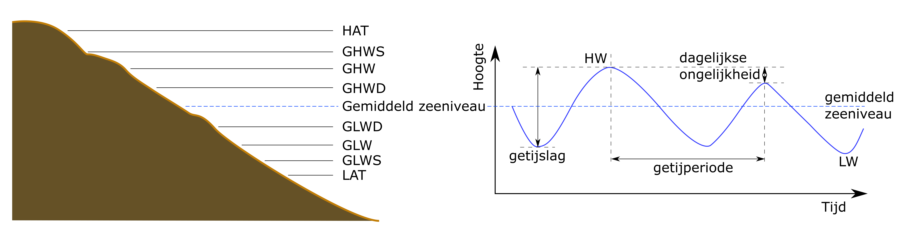
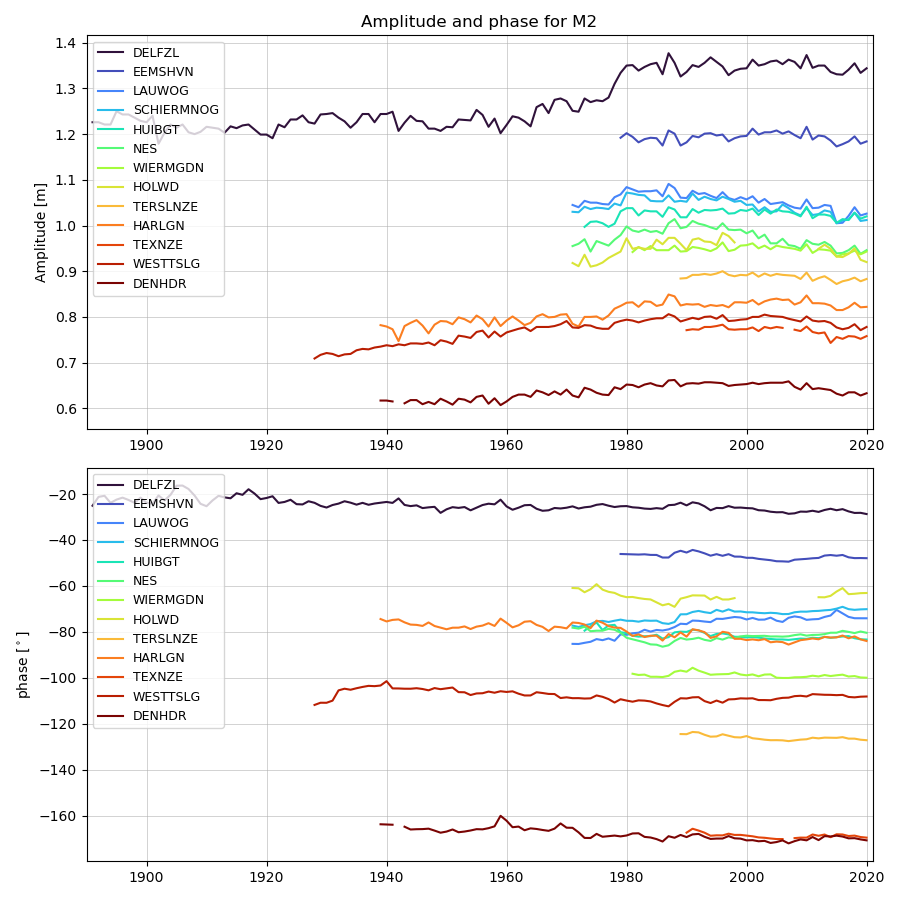
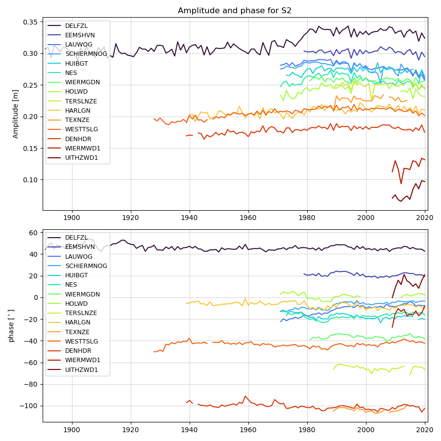
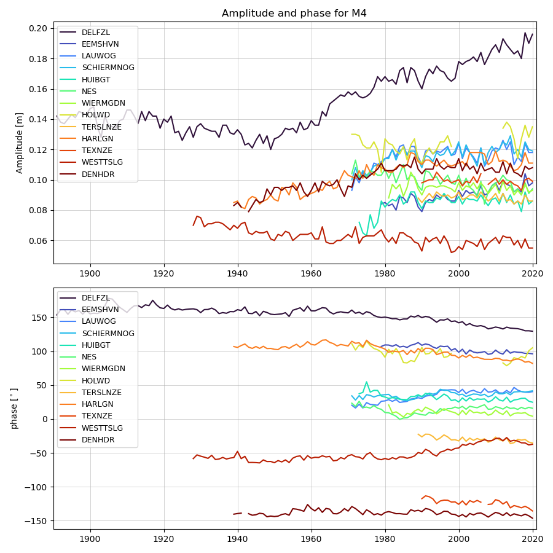
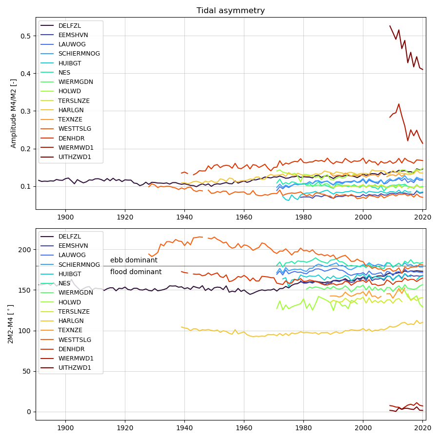
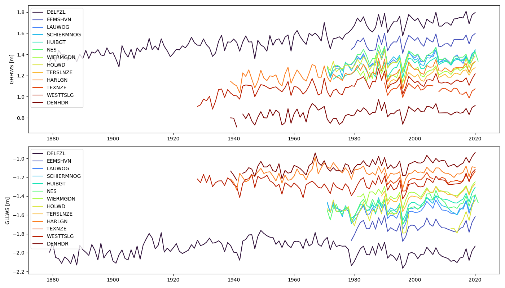
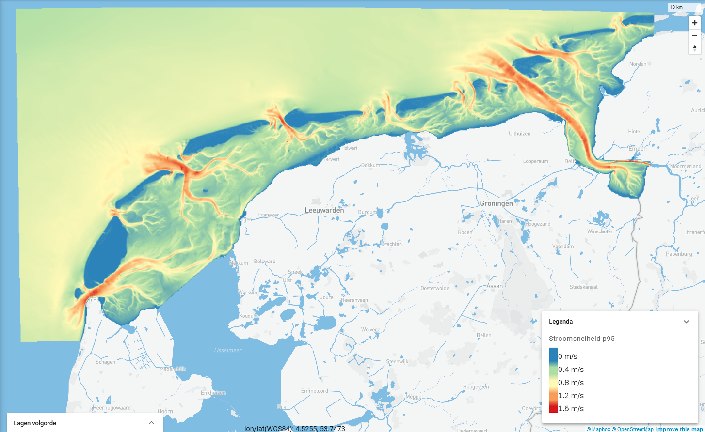
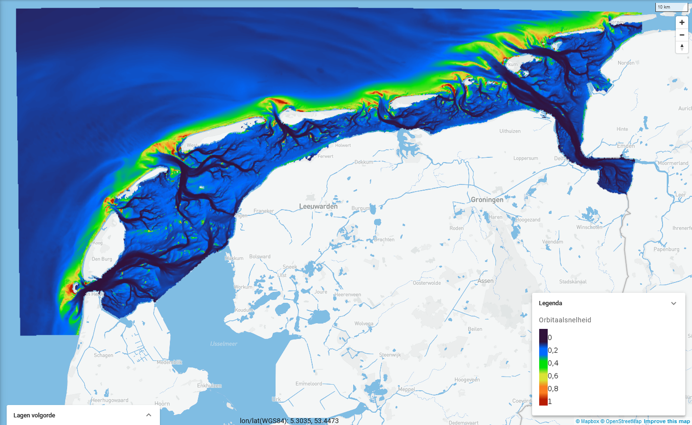

\newpage

# Hydrodynamiek {#hydro}

```{r setupWaterkwantiteit, include = FALSE}

theme_hy <- theme_bw()

alt_theme_hy <- theme_tufte() + theme(axis.line=element_line()) #+ 
    # scale_x_continuous(limits=c(10,35)) + scale_y_continuous(limits=c(0,400))

# plotly margins
m = list(
        l = 40,
        r = 40,
        b = 40,
        t = 50,
        pad = 0
      )
# plotly legend position
l = list(
        orientation = 'v',
        x = 0.05,
        y = 0.95
      )

require(magrittr)
```

## Afbakening, definitie en herkomst

**Belang**

Hydrodynamiek is sterk bepalend voor -en mede bepaald door- de morfologische en ecologische toestand en ontwikkeling van de Waddenzee. Waterstandsverschillen als gevolg van het getij drijven stromingen aan die voor grootschalig transport van sediment en nutriënten zorgen. Waterstanden bepalen ook de overstromings- of droogvalduur van wadplaten en kwelders, en daarmee welke soorten er wel of niet voor kunnen komen. Golven vergroten bodemschuifspanningen, vooral in ondiepe gebeiden. Daarmee beïnvloeden ze erosie en depositie van sediment, de concentraties van zwevende stof in de waterkolom (troebelheid), de korrelgrootteverdeling en verstoring van biota. Ook de hoeveelheid gespuid zoet water is, naast het directe effect op biota, mede bepalend voor de hydrodynamiek doordat het dichtheidsverschil tussen zoet en zout water stromingen aandrijft.

**Afbakening**

In dit hoofdstuk is de beschrijving van de hydrodynamiek beperkt tot de waterstanden (getij en zeespiegelstijging), golven en de grotere zoetwaterafvoeren. Deze parameters worden continu gemeten en de meetdata zijn goed ontsloten. Metingen van bijvoorbeeld stroomsnelheden zijn schaars en worden niet continu uitgevoerd. Daarom zijn deze (nog) niet opgenomen. Bovendien worden de stroomsnelheden sterk beïnvloed door de lokale bodemligging, waardoor ze minder goed gebruikt kunnen worden voor het volgen van trends. Veranderingen in stroomsnelheden op een bepaald punt zijn namelijk sterk gekoppeld aan lokale veranderingen in bodemligging. Ook debieten door de zeegaten zouden een informatieve indicator kunnen zijn, maar deze zijn evenmin consistent of recentelijk bemeten en daarom ook (nog) niet opgenomen.

**Databronnen**

Een overzicht van alle voor dit hoofdstuk gebruikte brondata en rekenmethoden is te vinden in Appendix \@ref(Appwaterstanden)

**Beschrijving opgenomen parameters**

De waterstanden in de Waddenzee worden voor een groot deel bepaald door het astronomisch getij. De waterstanden worden verder beïnvloed door de wind (zie hoofdstuk \@ref(wind)) en luchtdruk. Het astronomisch getij ontstaat door de aantrekkende kracht van de maan en de zon op de aarde. De variaties in het getij ontstaan door de draaiïng van de aarde, de positie van de aarde ten opzichte van de maan en de zon en doordat de maan en de aarde zich in een baan rond de zon bewegen. Daarnaast wordt het getij vervormd door de bodemligging van zeeën en oceanen. Wiskundig gezien kan het getij worden ontleed in groot aantal gesuperponeerde sinusvormige golven met verschillende amplitudes en frequenties: de getijcomponenten. Doordat deze een verschillende frequentie hebben onstaan periodieke variaties op verschillende tijdschalen. De M~2~-component ontstaat door de aantrekkingskracht van de maan en heeft in de Noordzee en de Waddenzee van alle getijcomponenten de grootste amplitude. De S~2~-component ontstaat door de aantrekkingskracht van de zon en door interactie met de M~2~-component ontstaat de springtij-doodtij cyclus per een periode van ongeveer 14 dagen. Andere belangrijke periodieke variaties in het getij zijn de zogeheten dagelijkse ongelijkheid (een gevolg van declinatie van de maan) en de 18,6-jarige cyclus (als gevolg van de hoek die de maan maakt met het equatorvlak van de aarde). Vanaf de zeegaten dringt het getij als een langgerekte golf de bekkens binnen. De geringer wordende diepte en de geometrie van het bekken vervormen het getij. Het getij wordt daardoor asymmetrisch, wat weer belangrijk is voor het residueel transport van zand en slib. De asymmetrie wordt vaak uitgedrukt met de verhouding en het faseverschil tussen de astronomische M~2~-component en de door geometrie bepaalde M~4~-component.

```{r getijVanRijn1994, fig.cap= "Getijdenniveaus plus waterbeweging in de tijd (eigen illustratie/Deltares 2022). LAT en HAT geven het laagste respectievelijk hoogste astronomisch getij aan. Meteorologische factoren kunnen tot nog lagere of nog hogere werkelijk optredende waterstanden leiden. GHWS is het gemiddeld hoogwater bij springtij, GHW het gemiddeld hoogwater en GHWD het gemiddeld hoogwater tijdens doodtij. Vergelijkbaar voor GLWD, GLW en GLWS. De getijslag geeft het verschil tussen GHW en GLW aan. De getijperiode, de tijd tussen twee hoogwaters, is voor alle stations 12 uur 25 minuten (dubbeldaags getij). " }

```

Figuur \@ref(fig:getijVanRijn1994) illustreert de samenhang tussen de verschillende karakteristieke afgeleide getijniveaus. Het Gemiddelde Hoog Water (GHW), Gemiddeld Hoog Hoogwater Spring (GHHWS), Gemiddelde Laag Water (GLW), Gemiddeld Laag Laagwater Spring (GLLWS) en de getijslag zijn relevant voor de ecologie en de morfologische ontwikkeling. De hoogteligging van wadplaten en de vegetatiegroei is afhankelijk van het niveau van hoogwater en droogvalduur. De getijslag laat zien hoe het getij zich voortplant in het bekken. Veranderingen in de getijslag door de tijd leiden tot veranderingen in de stroomsnelheden en de droogvalduur van het intergetijdengebied en hebben daarmee invloed op de morfologie en de ecologie.

In de Waddenzee wordt zoetwater gespuid, waarmee saliniteits- en dichtheidsverschillen tussen het zoute zeewater en het zoetwater ontstaan, die invloed hebben op de stroming en daarmee het sedimenttransport. Ook heeft de saliniteit (opgenomen in paragraaf \@ref(saliniteit)) van het Waddenwater direct invloed op de ecologie, omdat sommige soorten alleen zoutwater tolereren en anderen juist alleen zoetwater. Het spuien gebeurt zowel via grote als kleine spuisluizen. De drie grootste afvoerpunten zitten in de Afsluitdijk (Den Oever en Kornwerderzand) en bij het Lauwersmeer. De data van kleinere afvoeren wordt minder goed bijgehouden en/of ontsloten, waardoor velen daarvan in deze rapportage buiten beschouwing worden gelaten.

## Zeespiegelstijging {#zeespiegelstijging}

De jaargemiddelde waterstand voor de hoofdstations langs de Nederlandse kust zijn overgenomen uit de Zeespiegelmonitor (figuur \@ref(fig:zeespiegelstijging)). De zeespiegelstijging bij Delfzijl verloopt sneller dan bij Harlingen en Den Helder. Den Helder kent de langzaamste zeespiegelstijging.

(ref:zeespiegelstijgingLabel) Zeespiegel en predictie volgens het gebroken lineaire model waarbij gecorrigeerd is voor windopzet (GTSM) en nodaal getij. De trend is voor de 6 getijdestations afzonderlijk weergeven. De zeespiegel is uitgedrukt ten opzichte van post-2005 NAP. In de periode voor 1979 is gecorrigeerd voor een gemiddelde windopzet uit: [Zeespiegelmonitor 2023](https://pub.kennisbank.deltares.nl/Details/fullCatalogue/1000021208). 

```{r zeespiegelstijging, fig.cap='(ref:zeespiegelstijgingLabel)' }

knitr::include_graphics(path = "https://systeemrapportage.nl/zeespiegelmonitor/zeespiegelmonitor_files/figure-html/6stations-1.png")

```

In de Zeespiegelmonitor is de stijging van de zeespiegel nauwkeurig onderzocht en berekend. De berekening en aanvullende én interactieve figuren kunnen worden ingezien via de [Jupyter Notebook Zeespiegelmonitorberekening](https://nbviewer.jupyter.org/github/openearth/sealevel/blob/master/notebooks/dutch-sea-level-monitor.ipynb). De data voor figuur \@ref(fig:zeespiegelstijging) zijn verkregen via [PSMSL](https://psmsl.org/data/) als jaargemiddelde. Rijkswaterstaat levert elk jaar deze data na controle als maandgemiddelden en jaargemiddelden aan voor alle hoofdstations.

## Gemiddeld Hoogwater (GHW) {#gemiddeld-hoogwater-ghw}

De berekeningswijze van de Gemiddelde HoogWaterstanden is opgenomen in Appendix \@ref(Appwaterstanden). De locaties van de stations zijn te vinden in \@ref(fig:kaartAbiotieklocaties). 

```{r readExtremaData, cache=TRUE}

df.extrema <- read_delim(file.path(datadir, "RWS", "standard", paste0("extremaHLLL", "latest", ".csv")), delim = ";") %>%
  mutate(h = h * 100) # van meter naar cm

pad <- file.path(projectDataPath, mijnGebied, "RWS", "standard", paste0("extremaHLLL", "yearlyaverages.csv"))

# check
# df.extrema %>%
#   mutate(jaar = year(time)) %>%
#   group_by(jaar, locatie.naam, HL, status) %>%
#   summarize(n = n()) %>%
#   ggplot(aes(jaar, n)) +
#     geom_point(aes(color = status)) +
#   facet_wrap(~locatie.naam)

df.extrema.jaar <- df.extrema %>%
  mutate(jaar = year(time)) %>% 
  # group_by(locatie.naam) %>%
  # mutate(across(h, remove_outliers)) %>%
  group_by(locatie.naam, jaar, HL) %>% 
  summarise(
    jaargemiddelde = mean(h, na.rm = T),
    n = n()
    ) %>%
  group_by(locatie.naam, HL) %>% 
  mutate(
    `19jaargemiddelde` = zoo::rollmean(jaargemiddelde, 19, fill = NA)
    ) %T>%
  write_csv(pad)

```

```{r Hoogwaters, fig.height=6, fig.width=6, fig.cap='Jaargemiddeld hoogwater (GHW) per station (punten). De doorgetrokken lijn is het 19-jarig gemiddelde van de hoogwaters.'}

p <- df.extrema.jaar %>%
  filter(HL == "H") %>%
    ggplot() +
  geom_point(aes(x = jaar, y = jaargemiddelde, color = locatie.naam), size = 1) +
  geom_path(aes(x = jaar, y = `19jaargemiddelde`, color = locatie.naam), size = 1) +
  theme_hy +
  xlab("Jaar") + ylab("Jaargemiddeld gemeten hoogwater in cm")

if(knitr::is_html_output()){ggplotly(p)} else
  p

```

De GHW (figuur \@ref(fig:Hoogwaters)) laten een stijging zien over de getoonde periode en ruimtelijke verschillen over de Waddenzee. De getijslag neemt in oostwaartse richting langs de kust toe, en ook achtering de bekkens in de getijslag door opslingering hoger dan bij de zeegaten. De metingen bij Harlingen zijn beïnvloed door de afsluiting van de Zuiderzee in 1932, waardoor er in de trendlijn een sprong zou moeten worden toegevoegd.  


## Gemiddeld Laagwater (GLW) {#gemiddeld-laagwater-glw}

De berekeningswijze van de Gemiddelde Laag Waterstanden is vergelijkbaar met die van de GHW en opgenomen in Appendix \@ref(Appwaterstanden). De locaties van de stations zijn te vinden in \@ref(fig:kaartAbiotieklocaties). 

<!-- De meeste waterstandstations liggen in geulen, behalve Wierumerwad1 en Uithuizerwad1. Deze twee stations tonen een veel hoger gemeten laagwater omdat ze een gedeelte van de tijd droogvallen. -->

De Gemiddelde Laag Waterstanden (figuur \@ref(fig:Laagwaters)) variëren over de Waddenzee en laten voor de meeste stations ook een stijging zien. Daarnaast vallen enkele veranderingen in de tijd op waar de trendlijnen niet goed recht aan doen: Vooral het GLW te Harlingen is na de sluiting van de Zuiderzee begin jaren 1930 plotseling fors gedaald maar heeft sindsdien weer een licht stijgende trend. Ook West-Terschelling (eind jaren 1950) en Delfzijl (eind jaren 1970; aanleg Zeehavenkanaal) laten een vrij plotselinge daling zien die waarschijnlijk het gevolg is van geulverdieping of -verlegging.

```{r Laagwaters, fig.height=8, fig.width=8, fig.cap="Jaargemiddeld laagwater (GLW) per station (punten). De doorgetrokken lijn is het 19-jarig gemiddelde van de hoogwaters."}

p <- df.extrema.jaar %>%
  filter(HL == "L") %>%
    ggplot() +
  geom_point(aes(x = jaar, y = jaargemiddelde, color = locatie.naam), size = 1) +
  geom_path(aes(x = jaar, y = `19jaargemiddelde`, color = locatie.naam), size = 1) +
  theme_hy +
  xlab("Jaar") + ylab("Jaargemiddeld gemeten laagwater in cm")

if(knitr::is_html_output()){ggplotly(p, width = 700, height = 550)} else
  p

```

## Getijslag {#getijslag}
De berekeningswijze van de getijslag is het verschil tussen GHW en GLW (zie Appendix \@ref(Appwaterstanden)). De locaties van de stations zijn te vinden in \@ref(fig:kaartAbiotieklocaties). 

De getijslag (figuur \@ref(fig:getijslag)) laat zien dat er op sommige stations een dalende trend lijkt te zijn, terwijl op andere stations een stijgende trend in de data zit. 


```{r getijslag, fig.height=8, fig.width=8, fig.cap= 'Jaargemiddelde getijslag per station (punten). De doorgetrokken lijn is het 19-jarig gemiddelde van de hoogwaters.'}

p <- df.extrema.jaar %>%
  pivot_wider(id_cols = c(locatie.naam, jaar), names_from = HL, values_from = jaargemiddelde) %>%
  mutate(`getijslag in cm` = H-L) %>% 
  arrange(jaar) %>%
  group_by(locatie.naam) %>% 
  mutate(
    `19jaargemiddelde` = zoo::rollmean(`getijslag in cm`, 19, fill = NA)
  ) %>%
ggplot() +
  geom_point(aes(jaar, `getijslag in cm`, color = locatie.naam), size = 1) +
  geom_line(aes(jaar, `19jaargemiddelde`, color = locatie.naam), size = 1) +
  theme_hy

if(knitr::is_html_output()){ggplotly(p, height = 550, width = 700)} else
  p

```

Figuur \@ref(fig:kaartGetijslag) geeft de gemiddelde getijslag over 2011-2020 weer op de kaart van de Waddenzee. De figuur toont dat de getijslag toeneemt van west naar oost, en dat bij Delfzijl de getijslag het grootst is, door opslingering van het getij in het Eems-estuarium. 

<!-- De meeste waterstandstations liggen in geulen, behalve Wierumerwad1 en Uithuizerwad1. Deze twee stations tonen een kleinere getijslag omdat ze een gedeelte van de tijd droogvallen. -->


(ref:kaartGetijslagLabel) Gemiddelde getijslag per station over het meest recente jaar waar volledige gegevens beschikbaar zijn (`r endyear`).

```{r kaartGetijslag, fig.height=6, fig.width=8, fig.cap="(ref:kaartGetijslagLabel)"}

metadata <- read_delim(file.path(datadir, "ddl/metadata/Wadden_metadata.csv"),delim = ";") %>%
  distinct(locatie.naam, x, y)

gemGetijslag <- df.extrema.jaar %>%
  filter(jaar == endyear) %>%
  pivot_wider(id_cols = c(locatie.naam, jaar), names_from = HL, values_from = jaargemiddelde) %>%
  mutate(`getijslag in cm` = H-L) %>% 
  ungroup() %>%
  group_by(locatie.naam) %>% 
  summarize(`gemiddelde getijslag in cm` = mean(`getijslag in cm`, na.rm = T)) %>%
  ungroup() %>%
  left_join(metadata, by = c(locatie.naam = "locatie.naam")) %>%
  sf::st_as_sf(coords = c("x", "y"), crs = 25831) %>%
  st_transform(4326) 

pal <- colorNumeric(
  palette = "viridis",
  domain = gemGetijslag$`gemiddelde getijslag in cm`)


leaflet(gemGetijslag) %>%
  addTiles('http://{s}.tile.openstreetmap.org/{z}/{x}/{y}.png') %>% 
  addCircleMarkers(radius = 7, 
                   label = ~paste(locatie.naam, ", gemiddelde getijslag =", trunc(`gemiddelde getijslag in cm`), "cm"), 
                   color = ~ pal(`gemiddelde getijslag in cm`),
                   labelOptions = labelOptions(textsize = 12)) %>%
  leaflet::addLegend(pal = pal, values = gemGetijslag$`gemiddelde getijslag in cm`, position = 'bottomright')

```

## Getijcomponenten en -asymmetrie

De M~2~-component van het getij heeft de grootste amplitude en ontstaat door aantrekkingskracht van de maan. De S~2~-component wordt veroorzaakt door de aantrekkingskracht van de zon en vormt met de M~2~ component de springtij-doodtij cyclus. De M~4~-component is een hogere harmonische component en een ondiepwatereffect van M~2~ (i.e. harmonische boventoon / veelvoud van M~2~). Ondiepwatereffecten ontstaat doordat de getijgolf sneller voorplant in hoogwater dan in laagwater.

De M~4~/M~2~ amplitudeverhouding en het relatief faseverschil $2 \phi M_{2} - \phi M_{4}$ kunnen worden gebruikt voor de kwantificatie van de getijasymmetrie die belangrijk is voor het netto sedimenttransport [Friedrichs en Aubrey, 1988](https://doi.org/10.1016/0272-7714(88)90082-0). Het relatieve faseverschil bepaalt de aard van de asymmetrie: de pieksnelheid is vloeddominant als het tussen 0 en 180 graden is en ebdominant als het tussen 180 en 360 graden is. De grootte van de amplitudeverhouding (M~4~/M~2~) is een indicator voor de sterkte van de asymmetrie.

```{r tsM2, fig.cap="Amplitude en fase van de M~2~-component voor alle stations"}

path = file.path(datadir, "ddl", "calculated", "tidal_asymmetry", "ts_M2.png")
invisible(file.copy(path, "images/ts_M2.png", overwrite = T))


```

```{r tsS2, fig.cap="Amplitude en fase van de S~2~-component voor alle stations"}
path = file.path(datadir, "ddl", "calculated", "tidal_asymmetry", "ts_S2.png")
invisible(file.copy(path, "images/ts_S2.png", overwrite = T))

```

```{r tsM4, fig.cap="Amplitude en fase van de M~4~-component voor alle stations"}

path = file.path(datadir, "ddl", "calculated", "tidal_asymmetry", "ts_M4.png")
invisible(file.copy(path, "images/ts_M4.png", overwrite = T))

```

```{r M4divM2, fig.cap="Amplitude en fase van de mate van getij-asymmetrie M~4~/M~2~ en het relatieve faseverschil 2M2-M4 voor alle stations"}

path = file.path(datadir, "ddl", "calculated", "tidal_asymmetry", "ts_M4divM2.png")
invisible(file.copy(path, "images/ts_M4divM2.png", overwrite = T))


```

## Gemiddeld Laag LaagWater en Gemiddeld Hoog HoogWater bij Springtij (GLLWS & GHHWS) {#gllws-ghhws}

Gemiddeld Laag Laagwater (GLLWS) en Gemiddeld Hoog Hoogwater (GHHWS) geven aan hoe sterk het getij doordringt in het getijbekken, en wat onder normale omstandigheden de maximale getijamplitude is. Deze kenmerkende waterstanden worden berekend als de maandminima en -maxima van het berekend getij per station. Het berekend getij wordt bepaald uit de getijcomponenten, zie Appendix \@ref(getijcomponentenmethode). Hierdoor reageren GLLWS en GHHWS wel op veranderingen in het systeem, zoals ver(on)diepingen maar niet op meteorologische invloeden. Figuur \@ref(fig:GLLWGHHW) laat zien dat GHHWS met ruim 30 centimeter over meer dan een eeuw toegenomen is bij Delfzijl, met een plotseling grotere toename in de jaren '70. Voor andere stations zijn de tijdreeksen korter en is een toename minder duidelijk of afwezig. Voor Delfzijl is de GLLWS, na een kleine toename in het begin van de twintigste eeuw, in de jaren '70 enkele centimeters lager geworden. GLLWS laat voor geen van de andere stations een duidelijke trend zien.

```{r, GLLWGHHW, fig.cap="Gemiddeld hoog hoogwater (boven) en gemiddeld laag laagwater (onder) voor stations in de Waddenzee berekend met hatyan op basis van DataDistributieLaag waterhoogten gedownload in juli 2022. "}

path = file.path(datadir, "ddl", "calculated", "tidal_indicators", "GHHWS_GLLWS_10min.png")

invisible(file.copy(path, "images/GHHWS_GLLWS_10min.png", overwrite = T))


```

## Stormopzet en stormvloedhoogte {#waterhoogte-bij-storm}

Waterstanden tijdens events geven inzicht hoeveel krachtige stormen er zijn opgetreden per jaar. Er worden twee parameters opgenomen als indicator: de stormopzet of -afzet (excl. getij) en de stormvloedhoogte (incl. getij). De laatste geeft ook de afhankelijkheid weer van het moment in de getijfase dat een storm optreedt.

Als maat voor stormen wordt het 99,5-percentiel per jaar getoond, wat overeen komt met bijna 2 dagen. In combinatie met het jaarmaximum geeft dit goed inzicht in de meest energetische condities per jaar.

De definities en rekenmethoden van de hier gebruikte indicatoren zijn terug te vinden in Appendix \@ref(Appwaterstanden).

Figuur \@ref(fig:wateropzet) laat de variatie van de opzet in de tijd zien. Er zijn geen duidelijke trends waar te nemen. De locaties van de stations zijn te vinden in \@ref(fig:kaartAbiotieklocaties).


```{r wateropzet, fig.cap= "Maandelijks 99,5-percentiel voor opzet = gemeten waterstand - astronomische waterstand (rode lijn) en het jaarlijks maximum van de opzet (grijs streepje).", fig.height=30, fig.width=8}

monthlyStat  <- read_delim(file.path(datadir, "ddl", "standard", paste0("monthlyStatWaterhoogte", "2021-07-28", ".csv")), delim = ";")

# plot per year based on monthly statistics
monthlyStat %>% 
  drop_na() %>%  # filter NA en -inf waarden
  mutate(jaar = year(datum)) %>%
  group_by(station, jaar) %>% mutate(jaarmaximum = max(max, na.rm = T), n = n()) %>% ungroup() %>%
  filter(n > 11, ) %>%  # filter incomplete jaren
  complete(station, datum, fill = list(max = NA, p95 = NA)) %>% # stop weer NA's tussen de ontbrekende regels om lijnen af te breken bij ontbrekende data
  ggplot(aes(x = datum)) +
  geom_line(aes(y = p995, color = "p99,5 per maand"), size = 0.5) +
  # geom_line(aes(y = p005, color = "p0,005 per maand"), size = 0.5) +
  geom_point(aes(y = jaarmaximum,  color = "maximum per jaar"), shape = "-", size = 1) +
  # geom_smooth(method = "lm", formula = y ~ 1, aes(group = jaar, color = "jaargemiddelde p99,5 per maand")) +
  # coord_cartesian(ylim = c(0, 450)) +
  scale_x_date(breaks = seq(as.Date("1970-01-01"), as.Date("2021-12-31"), by = "5 year"), 
               minor_breaks = "1 year",
               date_labels = "%Y") +
  facet_wrap(~ station, ncol =1, scales = "free") +
  theme_hy +
  theme(legend.position = "bottom",
        strip.text.y = element_text(angle = 0)) +
  ylab("Waterhoogte in cm") +
  coord_cartesian(xlim = c(as.Date("1970-01-01"), as.Date("2022-01-01")), ylim = c(-20, NA)) +
      scale_colour_manual(name = "",
                        values = c("p99,5 per maand" = "red", 
                                   "maximum per jaar" = "black"))

```

Figuur \@ref(fig:stormhoogte) laat de variatie van stormhoogte in de tijd zien. De locaties van de stations zijn te vinden in figuur \@ref(fig:kaartAbiotieklocaties). De piek in het jaar 1953 is duidelijk zichtbaar voor de stations Den Helder en Harlingen. Het begin van de jaren '90 kent relatief hoge waarden. De stormhoogte te Delfzijl is sinds begin jaren '70 zelden meer lager dan 200 cm, terwijl dat daarvoor wel vaak het geval was.

```{r stormhoogte, fig.cap="Tijdserie van stormhoogte, berekend als 99,5-percentiel van de gemeten waterhoogte per jaar.", fig.width=10, fig.height=5}

yearlyStat <-  read_delim(file.path(datadir, "ddl", "standard", paste0("yearlyStatWaterhoogte", "2021-07-28", ".csv")), delim = ";")

labelpositions <-
  yearlyStat %>% group_by(station) %>% 
  summarize(y = mean(p995)) %>% 
  mutate(x = 3*row_number()) 

# hist(yearlyStat$p95, breaks = 100)

# plot per year based on monthly statistics
p<- yearlyStat %>%
  drop_na() %>%
  filter(station != "Eemshaven" | year != 1978) %>%
  complete(station, year, fill = list(p995 = NA, max = NA)) %>%
  mutate(station = factor(station)) %>%
  mutate(station = fct_reorder(station, p95)) %>%
ggplot(aes(year, p995)) +
  geom_line(aes(color = station), size = 0.5) +
  # geom_label(data = labelpositions, aes(x = 1970 + x, y = y, label = station), size = 3) +
  theme_hy +
  theme(
    strip.text.y = element_text(angle = 0)) +
  xlab("Jaar") + ylab("99,5-percentiel van gemeten waterhoogte (cm) per jaar")

  if(knitr::is_html_output()){ggplotly(p, height = 550)} else
    p
```

Het maximum van alle 99,5-percentielen voor de verschillende jaren in de tijdreeks is ook op de kaart ingetekend (figuur \@ref(fig:kaartjeMaximaleStormhoogte)). Bij Harlingen en Delfzijl zijn de grootste waarden gemeten, dat zijn de pieken rond 1960 uit figuur \@ref(fig:stormhoogte). Maar ook in recentere jaren treden de maximale stormhoogtes op bij Harlingen en Delfzijl, vanwege hun ligging achterin de bekkens.

```{r kaartjeMaximaleStormhoogte, fig.cap="Kaart met de maximale waarden van het 99,5 percentiel door de jaren. "}

pal <- colorNumeric(
  palette = "viridis",
  domain = yearlyStat$p995)

metadata <- read_delim(file.path(datadir, "ddl/metadata/Wadden_metadata.csv"),delim = ";") %>%
  distinct(locatie.naam, x, y)
yearlyStat %>% group_by(station) %>%
  summarize(`maximum p99,5 waterstand` = max(p995, na.rm = T)) %>%
  left_join(metadata, by = c(station = "locatie.naam")) %>%
  sf::st_as_sf(coords = c("x", "y"), crs = 25831) %>%
  st_transform(4326) %>%
  leaflet() %>%
  addTiles('http://{s}.tile.openstreetmap.org/{z}/{x}/{y}.png') %>% 
  addCircleMarkers(radius = 7, label = ~paste(station, ", maximum =", `maximum p99,5 waterstand`), color = ~ pal(`maximum p99,5 waterstand`)) %>%
  leaflet::addLegend(pal = pal, values = yearlyStat$p995)

```

## Golfhoogte {#golfhoogte}

Het 95-percentiel van de significante golfhoogte per jaar geeft de variatie van hoge golven tussen de jaren weer (figuur \@ref(fig:golfhoogte95perc)). Alleen voor de stations Schiermonnikoog Noord en Eierlandse Gat zijn langere complete tijdseries beschikbaar. De patronen van deze twee locaties zijn ongeveer gelijkvormig. In 2007 en 2011 lag het 95-percentiel hoger dan gemiddeld.

```{r leesGolfData, cache=TRUE}
golf.df <- "golven2021-07-08.csv"
golf.pad <- file.path(datadir, "ddl", "standard")
gdf <- read_delim(file.path(golf.pad, golf.df), delim = ";")
```


```{r golfhoogte95perc, fig.cap="Tijdserie van jaarlijks 95-percentiel van de significante golfhoogte in het spectrale domein Oppervlaktewater golffrequentie tussen 30 en 500 mHz in cm. Alleen jaren met metingen in alle maanden zijn meegenomen in de het berekenen van het percentiel. NB De stations Uithuizerwad1 en Wierumerwad1 liggen hoog, op bij laag water droogvallende gebieden, waardoor de golfhoogte substantieel lager is dan bij andere stations (geen meetfout).", fig.height=4, fig.width=10}

param = "Significante golfhoogte in het spectrale domein Oppervlaktewater golffrequentie tussen 30 en 500 mHz in cm"

plotlocaties <- gdf %>% ungroup() %>%
  filter(parameter.wat.omschrijving == param) %>%
  group_by(locatie.naam, jaar) %>% summarize(n_maanden = n(), yearly_perc95 = mean(yearly_perc95)) %>% 
  filter(n_maanden == 12) %>%
  group_by(locatie.naam) %>% 
  summarize(mean = mean(yearly_perc95)) %>%
  arrange(-mean) %>% select(locatie.naam) %>%  unlist %>% unname
  
gdf %>% 
  filter(parameter.wat.omschrijving == param, locatie.naam %in% plotlocaties) %>%
  # group_by(locatie.naam, jaar) %>% mutate(n_maanden = n()) %>% 
  group_by(locatie.naam, jaar, parameter.wat.omschrijving) %>%
  summarize(n_maanden = n(), `95-percentiel per jaar in cm` = mean(yearly_perc95)) %>%
  filter(n_maanden == 12) %>%
  # group_by(locatie.naam) %>% mutate(`aantal jaren` = n()) %>% 
  mutate(locatie.naam = factor(locatie.naam, levels = plotlocaties)) %>%
  # mutate(locatie.naam = fct_reorder(locatie.naam, `95-percentiel per jaar in cm`)) %>%
  ggplot(aes(jaar, `95-percentiel per jaar in cm`)) +
  geom_line(aes(color = locatie.naam), size = 1) +
  scale_x_continuous(breaks = pretty_breaks()) +
  theme_hy
```

De afwijking van maandgemiddelde golfhoogte ten opzichte van het langjarig gemiddelde is een maat voor de seizoensdynamiek (zie berekeningswijze in Appendix \@ref(Appgolfhoogte)). In figuur \@ref(fig:golfanomalie) is dit uitgezet voor alle stations. Te zien is dat er in de winter over het algemeen hogere golven zijn dan in de zomer. In Uithuizerwad en Wieringerwad is dit niet zichtbaar. Dit zijn zeer beschutte locaties zonder hoge golven. Uit de langjarige series bij Schiermonnikoog Noord en Eierlandse Gat is ook de variatie van de seizoensdynamiek in de tijd te zien, maar er lijkt geen duidelijke trend te zijn. Tussen de maanden en jaren zitten flinke fluctuaties.

```{r golfanomalie, fig.height=15, fig.width = 8, fig.cap="Afwijking maandgemiddeld t.o.v. langjarig gemiddelde, als maat voor seizoensdynamiek. Verschillende jaren weergeven als stippen met kleurverloop (oude jaren blauw en naar heden toe verkleurend naar rood). De blauwe doorgetrokken lijn geeft het gemiddelde voor alle beschikbare jaren. "}

labels = tibble(bind_cols(x = 1:12, y = month.abb))

gdf %>% 
  filter(parameter.wat.omschrijving == "Significante golfhoogte in het spectrale domein Oppervlaktewater golffrequentie tussen 30 en 500 mHz in cm") %>%
  group_by(locatie.naam, jaar) %>% mutate(n_maanden = n()) %>% 
  filter(n_maanden == 12) %>%
  mutate(locatie.naam = factor(locatie.naam)) %>%
  mutate(locatie.naam = fct_reorder(locatie.naam, yearly_perc95)) %>% # ordening naar p95 golfhoogte voor grafiek
  group_by(locatie.naam) %>% mutate(`langjarig gemiddelde` = mean(maandgemiddelde)) %>% ungroup() %>%
  group_by(locatie.naam, jaar, maand, parameter.wat.omschrijving) %>% 
  summarize(anomalie = maandgemiddelde - `langjarig gemiddelde`) %>% ungroup() %>%
  # mutate(datum = ymd(paste(as.character(jaar), as.character(maand), "15"))) %>%
  ggplot(aes(maand, anomalie)) +
  geom_point(aes(color = jaar), size = 2, alpha = 0.3) +
  geom_text(data = labels, aes(x = x, y = -100, label = y), size = 3.5) +
  geom_smooth(aes(), alpha = 0.5, method = "loess", se = F, size = 2) +
  scale_color_gradient2(low = "blue", high = "red", mid = "blue",  midpoint = 1995) +
  facet_wrap( ~ locatie.naam, ncol = 2) +
  scale_x_continuous(breaks = 1:12, labels = NULL) +
  theme_hy +
  theme(legend.position = "bottom")
```

## Stroming
De stroming is sterk bepalend voor zowel de abiotische (morfologische) als de biotische ontwikkeling. In gebieden met hogere stroomsnelheden treedt meer morfodynamiek op, terwijl in rustiger gebieden meer geleidelijke sedimentatie plaatsvindt. Sommige soorten prefereren deze dynamiek en een ruim aanbod van vers water, terwijl andere juist goed gedijen bij rustiger omstandigheden.

Het is belangrijk om te realiseren dat de hier weergegeven stroomsnelheden geen gemeten data betreft maar gebaseerd is op modelbewerkingen die ook gebruikt zijn voor het maken van de huidige ecotopenkaarten. Hoewel geen gemeten data, zijn deze stroomsnelheden op verzoek van veel gebruikers toch opgenomen in de digtiale systeemrapportage omdat ze een goed eerste inzicht in de ruimtelijke verdeling van stroomsnelheden geven, welke voor veel ecologische en morfologische processen van belang is. Voor sommige toepassingen is het tijdsgemiddelde indicatief, in andere gevallen juist de meer extreem hoge of lage waarden. Daarom zijn er zijn drie verschillende kaarten beschikbaar via de Waddenviewer: de 5%, 50% en de 95% overschrijdingswaarden. Absolute minima en maxima treden gedurende zo'n korte tijd op dat deze óf niet beperkend zijn voor de biotiek óf het gevolg van kunstmatige extremen door numerieke processen bij bijvoorbeeld het onderlopen of droogvallen van platen.

Hieronder zijn de p95 (dus gedurende 95% van de tijd overschreden, vrijwel maximale) diepte-gemiddelde stroomsnelheden gepresenteerd, bepaald over twee springtij-doodtij periodes van 3 februari tot 4 maart 2019. De gebruikte bodemligging is gelijk aan die in de Ecotopenkaart (opnames tussen 2018-2021 voor de verschillende gebieden) en wijkt daarmee iets af van de Baseline data. De hoogste stroomsnelheden (\> 1m/s) treden uiteraard op in de zeegaten en de hoofdgeulen. De laagste maxima treden op bij de kwelders langs de vastelandskust (Koehaol-Lauwersmeer en Pieterburen-Eemshaven), het westen van de Aflsuitdijk en Balgzand.
Door de resolutie van het model (100x100 m) zijn de stroomsnelheden in kleine geulen niet accuraat.

Deze kaarten zijn in meer detail te bekijken en downloaden via de Waddenviewer van [Datahuis Wadden](https://viewer.openearth.nl/wadden-viewer/?layers=154102708,154102711,154102715&layerNames=Stroomsnelheid%20p05,Stroomsnelheid%20p50,Stroomsnelheid%20p95&folders=93790295,93793330,93793344,93795018,154102245).

Voor details van het gebruikte Dutch Wadden Sea Model (DWSM) en de berekeningswijze wordt verwezen naar Van Weerdenburg (2022) [download](https://publicwiki.deltares.nl/download/attachments/137135283/11208040-011-ZKS-0001_v1.0-Modelparameters%20Ecotopenkaart%20Waddenzee%202022%20%28definitief%29.pdf?version=1&modificationDate=1670514304038&api=v2).

```{r ecotopenStroming, fig.cap="Kaart van de gedurende 95% van de tijd overschreden, dus vrijwel maximale, diepte-gemiddelde stroomsnelheid afkomstig uit modelberekeningen gebruikt voor de Ecotopenkaart."}

```

## Orbitaalsnelheid
De orbitaalsnelheid aan de bodem heeft een vergelijkbare invloed als de stroomsnelheid: een hogere snelheid betekent meer dynamiek. Echter, waar hoge stroomsnelheden vooral optreden in de geulen en vooral het gevolg zijn van het getij, komen hoge orbitaalsnelheden aan de bodem juist ook voor in ondiepe gebieden en vooral in meteorologisch dynamische periodes (stormen). Gebieden met hogere orbitaalsnelheden zijn zandiger -slib kan immers niet bezinken en wordt naar elders getransporteerd- en kennen andere biota dan rustiger gebieden. De voor biota optimale orbitaalsnelheid verschilt per soort. 

Het is belangrijk om te realiseren dat de hier weergegeven representatieve orbitaalsnelheden geen gemeten data betreft maar gebaseerd is op modelbewerkingen die ook gebruikt zijn voor het maken van de huidige ecotopenkaarten. Hoewel geen gemeten data, zijn deze orbitaalsnelheden op verzoek van veel gebruikers toch opgenomen in de DSR. 

Hieronder zijn de rms (root-mean-square) orbitaalsnelheden aan de bodem gepresenteerd, bepaald over elk uur in de maand maart 2020. De daarbij gebruikte bodemligging is gelijk aan die in de Ecotopenkaart (opnames tussen 2018-2021 voor de verschillende gebieden) en wijkt daarmee iets af van de Baseline data. Omdat de orbitaalsnelheid niet direct door het SWAN-Kuststrookmodel berekend wordt, is deze per roostercel berekend uit de waterdiepte, de golfamplitude en de golfperiode middels lineaire golftheorie. Hierbij zijn alleen windgolven meegenomen welke dominant zijn in de Waddenzee, niet de swell die vooral een rol speelt op de Noordzee. 

De hoogste orbitaalsnelheden treden uiteraard op direct zeewaarts van de eilanden. De laagste waarden treden op in de geulen; deze zijn immers diep. Vooral in de westelijke Waddenzee treden op de platen ook wat hogere orbitaalsnelheden op, net als op de Friese kwelders. 

De orbitaalsnelheden zijn in detail te bekijken en downloaden via de Waddenviewer van [Datahuis Wadden](https://viewer.openearth.nl/wadden-viewer/?layers=154102470&layerNames=Orbitaalsnelheid&folders=93790295,154102245). 

Voor details van het gebruikte SWAN-Kuststrookmodel en de berekeningswijze wordt verwezen naar Van Weerdenburg (2022) [download](https://publicwiki.deltares.nl/download/attachments/137135283/11208040-011-ZKS-0001_v1.0-Modelparameters%20Ecotopenkaart%20Waddenzee%202022%20%28definitief%29.pdf?version=1&modificationDate=1670514304038&api=v2).

```{r ecotopenkaartOrbitaal, fig.cap="Kaart van de gedurende 95% van de tijd overschreden, dus vrijwel maximale, diepte-gemiddelde stroomsnelheid afkomstig uit modelberekeningen gebruikt voor de Ecotopenkaart."}

```


## Golfperiode {#golfperiode}

De golfperiode is samen met de golfhoogte van belang voor de orbitaalsnelheden. De orbitaalsnelheden worden gebruikt bij het opstellen van de ecotopenkaart en geven aan hoe dynamisch een bepaald gebied is. Ook bepalen orbitaalsnelheden samen met de stroomsnelheden van het getij hoeveel zand en slib er kan eroderen en sedimenteren.

Figuur \@ref(fig:plotGolfperiode) toont de tijdserie van de golfperiode T~M02~ (in seconden), dat is de gemiddelde golfperiode van alle golven zoals bepaald uit het golfspectrum, als individuele blauwe punten. De rode stippen geven het 95-percentiel van de golfperiode T~M02~ per jaar. Er zijn enkele abrupte veranderingen in golfperiode te zien, die waarschijnlijk te wijten zijn aan verandering van de instellingen van de meetapparatuur en/of meetfouten. Ook veranderingen in de lokale morfologie kunnen ertoe leiden dat een station meer geexponeerd of juist beschut komt te liggen. Dit geldt vooral voor de stations in de Waddenzee.

```{r readGolfperiodeData}
path = file.path(datadir, "ddl", "standard", paste0("golfperiode", "2021-07-16", ".Rdata"))
load(path)
```

```{r plotGolfperiode, fig.height=20, fig.width=10, fig.cap = "Tijdserie van 95-percentiel van de golfperiode T~M02~ per jaar (in seconden), incl metingen als losse puntjes. De metingen in deze figuur zijn een sample uit alle data (n = 100000 uit totaal van 10 miljoen datapunten)."}

df_all %>% sample_n(100000) %>%            #group_by(locatie.naam) %>% summarize(n = n())
  filter( numeriekewaarde < 9999) %>%
  ggplot() +
  geom_point(aes(tijdstip, numeriekewaarde, color = "metingen"), size = 0.5) +
  geom_point(data = df_all %>% distinct(locatie.naam, jaar, yearly_perc95), aes(ymd_hms(paste0(jaar, "-06-01 00:00:00")), yearly_perc95, color = "p95 per jaar")) +
  facet_wrap(~ locatie.naam, ncol =2, scales = "free") +
  theme_hy +
  theme(legend.position = "bottom",
        strip.text.y = element_text(angle = 0)) +
  coord_cartesian(xlim = c(ymd_hm("1979-01-01 00:00"), ymd_hm("2021-01-01 00:00")), ylim = c(0, 15)) +
  scale_colour_manual(name = "",
                      values = c("p95 per jaar" = "red", 
                                 "metingen" = "blue"))
```

```{r cleanupgolfdata}
rm(df_all)
```

## Zoetwaterafvoeren {#zoetwaterafvoeren}

De zoetwaterafvoer leidt tot saliniteits- en dichtheidsverschillen tussen het zoute zeewater en het zoetwater, die invloed hebben op de stroming en daarmee het sedimenttransport. Ook heeft de saliniteit (opgenomen in hoofdstuk \@ref(Waterkwaliteit)) van het Waddenwater direct invloed op de ecologie, omdat sommige soorten alleen zoutwater tolereren en anderen juist alleen zoetwater. Het spuien gebeurt zowel via grote als kleine spuisluizen.


```{r kaartAfvoerLocaties, fig.cap = "Locaties van alle gerapporteerde afvoeren."}

url2 <- "https://datahuiswadden.openearth.nl/geoserver/zoetwaterafvoeren/ows?service=WFS&version=1.0.0&request=GetFeature&typeName=zoetwaterafvoeren%3Aafvoeren_rijkswateren_location&outputFormat=application%2Fjson"
RWSlocations <- sf::st_read(url2, quiet = T) %>%
  sf::st_transform(4326)

EmsLocations <- st_read("https://datahuiswadden.openearth.nl/geoserver/zoetwaterafvoeren/ows?service=WFS&version=1.0.0&request=GetFeature&typeName=zoetwaterafvoeren%3Aems_discharge_bewerkt_location&outputFormat=application/json", quiet = T) %>%
  filter(locatie.origineel == "q_hebrum_berekend_m3_s") %>%
  sf::st_transform(4326)

LedaLocations <- st_read("https://datahuiswadden.openearth.nl/geoserver/zoetwaterafvoeren/ows?service=WFS&version=1.0.0&request=GetFeature&typeName=zoetwaterafvoeren%3Aleda_discharge_bewerkt_location&outputFormat=application/json", quiet = T)%>%
  filter(locatie.origineel == "qo_leer_leda_m_3_s") %>%
  sf::st_transform(4326)

NoorderzijlvestLocations <- st_read("https://datahuiswadden.openearth.nl/geoserver/zoetwaterafvoeren/ows?service=WFS&version=1.0.0&request=GetFeature&typeName=zoetwaterafvoeren%3Anoorderzijlvest_location&outputFormat=application/json", quiet = T)%>%
  sf::st_transform(4326)

frieslandLocations <- sf::st_read("https://datahuiswadden.openearth.nl/geoserver/zoetwaterafvoeren/ows?service=WFS&version=1.0.0&request=GetFeature&typeName=zoetwaterafvoeren%3Afriesland_location&outputFormat=application/json", quiet = T) %>%
  sf::st_transform(4326)

hhnkLocations <- sf::st_read("https://datahuiswadden.openearth.nl/geoserver/zoetwaterafvoeren/ows?service=WFS&version=1.0.0&request=GetFeature&typeName=zoetwaterafvoeren%3Ahhnk_location&outputFormat=application/json", quiet = T) %>%
  sf::st_transform(4326)

hunzeLocations <- sf::st_read("https://datahuiswadden.openearth.nl/geoserver/zoetwaterafvoeren/ows?service=WFS&version=1.0.0&request=GetFeature&typeName=zoetwaterafvoeren%3Ahunzeenaas_location&outputFormat=application/json", quiet = T) %>%
  sf::st_transform(4326)

hunzeLocations$locatie.origineel <- as.character(hunzeLocations$locatie.origineel)

allLocations <- list(RWSlocations, EmsLocations, LedaLocations, frieslandLocations, NoorderzijlvestLocations, hhnkLocations, hunzeLocations) %>%
  bind_rows() %>%
  mutate(gebied = as.factor(gebied))
  
# allLocations <- do.call(bind_rows, allLocationsList)

pal <- leaflet::colorFactor("Accent", allLocations$gebied)

map <- leaflet(allLocations) %>% 
  addTiles('http://{s}.tile.openstreetmap.org/{z}/{x}/{y}.png', group = "OSM") %>% 
  addCircleMarkers(
    fillColor = ~pal(gebied), 
    stroke = F, 
    fillOpacity = 1,
    label = ~locatie.naam, 
    labelOptions = labelOptions(noHide = T, textOnly = T)
  ) %>%
  leaflet::addLegend(
    position = "bottomright", 
    pal = pal, 
    values = ~gebied,
    title = "Gebieden",
    opacity = 1
  )

map

```

### Rijkswateren - IJsselmeer en Lauwersmeer

De data van de grootste afvoeren vanuit Rijkswateren (Den Oever, Kornwerderzand, Lauwersoog) zijn ontsloten door Rijkswaterstaat en worden hier getoond. De afvoeren bij Den Oever en Kornwerderzand worden beïnvloed door het peilbeheer in het IJsselmeer. Daarom worden ook zomer- en wintergemiddelde afvoeren gevisualiseerd.

De daggemiddelde waarden van de afvoeren (grijze punten in figuur \@ref(fig:jaargemiddeldeAfvoer)) laten de sterke fluctuaties in afvoeren zien. Er treden pieken op tot boven de 2000 m^3^/s bij Den Oever en 1500 m^3^/s bij Kornwerderzand. Ook laten de grijze punten en de zwarte punten die de maandgemiddelden voorstellen een duidelijk seizoenssignaal zien, waarbij in de zomer minder wordt gespuid dan in de winter. In de jaargemiddelden is het lastig trends te herkennen.

Doordat er wordt gespuid onder vrij verval, kan er een deel van de tijd (tijdens hoogwater) niet gespuid worden. Indien de 10-minuutwaarden zouden worden gevisualiseerd, kunnen de pulsen in afvoer nog hogere debieten laten zien. Deze 10-minuutwaarden zijn alleen voor recente jaren beschikbaar, en bevatten vrij veel gaten. Daarom is ervoor gekozen hier de daggemiddelden te tonen.


```{r leesRWSAfvoerData}

nieuweAfvoerData = F

if(nieuweAfvoerData){

afvoerDir <- file.path(datadir, "RWS", "afvoeren", "raw")
afvoerFiles <- list.files(afvoerDir, pattern = "csv", full.names = T)
names <- gsub(pattern = ".csv", replacement = "", list.files(afvoerDir, pattern = "csv"))

afvoer.lst <- map(afvoerFiles, 
                  function(x) read_delim(x, 
                                         delim = ";", 
                                         locale=locale(decimal_mark = ","),
                                         col_select = c('paroms', 'ehdcod', 'crdtyp', 'loc_xcrdgs', 'loc_ycrdgs',  'datum', 'anaoms', 'bewoms', 'rks_begdat', 'waarde', 'kwlcod', 'rkssta', 'tydstp',
                                                        'locoms', 'loccod', 'gbdoms')) %>%
                    filter(tydstp == 1440)
)
# names(afvoer.lst) <- names
afvoer.df <- bind_rows(afvoer.lst) %>%
  mutate(locatie.naam = case_when(
    loccod == "DENOVBTN" ~ "Den Oever",
    loccod == "KORNWDZBTN" ~ "Kornwerderzand",
    loccod == "LAUWOG" ~ "Lauwersoog"
  )) %>%
  mutate(datum = as.Date(datum, "%d %m %Y")) %>%
  filter(kwlcod == 0)

afvoer.df %>%
  rename(grootheid.omschrijving =  paroms,
         eenheid.code = ehdcod,
         coordinatensoort = crdtyp,
         geometriepunt.x = loc_xcrdgs,
         geometriepunt.y = loc_ycrdgs,
         waardebewerkingsmethode.omschrijving = bewoms,
         numeriekewaarde = waarde,
         kwaliteitswaarde.code = kwlcod,
         locatie.omschrijving = locoms,
         locatie.code = loccod,
         gebied = gbdoms
         ) %>% 
  mutate(geometriepunt.x = geometriepunt.x/100,
         geometriepunt.y = geometriepunt.y/100,
         coordinatensoort = "EPSG:28992") %>% 
  select(
    "grootheid.omschrijving", 
    "eenheid.code",           
    "coordinatensoort",       
    "geometriepunt.x",        
    "geometriepunt.y",        
    "datum",                  
    "waardebewerkingsmethode.omschrijving",
    "numeriekewaarde",        
    "kwaliteitswaarde.code", 
    "locatie.omschrijving",   
    "locatie.code" ,          
    "gebied"                 
  ) %>% 
  write_delim(file.path(afvoerDir, "../", "standard", "etmaalgemiddelden.csv"), delim = ";")
}  

# Deze moet worden opgenomen in Datahuis Wadden. Daarna weer inlezen vanuit Geoserver

url <- "https://datahuiswadden.openearth.nl/geoserver/zoetwaterafvoeren/ows?service=WFS&version=1.0.0&request=GetFeature&typeName=zoetwaterafvoeren%3Aafvoeren_rijkswateren&outputFormat=csv"
afvoer.df <- read_csv(url)

```


(ref:jaargemiddeldeAfvoer-Label) Afvoer vanuit de Rijkswateren (IJsselmeer en Lauwersmeer) naar de Waddenzee. De rode lijn is het jaargemiddeld op basis van metingen per etmaal. De zwarte punten zijn maandgemiddeleden en de kleinere grijze punten geven de individuele metingen weer. De individuele maxima gaan tot 2000 $m^3/s$ maar zijn niet weergegeven in deze figuur vanwege de leesbaarheid.

```{r jaargemiddeldeAfvoer, fig.height=8, fig.width=10, fig.cap="(ref:jaargemiddeldeAfvoer-Label)"}

######## lees data uit geoserver wanneer deze klaar is. 
### dit script werkt op dit moment niet. kolomnamen aanpassen

parlabel = "jaargemiddelde afvoer "
xlabel = "jaar"

plotlocaties = c("Den Oever", "Kornwerderzand", "Lauwersoog")

parData <- afvoer.df %>%  
  mutate(locatie.naam = case_when(
    locatie.code == "DENOVBTN" ~ "Den Oever",
    locatie.code == "KORNWDZBTN" ~ "Kornwerderzand",
    locatie.code == "LAUWOG" ~ "Lauwersoog"
  )) %>%
  select(locatie.naam, datum, numeriekewaarde) %>% #distinct(tydstp)
  mutate(jaar = year(datum), maand = month(datum)) %>%
  mutate(locatie.naam = factor(locatie.naam, levels = plotlocaties)) %>%
  group_by(locatie.naam, jaar, maand, datum) %>% summarize(`Q daggemiddeld` = mean(numeriekewaarde))

  ggplot() +
    geom_point(data = parData, aes(datum, `Q daggemiddeld`, color = "daggemiddelde"), alpha = 1, size = 0.65) + #
    geom_point(data = parData %>%
                 group_by(locatie.naam, jaar, maand) %>% summarize(maandgemiddelde = mean(`Q daggemiddeld`), n = n()),
               aes(as.Date(lubridate::ymd(paste(jaar, maand, "15"))), maandgemiddelde, color = "maandgemiddelde"), size = 1
    ) +
    geom_line(data = parData %>%
                group_by(locatie.naam, jaar, maand) %>% summarize(maandgemiddelde = mean(`Q daggemiddeld`), n = n()) %>% ungroup() %>%
                group_by(locatie.naam, jaar) %>% summarize(jaargemiddelde = mean(maandgemiddelde), `n/jaar` = sum(n)) %>% ungroup() %>% filter(`n/jaar` > 10),
              aes(as.Date(lubridate::ymd(paste(jaar, "07", "01"))), jaargemiddelde, color = "jaargemiddelde"), size = 1.5, alpha = 0.8
    ) +
    coord_cartesian(ylim = c(NA,1000)) +
    ylab('Q daggemiddeld  m^3^/s') + xlab('jaar') +
    facet_wrap(~ locatie.naam, ncol = 1, scales = "free_y") +  #scales = "free",
    theme_hy +
    theme(legend.position = "bottom") +
    scale_colour_manual(name = "",
                        values = c("maandgemiddelde" = "black", 
                                   "jaargemiddelde" = "red",
                                   "daggemiddelde" = "darkgrey")) +
    guides(colour = guide_legend(override.aes = list(shape = 1, size = 3)))

```

In figuur \@ref(fig:seizoensgemiddeldenAfvoer) is de afvoer gemiddeld per zomerperiode (1 april - 30 september) en winterperiode (1 oktober - 31 maart). Hieruit is duidelijk te zien dat de zomerafvoer 2 tot 3 keer zo laag is als de winterafvoer. Ook de droge zomers van 2018, 2019 en 2020 zijn terug te zien in de figuur. Bij Den Oever lijkt zowel de zomergemiddelde als de wintergemiddelde afvoer de laatste twee decennia langzaam af te nemen.

```{r seizoensgemiddeldenAfvoer, fig.width=10, fig.height=8, fig.cap = "Zomer- (1 apr-30 sep) en wintergemiddelde (1 okt-31 maart) waterafvoer naar de Waddenzee. "}

xlabel = "jaar"

parData <- afvoer.df %>%  
  mutate(locatie.naam = case_when(
    locatie.code == "DENOVBTN" ~ "Den Oever",
    locatie.code == "KORNWDZBTN" ~ "Kornwerderzand",
    locatie.code == "LAUWOG" ~ "Lauwersoog"
  )) %>%
  select(locatie.naam, datum, numeriekewaarde) %>% #distinct(tydstp)
  mutate(jaar = year(datum), maand = month(datum)) %>%
  mutate(locatie.naam = factor(locatie.naam, levels = plotlocaties))%>%
  group_by(locatie.naam, jaar, maand, datum) %>% summarize(`Q daggemiddeld` = mean(numeriekewaarde)) %>%
  mutate(
    seizoen = case_when(
      maand %in% summermonths ~ "zomer",
      maand %in% wintermonths ~ "winter"
    )
  ) %>%
  mutate(seizoen = factor(seizoen, levels = c("zomer", "winter")))

  ggplot() +
    geom_point(data = parData %>%
                 group_by(locatie.naam, jaar, maand, seizoen) %>% summarize(maandgemiddelde = mean(`Q daggemiddeld`), n = n()),
               aes(as.Date(lubridate::ymd(paste(jaar, maand, "15"))), maandgemiddelde, color = seizoen), size = 1
    ) +
    geom_line(data = parData %>%
                group_by(locatie.naam, jaar, maand, seizoen) %>% summarize(maandgemiddelde = mean(`Q daggemiddeld`), n = n()) %>% ungroup() %>%
                group_by(locatie.naam, jaar, seizoen) %>% summarize(seizoensgemiddelde = mean(maandgemiddelde), `n/jaar` = sum(n)) %>% ungroup() %>%
                filter(`n/jaar` > 4),
              aes(as.Date(lubridate::ymd(paste(jaar, "07", "01"))), seizoensgemiddelde, color = seizoen), size = 1.5, alpha = 0.8
    ) +
    ylab('Maandgemiddelde afvoer m^3^/s') + xlab(xlabel) +
    facet_wrap(~ locatie.naam, ncol = 1, scales = "free_y") +  #scales = "free",
    theme_hy +
    theme(legend.position = "bottom") #+


```

### Eems
De afvoer vanuit de Eems wordt weergegeven als geschatte afvoer bij Herbrum, het meest stroomafwaartse gedeelte van de rivier waar nog getij-invloed is en waar de stuw is gelegen. De waarde is berekend als 1.1 \* de afvoer bij Versen. De gegevens zijn beschikbaar gemaakt door Federal Institut of Hydrology en komen uit de hydrological database HYDABA1. Voor metingen bij Versen is tot 2019 het station "Versen_gesamt" gebruikt, daarna is overgegaan op station "versen_wehr_durchstich" (zie kaart \@ref(fig:kaartHydrologischeStationsNLWKN)).

```{r eemsafvoertijdserie, fig.cap = "Jaargemiddelde afvoer vanuit de Eems en Leda per etmaal naar de Waddenzee (rode lijn), maandgemiddelden (punten) en individuele metingen (kleinste punten). "}


EmsAfvoer <- read_delim("https://datahuiswadden.openearth.nl/geoserver/zoetwaterafvoeren/ows?service=WFS&version=1.0.0&request=GetFeature&typeName=zoetwaterafvoeren%3Aems_discharge_bewerkt&outputFormat=csv")
LedaAfvoer <- read_delim("https://datahuiswadden.openearth.nl/geoserver/zoetwaterafvoeren/ows?service=WFS&version=1.0.0&request=GetFeature&typeName=zoetwaterafvoeren%3Aleda_discharge_bewerkt&outputFormat=csv")


parlabel = paste(unique(EmsAfvoer$grootheid.code), unique(EmsAfvoer$eenheid.code))
xlabel = "jaar"

plotlocaties = c("q_hebrum_berekend_m3_s", "qo_leer_leda_m_3_s")

parData <- EmsAfvoer %>% bind_rows(LedaAfvoer) %>%
  filter(locatie.origineel %in% plotlocaties) %>%
  mutate(jaar = year(datum), maand = month(datum), datum = as.Date(datum)) %>%
  mutate(locatie.naam = factor(paste(locatie.naam, gebied, sep = " - "))) %>%
  group_by(locatie.naam, gebied, jaar, maand, datum) %>% summarize(`Q daggemiddeld` = mean(numeriekewaarde))

  ggplot() +
    geom_point(data = parData, aes(datum, `Q daggemiddeld`, color = "daggemiddelde"), alpha = 1, size = 0.65) + #
    geom_point(data = parData %>%
                 group_by(locatie.naam, jaar, maand) %>% summarize(maandgemiddelde = mean(`Q daggemiddeld`), n = n()),
               aes(as.Date(lubridate::ymd(paste(jaar, maand, "15"))), maandgemiddelde, color = "maandgemiddelde"), size = 1
    ) +
    geom_line(data = parData %>%
                group_by(locatie.naam, jaar, maand) %>% summarize(maandgemiddelde = mean(`Q daggemiddeld`), n = n()) %>% ungroup() %>%
                group_by(locatie.naam, jaar) %>% summarize(jaargemiddelde = mean(maandgemiddelde), `n/jaar` = sum(n)) %>% ungroup() %>% filter(`n/jaar` > 10),
              aes(as.Date(lubridate::ymd(paste(jaar, "07", "01"))), jaargemiddelde, color = "jaargemiddelde"), size = 1.5, alpha = 0.8
    ) +
    coord_cartesian(ylim = c(NA,250)) +
    ylab(parlabel) + xlab(xlabel) +
    facet_grid(locatie.naam ~.) +  #scales = "free",
    theme_hy +
    theme(legend.position = "bottom") +
    scale_colour_manual(name = "",
                        values = c("maandgemiddelde" = "black", 
                                   "jaargemiddelde" = "red",
                                   "daggemiddelde" = "darkgrey")) +
    guides(colour = guide_legend(override.aes = list(shape = 1, size = 3)))

```

### Kleinere zoetwaterafvoeren {#kleinzoetwater}

[Duran-Matute et al. (2014)](https://os.copernicus.org/articles/10/611/2014/os-10-611-2014.pdf) geeft een (incompleet) overzicht van de ordegrootte van de zoetwaterafvoeren in de westelijke Waddenzee met de gemiddelde afvoerhoeveelheden. De gegevens van de kleinere zoetwaterafvoeren (poldergemalen) worden beheerd bij de verschillende waterschappen:

- [Hollands Noorderkwartier](http://www.hhnk.nl/)
- [Wetterskip Friesland](http://www.wetterskipfryslan.nl/)
- [Noorderzijlvest](http://www.noorderzijlvest.nl/)
- [Hunze en Aas](http://www.hunzeenaas.nl/)

De gegevens zijn opgevraagd bij de desbetreffende waterschappen en ontsloten via Datahuis Wadden. Zie voor details paragraaf \@ref(Appzoetwaterafvoer). De locaties van de afvoeren zijn aangegeven in figuur \@ref(fig:kaartAfvoerLocaties). Naar verwachting volgen de kleinere afvoeren de eventuele trends in de grotere afvoeren (als gevolg van toegenomen regenval of droogte). 


```{r kleineZoetwaterDataInlezen, cache=TRUE}

hhnkURL = "https://datahuiswadden.openearth.nl/geoserver/zoetwaterafvoeren/ows?service=WFS&version=1.0.0&request=GetFeature&typeName=zoetwaterafvoeren%3Ahhnk&outputFormat=csv"
hhnkDat = data.table::fread(hhnkURL, na.strings = '-999')

wetterskipURL <- "https://datahuiswadden.openearth.nl/geoserver/zoetwaterafvoeren/ows?service=WFS&version=1.0.0&request=GetFeature&typeName=zoetwaterafvoeren%3Afriesland&outputFormat=csv"
wetterskipDat <- data.table::fread(wetterskipURL, na.strings = '-999')

noorderzijlURL <- "https://datahuiswadden.openearth.nl/geoserver/zoetwaterafvoeren/ows?service=WFS&version=1.0.0&request=GetFeature&typeName=zoetwaterafvoeren%3Anoorderzijlvest&outputFormat=csv"
noorderzijlDat <-  data.table::fread(noorderzijlURL, na.strings = '-999')

hunzeURL<- "https://datahuiswadden.openearth.nl/geoserver/zoetwaterafvoeren/ows?service=WFS&version=1.0.0&request=GetFeature&typeName=zoetwaterafvoeren%3Ahunzeenaas&outputFormat=csv"
hunzeDat <- data.table::fread(hunzeURL, na.strings = '-999')
```


***Hollands Noorderkwartier***
Hier wordt nog aan gewerkt.

```{r hhnkAfvoerTijdserie, fig.cap="Tijdseries van zoetwaterafvoeren Hoogheemraadschap Hollands Noorderkwartier. "}
#that cell is still turned off the final graph is not correct

# table(hhnkDat$kwaliteitsoordeel.code)
# wat doen met onbetrouwbare waarden? voor nu alleen een filter op betrouwbaar

hhnkDat2<-hhnkDat %>% 
  dplyr::filter(kwaliteitsoordeel.code == "betrouwbaar") %>%
  # make daily average
  dplyr::mutate(datum = as.POSIXct(datum, format="%d-%m-%Y %I:%M")) %>%
  dplyr::mutate(
    dag = day(as_date(datum)),
    jaar = year(as_date(datum)), 
    maand = month(as_date(datum))
  ) %>%
  dplyr::group_by(locatie.naam, dag, grootheid.code, eenheid.code, kwaliteitsoordeel.code, jaar, maand)  %>%
  dplyr::summarize(daggemiddelde = mean(numeriekewaarde, na.rm = T), count = n()) #sunmmarizing the column numeriekewaarde

parlabel = paste(unique(hhnkDat$grootheid.code), unique(hhnkDat$eenheid.code))
xlabel = "jaar"

ggplot() +
  geom_point(data = hhnkDat2, aes(as.Date(lubridate::ymd(paste(jaar, maand, dag))), daggemiddelde, color = "daggemiddelde"), alpha = 1, size = 0.65) + #
  geom_point(data = hhnkDat2 %>%
               group_by(locatie.naam, jaar, maand) %>% summarize(maandgemiddelde = mean(daggemiddelde), n = n()),
             aes(as.Date(lubridate::ymd(paste(jaar, maand, "15"))), maandgemiddelde, color = "maandgemiddelde"), size = 1
  )  +
  geom_line(data = hhnkDat2 %>%
              group_by(locatie.naam, jaar, maand) %>% summarize(maandgemiddelde = mean(daggemiddelde), n = n()) %>% ungroup() %>%
              group_by(locatie.naam, jaar) %>% summarize(jaargemiddelde = mean(maandgemiddelde), `n/jaar` = sum(n)) %>% ungroup() %>% filter(`n/jaar` > 10),
            aes(as.Date(lubridate::ymd(paste(jaar, "07", "01"))), jaargemiddelde, color = "jaargemiddelde"), size = 1.5, alpha = 0.8
  ) +
  coord_cartesian(ylim = c(NA,NA)) +
  ylab(parlabel) + xlab(xlabel) +
  facet_grid(locatie.naam ~., scales = "free") +  #scales = "free",
  theme_hy +
  theme(legend.position = "bottom") +
  scale_colour_manual(name = "",
                      values = c("maandgemiddelde" = "black", 
                                 "jaargemiddelde" = "red",
                                 "daggemiddelde" = "darkgrey")) +
  guides(colour = guide_legend(override.aes = list(shape = 1, size = 3))) +
  theme(strip.text.y = element_text(angle = 0))
```


***Wetterskip Friesland***

```{r friesAfvoerTijdserie, fig.cap="Tijdseries van zoetwaterafvoeren Wetterskip Friesland. "}

wetterskipDat2 <- wetterskipDat %>%
  mutate(jaar = year(datum), maand = month(datum)) %>%
  mutate(
    numeriekewaarde = numeriekewaarde/(24*60*60),
    eenheid.code = "m3/s"
  )

parlabel = paste(unique(wetterskipDat$grootheid.code), unique(wetterskipDat$eenheid.code))
xlabel = "jaar"

ggplot() +
  geom_point(data = wetterskipDat2, aes(datum, numeriekewaarde, color = "daggemiddelde"), alpha = 1, size = 0.65) + #
  geom_point(data = wetterskipDat2 %>%
               group_by(locatie.naam, jaar, maand) %>% summarize(maandgemiddelde = mean(numeriekewaarde), n = n()),
             aes(as.Date(lubridate::ymd(paste(jaar, maand, "15"))), maandgemiddelde, color = "maandgemiddelde"), size = 1
  ) +
  geom_line(data = wetterskipDat2 %>%
              group_by(locatie.naam, jaar, maand) %>% summarize(maandgemiddelde = mean(numeriekewaarde), n = n()) %>% ungroup() %>%
              group_by(locatie.naam, jaar) %>% summarize(jaargemiddelde = mean(maandgemiddelde), `n/jaar` = sum(n)) %>% ungroup() %>% filter(`n/jaar` > 10),
            aes(as.Date(lubridate::ymd(paste(jaar, "07", "01"))), jaargemiddelde, color = "jaargemiddelde"), size = 1.5, alpha = 0.8
  ) +
  coord_cartesian(ylim = c(NA,NA)) +
  ylab(parlabel) + xlab(xlabel) +
  facet_grid(locatie.naam ~., scales = "free_y") +  #scales = "free",
  theme_hy +
  theme(legend.position = "bottom") +
  scale_colour_manual(name = "",
                      values = c("maandgemiddelde" = "black", 
                                 "jaargemiddelde" = "red",
                                 "daggemiddelde" = "darkgrey")) +
  guides(colour = guide_legend(override.aes = list(shape = 1, size = 3))) +
  theme(strip.text.y = element_text(angle = 0))

```

***Noorderzijlvest***

```{r noorderzijlAfvoerTijdserie, fig.cap="Tijdseries van zoetwaterafvoeren Noorderzijlvest. "}


noorderzijlDat2 <- noorderzijlDat %>%
  mutate(datum = as.Date(datum)) %>%
  mutate(jaar = year(datum), maand = month(datum)) %>%
  mutate(
    numeriekewaarde = numeriekewaarde/(24*60*60),
    eenheid.code = "m3/s"
    )

parlabel = paste(unique(noorderzijlDat$grootheid.code), unique(noorderzijlDat$eenheid.code))
xlabel = "jaar"

ggplot() +
  geom_point(data = noorderzijlDat2, aes(datum, numeriekewaarde, color = "daggemiddelde"), alpha = 1, size = 0.65) + #
  geom_point(data = noorderzijlDat2 %>%
               group_by(locatie.naam, jaar, maand) %>% summarize(maandgemiddelde = mean(numeriekewaarde), n = n()),
             aes(as.Date(lubridate::ymd(paste(jaar, maand, "15"))), maandgemiddelde, color = "maandgemiddelde"), size = 1
  ) +
  geom_line(data = noorderzijlDat2 %>%
              group_by(locatie.naam, jaar, maand) %>% summarize(maandgemiddelde = mean(numeriekewaarde), n = n()) %>% ungroup() %>%
              group_by(locatie.naam, jaar) %>% summarize(jaargemiddelde = mean(maandgemiddelde), `n/jaar` = sum(n)) %>% ungroup() %>% filter(`n/jaar` > 10),
            aes(as.Date(lubridate::ymd(paste(jaar, "07", "01"))), jaargemiddelde, color = "jaargemiddelde"), size = 1.5, alpha = 0.8
  ) +
  coord_cartesian(ylim = c(NA,NA)) +
  ylab(parlabel) + xlab(xlabel) +
  facet_grid(locatie.naam ~., scales = "free_y") +  #scales = "free",
  theme_hy +
  theme(legend.position = "bottom") +
  scale_colour_manual(name = "",
                      values = c("maandgemiddelde" = "black", 
                                 "jaargemiddelde" = "red",
                                 "daggemiddelde" = "darkgrey")) +
  guides(colour = guide_legend(override.aes = list(shape = 1, size = 3))) +
  theme(strip.text.y = element_text(angle = 0))

```


***Hunze en Aas***


```{r hunzeAfvoerTijdserie, fig.cap="Tijdseries van zoetwaterafvoeren waterschap Hunze en Aa's. "}
# Data ziet er gek uit -> klopt deze analyse wel? 
# Andere optie zou andere sensoren kunnen zijn dat het anders gemeten wordt of andere frequentie. Nu lijken het non equidistante tijdreeksen te zijn. 

hunzeDat2 <-hunzeDat %>%
  # sf::st_drop_geometry() %>%
  dplyr::mutate(datum = as_date(datumtijd)) %>%
  mutate(
    dag = day(as_date(datum)),
    jaar = year(as_date(datum)), 
    maand = month(as_date(datum))
  ) %>%
  group_by(locatie.naam, dag, grootheid.code, eenheid.code, jaar, maand)  %>%
  summarize(daggemiddelde = mean(numeriekewaarde, na.rm = T), count = n()) #


ggplot() +
  geom_point(data = hunzeDat2, aes(as.Date(lubridate::ymd(paste(jaar, maand, dag))), daggemiddelde, color = "daggemiddelde"), alpha = 1, size = 0.65) +
   geom_point(data = hunzeDat2 %>%
               group_by(locatie.naam, jaar, maand) %>% summarize(maandgemiddelde = mean(daggemiddelde), n = n()),
             aes(as.Date(lubridate::ymd(paste(jaar, maand, "15"))), maandgemiddelde, color = "maandgemiddelde"), size = 1
  )  +
  geom_line(data = hunzeDat2 %>%
              group_by(locatie.naam, jaar, maand) %>% summarize(maandgemiddelde = mean(daggemiddelde), n = n()) %>% ungroup() %>%
              group_by(locatie.naam, jaar) %>% summarize(jaargemiddelde = mean(maandgemiddelde), `n/jaar` = sum(n)) %>% ungroup() %>% filter(`n/jaar` > 10),
            aes(as.Date(lubridate::ymd(paste(jaar, "07", "01"))), jaargemiddelde, color = "jaargemiddelde"), size = 1.5, alpha = 0.8
  ) +
  coord_cartesian(ylim = c(NA,NA)) +
  ylab(parlabel) + xlab(xlabel) +
  facet_grid(locatie.naam ~., scales = "free") +  #scales = "free",
  theme_hy +
  theme(legend.position = "bottom") +
  scale_colour_manual(name = "",
                      values = c("maandgemiddelde" = "black", 
                                 "jaargemiddelde" = "red",
                                 "daggemiddelde" = "darkgrey")) +
  guides(colour = guide_legend(override.aes = list(shape = 1, size = 3))) +
  theme(strip.text.y = element_text(angle = 0))
  
```


```{r cleanupWaterkwantiteit}
rm(df_all_WATHTE, df_all_WATHTE2, df_all, extrema, h)

```
