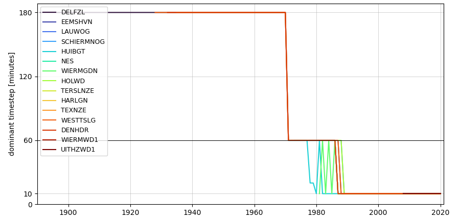

\newpage

# (APPENDIX) Appendix {-} 

```{r setupAppendix, include = FALSE}
knitr::opts_chunk$set(
	message = FALSE,
	warning = FALSE,
	echo = FALSE,
	out.width = "100%"
)

source("r/runThisFirst.R")
theme_hy <- theme_bw()

alt_theme_hy <- theme_tufte() + theme(axis.line=element_line()) #+ 
    # scale_x_continuous(limits=c(10,35)) + scale_y_continuous(limits=c(0,400))
```


# Brondata, bewerking en download {#data}


## Zeespiegelstijging {#Appzeespiegelstijging}
In de DSR Waddenzee is de jaargemiddelde waterstand voor de zes hoofdstations langs de Nederlandse kust overgenomen uit de Zeespiegelmonitor. In deze studie is de stijging van de zeespiegel nauwkeurig onderzocht en berekend. De berekening en aanvullende en interactieve figuren kunnen worden ingezien via de [Jupyter Notebook Zeespiegelmonitorberekening](https://nbviewer.jupyter.org/github/openearth/sealevel/blob/master/notebooks/dutch-sea-level-monitor.ipynb).

```{r}
download_link(
  link = "https://raw.githubusercontent.com/openearth/sealevel/master/data/deltares/results/dutch-sea-level-monitor-export-stations-2021-11-26.csv",
  button_label = "Jaargemiddelde zeespiegel hoofdstations als csv",
  button_type = "primary",
  has_icon = TRUE,
  icon = "fa fa-save",
  self_contained = TRUE
)

```

## Waterstanden {#Appwaterstanden}

### Brondata

Voor de beschikbare stations in de Waddenzee en aangrenzende delen van de Noordzee worden de tijdseries van zowel de gemeten als de berekende waterstand (astronomische waterstand) ingelezen via de [webservice van de Data Distributie Laag](https://rijkswaterstaat.github.io/wm-ws-dl/#introduction) van Rijkswaterstaat. Merk op dat er een aantal stations missen in de Waddenzee, zoals vermeld in paragraaf \@ref(ontsluiting).

De recente waterstandsmetingen, vanaf 1984, hebben een tijdstap van 10 minuten op alle stations. Voor 1984 is met een lagere frequentie gemeten, met een tijdstap van 1 uur, en voor 1966 is dit zelfs een tijdstap van 3 uur, zie figuur \@ref(fig:tijdstap)). Voor deze lagere frequenties is de hieronder beschreven methode voor het afleiden van de waterstanden te onnauwkeurig. Voor die periode beschikt RWS wel over een dataset van hoog- en laagwaterstanden, die hiervoor kunnen worden gebruikt. Daarvan kan dan het jaarlijkse gemiddelde worden bepaald. Deze data zijn momenteel nog niet online beschikbaar.


(ref:tijdstapCaption) Gebruikte tijdstap in de dataset voor alle stations. Vanaf 1984 is voor alle stations data op elke 10 minuten beschikbaar. Tussen 1966 en 1984 (variërend per station), is dit een tijdstap van een uur. In de jaren voor 1966 is dit zelfs 3 uur.

```{r tijdstap, out.width="80%", fig.cap= "(ref:tijdstapCaption)"  }

```

De getijcomponenten zijn berekend op basis van de waterstationsmeetseries, zoals ontsloten via [Open Earth Data](https://publicwiki.deltares.nl/display/OET/Dataset+documentation+MWTL).


### GHW, GLW en getijslag

De jaargemiddelde hoog- en laagwaters (GHW en GLW) zijn bepaald door in de tijdseries van gemeten waterstanden te zoeken naar het maximum en minimum per getijcyclus, met een onderlinge afstand van minimaal 4 uur. In figuur \@ref(fig:hooglaagvoorbeeld2) is daarvan een voorbeeld te zien. Vervolgens wordt hiervan het jaargemiddelde bepaald. 
De jaargemiddelde getijslag wordt berekend door het verschil tussen het jaargemiddelde GHW en GLW.

```{r}
downloadthis::download_link(
  link = file.path(ThreddsDataPath, mijnGebied, "RWS", "standard", paste0("extremaHLLL", "yearlyaveragesCopy.csv")),
  button_label = "Download jaargemiddelde GHW en GLW als .csv",
  button_type = "primary",
  has_icon = TRUE,
  icon = "fa fa-save",
  self_contained = TRUE
)
```

Om trends te kunnen bepalen is vervolgens een lineaire trendlijn toegevoegd die varieert met de 18,6-jarige cyclus. Doordat de frequentie van de 18,6-jarige cyclus bekend is en de tijdserie voldoende lang, kan de software zelf de amplitude en de fase van de 18,6-jarige cyclus fitten.

    
```{r loadWaterhoogteData2}
load(file.path(datadir, "ddl", "standard", paste0("waterhoogte", "Delfzijl", "2021-08-05", ".Rdata")))
assign("Delfzijl", x1); rm(x1)

df.extrema <- read_delim(file.path(datadir, "ddl", "standard", paste0("extremaHLLL", "2021-08-04", ".csv")), delim = ";")
```

```{r hooglaagvoorbeeld2, fig.width=8, fig.height=4, fig.cap= "Gemeten waterstand en hoog- (rood) en laagwater (groen) voor eind maart 2018 (inclusief overgang naar zomertijd van 24 op 25 maart), zoals berekend voor de hele tijdserie." }
minplottime = ymd("2018-03-23")
maxplottime = ymd("2018-03-27")
Delfzijl %>%
  filter(tijdstip > minplottime, tijdstip < maxplottime) %>%
  ggplot() +
  geom_point(aes(tijdstip, numeriekewaarde)) +
  geom_point(data = df.extrema %>% filter(locatie.naam == "Delfzijl") %>% filter(time > minplottime, time < maxplottime), aes(time, h, fill = HL), size = 5, shape = 21, color = "white") +
  theme_hy +
  theme(legend.position = "bottom")
```

### Getijcomponenten en -asymmetrie {#getijcomponentenmethode}
Op basis van de gemeten waterstanden wordt met het python package 'hatyan' de amplitude en fase van de verschillende getijcomponenten bepaald. Op basis van deze amplitudes en fases kan de amplitudeverhouding M~4~/M~2~ en het faseverschil ($2 \phi M_{2} - \phi M_{4}$) worden berekend [https://github.com/Deltares/hatyan](https://github.com/Deltares/hatyan).  Voor uitgebreide documentatie wordt verwezen naar [de gebruikershandleiding](https://github.com/Deltares/hatyan/blob/main/docs/11205257-013-DSC-0006_v1.0-Gebruikershandleiding%20hatyan.pdf).

Getijcomponenten zijn berekend per station en jaar, en kunnen gedownload worden vanaf [watersysteemdata.deltares.nl](https://watersysteemdata.deltares.nl/thredds/catalog/watersysteemdata/Wadden/ddl/calculated/TA_filtersurge/catalog.html).

### Gemiddeld laag laag water (GLLW) en gemiddeld hoog hoog water (GHHW) {}
GLLW en GHHW worden berekend als de maandminima en -maxima van het berekend getij per station. Het berekend getij wordt bepaald uit de getijcomponenten, zie sectie \@ref(getijcomponentenmethode).

```{r}
download_link(
  link = "http://watersysteemdata.deltares.nl/thredds/fileServer/watersysteemdata/Wadden/ddl/calculated/tidal_indicators/GHHWS_10min.csv",
  button_label = "Download GHHW als .csv",
  button_type = "primary",
  has_icon = TRUE,
  icon = "fa fa-save",
  self_contained = TRUE
)
```

```{r}
download_link(
  link = "http://watersysteemdata.deltares.nl/thredds/fileServer/watersysteemdata/Wadden/ddl/calculated/tidal_indicators/GLLWS_10min.csv",
  button_label = "Download GLLW als .csv",
  button_type = "primary",
  has_icon = TRUE,
  icon = "fa fa-save",
  self_contained = TRUE
)
```

### Stormopzet en stormvloedhoogte

De stormopzet (en -afzet) wordt berekend als de gemeten waterstand, verminderd met de astronomische waterstand (het getij). In de systeemrapportage worden de 99,5-percentiel per jaar en het maximum per jaar gebruikt als maat voor storm. 

Voor de stormvloedhoogte gebruiken we het 99,5-percentiel per jaar van de gemeten waterstand (dus inclusief het getij). 

De astronomische waterstand is berekend per station en jaar, en kan gedownload worden vanaf [watersysteemdata.deltares.nl](https://watersysteemdata.deltares.nl/thredds/catalog/watersysteemdata/Wadden/ddl/calculated/waterstand_berekend_m/catalog.html).

## Golven {#Appgolfhoogte}

### Brondata

De significante golfhoogte, golfperiode (Tm02) en golfrichting worden rechtstreeks ingelezen uit de Data DistributieLaag. De ingelezen set die gebruikt is voor deze rapportage is beschikbaar via onderstaande downloadknop: 

```{r}
download_link(
  link = "http://watersysteemdata.deltares.nl/thredds/fileServer/watersysteemdata/Wadden/ddl/standard/golven2021-07-08.csv",
  button_label = "Download golfdata als .csv",
  button_type = "primary",
  has_icon = TRUE,
  icon = "fa fa-save",
  self_contained = TRUE
)
```


### Anomalie van de maandgemiddelde golfhoogte

Als maat voor de seizoensfluctuatie van de golfhoogte wordt de afwijking (anomalie) van de maandgemiddelde golfhoogte ten opzichte van het langjarige gemiddelde gebruikt.

De anomalie is berekend aan de hand van de volgende stappen:

1)  Incomplete jaren verwijderen.

1)  Langjarig gemiddelde voor elk station berekenen als gemiddelde van alle maandgemiddelden.

1)  De afwijking per station en maand berekenen als het verschil tussen maandgemiddelde en langjarig gemiddelde.

1)  De afwijking uitzetten tegen de maand in het jaar, en voor alle jaren in een figuur. De kleurenschaal toont het onderscheid tussen de jaren.


## Zoetwaterafvoeren {#Appzoetwaterafvoer}

### Brondata

De daggemiddelde waarden van de drie grote afvoeren vanaf Rijkswateren (Den Oever, Kornwerderzand en Lauwersoog) zijn opgevraagd via Servicedesk Data van RWS. De 10-minuutwaarden bevatten veel gaten in de tijdreeksen en zijn daarom niet gebruikt. 

Afvoeren van de Eems en Leda zijn opgevraagd bij NLWKN en toegevoegd aan de [Datahuis Wadden Geoserver](https://datahuiswadden.openearth.nl/geoserver/web/wicket/bookmarkable/org.geoserver.web.demo.MapPreviewPage?1&filter=false). De data kunnen ook via onderstaande links direct worden gedownloadt als csv. Om niet ongewild grote datasets te downloaden is deze nu nog beperkt tot de eerste 50 records. Wanneer alle data gewenst zijn, moet "&maxFeatures=50" verwijderd worden uit de URL:

Voor de polderafvoeren van de waterschappen zijn gegevens opgevraagd bij het desbetreffende waterschap en voor deze rapportage beschikbaar gemaakt via de [Datahuis Wadden Geoserver](https://datahuiswadden.openearth.nl/geoserver/web/wicket/bookmarkable/org.geoserver.web.demo.MapPreviewPage?1&filter=false). Directe links naar de afvoerdata staan hieronder.

**Rijkswaterstaat**

De etmaalgemiddelde afvoeren die in deze rapportage zijn gebruikt zijn opgevraagd bij de servicedesk data van Rijkswaterstaat. Deze gegevens zijn lokaal opgeslagen als bevroren versie voor deze rapportage en te downloaden via onderstaande link. 

```{r}
download_link(
  link = "https://datahuiswadden.openearth.nl/geoserver/zoetwaterafvoeren/ows?service=WFS&version=1.0.0&request=GetFeature&typeName=zoetwaterafvoeren%3Aafvoeren_rijkswateren&outputFormat=csv",
  button_label = "Etmaalgemiddelde afvoeren IJsselmeer en Lauwersmeer als csv",
  button_type = "primary",
  has_icon = TRUE,
  icon = "fa fa-save",
  self_contained = TRUE
)
```

**NLWKN (Eems en Leda) **

```{r}
download_link(
  link = "https://datahuiswadden.openearth.nl/geoserver/zoetwaterafvoeren/ows?service=WFS&version=1.0.0&request=GetFeature&typeName=zoetwaterafvoeren%3Aems_discharge_bewerkt&outputFormat=csv",
  button_label = "Eems afvoer als csv",
  button_type = "primary",
  has_icon = TRUE,
  icon = "fa fa-save",
  self_contained = TRUE
)
```

```{r}
download_link(
  link = "https://datahuiswadden.openearth.nl/geoserver/zoetwaterafvoeren/ows?service=WFS&version=1.0.0&request=GetFeature&typeName=zoetwaterafvoeren%3Aleda_discharge_bewerkt&outputFormat=csv",
  button_label = "Leda afvoer als csv",
  button_type = "primary",
  has_icon = TRUE,
  icon = "fa fa-save",
  self_contained = TRUE
)
```


```{r kaartHydrologischeStationsNLWKN, out.width="70%", fig.cap="Overzichtskaart van hydrologische meetstations in het stroomgebied van de Eems en West-Duitse Waddenzee."}

invisible(file.copy(file.path(datadir, "NLWKN", "afvoeren", "raw", "2022_07_06_Discharges Ems.jpg"), "images/2022_07_06_Discharges Ems.jpg", overwrite = T))

knitr::include_graphics(path = file.path("images/2022_07_06_Discharges Ems.jpg"))
```


**Waterschappen**

```{r}
download_link(
  link = "https://datahuiswadden.openearth.nl/geoserver/zoetwaterafvoeren/ows?service=WFS&version=1.0.0&request=GetFeature&typeName=zoetwaterafvoeren%3Afriesland&outputFormat=csv",
  button_label = "Wetterskip Friesland afvoeren als csv",
  button_type = "primary",
  has_icon = TRUE,
  icon = "fa fa-save",
  self_contained = TRUE
)
```

```{r}
download_link(
  link = "https://datahuiswadden.openearth.nl/geoserver/zoetwaterafvoeren/ows?service=WFS&version=1.0.0&request=GetFeature&typeName=zoetwaterafvoeren%3Anoorderzijlvest&outputFormat=csv",
  button_label = "Noorderzijlvest afvoeren als csv",
  button_type = "primary",
  has_icon = TRUE,
  icon = "fa fa-save",
  self_contained = TRUE
)
```


```{r}
download_link(
  link = "https://datahuiswadden.openearth.nl/geoserver/zoetwaterafvoeren/ows?service=WFS&version=1.0.0&request=GetFeature&typeName=zoetwaterafvoeren%3Ahunzeenaas_daggemiddelden&outputFormat=csv",
  button_label = "Hunze en Aa's daggemiddelden afvoeren als csv",
  button_type = "primary",
  has_icon = TRUE,
  icon = "fa fa-save",
  self_contained = TRUE
)
```

```{r}
download_link(
  link = "https://datahuiswadden.openearth.nl/geoserver/zoetwaterafvoeren/ows?service=WFS&version=1.0.0&request=GetFeature&typeName=zoetwaterafvoeren%3Ahhnk_daggemiddelden&outputFormat=csv",
  button_label = "HHNK daggemiddelden afvoeren als csv",
  button_type = "primary",
  has_icon = TRUE,
  icon = "fa fa-save",
  self_contained = TRUE
)
```

### Bewerking van afvoeren

In de systeemrapportage worden de daggemiddelde, maandgemiddelde en jaargemiddelde afvoeren weergegeven. 

Daarnaast wordt voor de grotere afvoeren ook de gemiddelde zomerafvoer en de gemiddelde winterafvoer berekend. Voor de zomer wordt daarbij gemiddeld over de periode 1 april tot en met 30 september. En voor de winter wordt gemiddeld over de periode van 1 oktober tot en met 31 maart.


## Wind {#Appwind}


```{r readMeteodata2, eval=F}
dtwind <- data.table::fread(file.path(datadir, "KNMI", "raw", "uurgegevenswind.csv"))
# paste(unique(dtwind$station), collapse = ", ")
```

### Brondata

De data betreffen de [KNMI uurgegevens](https://www.knmi.nl/nederland-nu/klimatologie/uurgegevens) voor de vier stations De Kooy, Lauwersoog, Hoorn Terschelling, Vlieland. 

### Windsterkte en windrichting

Als indicatoren voor de windsterkte worden de windrozen per station van de volledige tijdreeks en het jaarlijkse 25, 50, 75 en 95 percentiel van de windsnelheid weergegeven. 

Voor het bepalen van de periodes met hoge windsterkte wordt gekeken naar het aantal achtereenvolgende uren dat de windsnelheid boven een bepaalde grenswaarde komt. In de systeemrapportage worden de grenswaardes >10,8 m/s (Beaufort 6) en >13,9 m/s (Beaufort 7) gebruikt. Dit aantal uren wordt uitgezet in de tijd voor alle windrichtingen en uitgesplitst per kwadrant. Daarnaast wordt ook het aantal uren gesommeerd per jaar weergegeven met onderverdeling per kwadrant, zodat de jaren onderling beter vergeleken kunnen worden.

```{r}
download_link(
  link = "http://watersysteemdata.deltares.nl/thredds/fileServer/watersysteemdata/Wadden/KNMI/raw/uurgegevenswind.csv",
  button_label = "Gebruikte uurgegevens wind als csv",
  button_type = "primary",
  has_icon = TRUE,
  icon = "fa fa-save",
  self_contained = TRUE
)
```

## Waterkwaliteit {#Appwaterkwaliteit}

### Brondata

MWTL metingen van Rijkswaterstaat worden beschikbaar gemaakt via [Waterinfo](https://waterinfo.rws.nl/) en zijn ook direct via een webservice te downloaden uit de Datadistributielaag (DDL) ([documentatie webservice](https://www.rijkswaterstaat.nl/rws/opendata/DistributielaagWebservices-SUM-2v7.pdf)).

Zwevend stof was tijdens de samenstelling van dit rapport niet beschikbaar uit de DDL, en is daarom apart opgevraagd bij de servicedesk data van RWS. Voor het kunnen combineren van deze data met andere waterkwaliteitsdata is een aparte nabewerking nodig (mapping). 

```{r}
download_link(
  file.path("http://watersysteemdata.deltares.nl/thredds/fileServer/watersysteemdata/Wadden", "RWS", "standard", "ZS_all.csv"),
  button_label = "Zwevend stofgegevens als csv",
  button_type = "primary",
  has_icon = TRUE,
  icon = "fa fa-save",
  self_contained = TRUE
)
```


### Gemiddelde watertemperatuur (maand, jaar en zomer/winter)

Omdat de MWTL metingen een andere opnamefrequentie in de zomer en de winter hebben, is het van belang eerst de 'maandgemiddelden' te bepalen, en deze vervolgens te middelen per jaar. Anders worden de jaargemiddelden beïnvloed door de hogere meetfrequentie in de zomer. (Het woord 'maandgemiddelden' staat tussen aanhalingstekens, omdat er in de winterperiode vaak maar 1 meting per maand is.)

De seizoensgemiddelden zijn alleen berekend en weergegeven als er minimaal 5 metingen in het seizoen beschikbaar waren. Het zomerseizoen wordt gerekend vanaf 1 april t/m 30 september, en het winterseizoen vanaf 1 oktober t/m 31 maart.

Zomer- en wintergemiddelden zijn berekend om te zien of er trends in de seizoenen zitten die bij jaargemiddelden weg worden gemiddeld. 


### Gemiddelde saliniteit (maand, jaar) en anomalie

Omdat de MWTL metingen een andere opnamefrequentie in de zomer en de winter hebben, is het van belang eerst de 'maandgemiddelden' te bepalen, en deze vervolgens te middelen per jaar. Anders worden de jaargemiddelden beinvloed door de hogere meetfrequentie in de zomer. (Het woord 'maandgemiddelden' staat tussen aanhalingstekens, omdat er in de winterperiode vaak maar 1 meting per maand is.)

Het jaargemiddelde is alleen berekend bij meer dan 10 metingen per jaar. 

De anomalie van de saliniteit is de afwijking van de maandgemiddelde saliniteit ten opzichte van het langjarig gemiddelde. De anomalie is berekend aan de hand van de volgende stappen:

1)  Incomplete jaren verwijderen.

1)  Langjarig gemiddelde voor elk station berekenen als gemiddelde van alle maandgemiddelden.

1)  De afwijking per station en maand berekenen als het verschil tussen maandgemiddelde en langjarig gemiddelde.

1)  De afwijking uitzetten tegen de tijd. 


```{r}
download_link(
  file.path("http://watersysteemdata.deltares.nl/thredds/fileServer/watersysteemdata/Wadden", "ddl", "standard", "WQ_TS_trendstations_allyears.csv"),
  button_label = "Temperatuur en saliniteitgegevens als csv",
  button_type = "primary",
  has_icon = TRUE,
  icon = "fa fa-save",
  self_contained = TRUE
)
```

### Gemiddelde zwevende stof gehalte (maand, jaar) en anomalie

Omdat de MWTL metingen een andere opnamefrequentie in de zomer en de winter hebben, is het van belang eerst de 'maandgemiddelden' te bepalen, en deze vervolgens te middelen per jaar. Anders worden de jaargemiddelden beinvloed door de hogere meetfrequentie in de zomer. (Het woord 'maandgemiddelden' staat tussen aanhalingstekens, omdat er in de winterperiode vaak maar 1 meting per maand is.)

Voor zwevende stof is de anomalie, de afwijking ten opzichte van het langjarig gemiddelde, berekend voor alle jaren en maanden. Bovendien is deze data log-getransformeerd. De stappen voor de afleiding zijn:

1)  Incomplete jaren verwijderen.

1)  Alle meetwaarden log (e-basis) transformeren.

1)  Langjarig gemiddelde berekenen voor elk station als gemiddelde van alle maandgemiddelden.

1)  De afwijking berekenen per station per maand, als het verschil tussen maandgemiddelde en langjarig gemiddelde.

1)  De afwijking uitzetten tegen de tijd, zowel voor de gehele meetperiode als per maand. De kleurenschaal geeft de absolute waarde van de zwevend stofconcentratie aan. Bij het figuur met de gehele meetperiode achter elkaar is een lijn toegevoegd op basis van het 13-maanden (dus minstens 1 jaar) lopend gemiddelde.

## Morfologie {#Appmorfologie}

### Brondata bodemligging

Gegevens van de bodemligging van de Waddenzee zijn opgehaald van de [Open Earth Dataserver](https://opendap.deltares.nl/thredds/catalog/opendap/rijkswaterstaat/vaklodingen_new/catalog.html). De database bevat de vaklodingen data in 20x20 m resolutie. De vaklodingen zijn een combinatie van lodingen van de diepe delen aangevuld met LiDAR opnames van de hoge delen. Voor meer informatie over deze metingen verwijzen we naar de desbetreffende webpagina van [Rijkswaterstaat](https://waterinfo-extra.rws.nl/monitoring/morfologie/).

<!-- Er is gewerkt met 1 polygoon van het Friesche Zeegat, dat wil zeggen dat voor alle jaren met hetzelfde polygoon is gerekend om de begrenzing van het bekken te bepalen. Daarnaast is er alleen data gebruikt van de cellen (20x20m tegels) die in alle opnamejaren data bevatten. Dit voorkomt dat afwijkingen ontstaan die het gevolg zijn van verschillende ruimtelijke dekking van de data. De getoonde veranderingen zijn daarmee puur het gevolg van veranderingen van de morfologie voor het geanalyseerde gebied. -->

De visualisatie van de bodemligging van de Waddenzee is interactief beschikbaar gemaakt voor deze Digitale Systeemrapportage. De interactiveit wordt beschikbaar gemaakt met behulp van een r shiny app, die in de rapportage getoond wordt. De bathymetrie wordt hier gepresenteerd als een laag bovenop een Openstreetmap achtergrondkaart. De bathymetrielaag bevat gestapelde zgn. "tiles" van vaklodingen tussen de jaren die gekozen zijn met de slider. De bodemligging kan met en zonder "Hillshading" worden bekeken.

De oorspronkelijke data is gemeten en opgeleverd door RWS voor elk jaar^[https://waterinfo-extra.rws.nl/monitoring/morfologie/#h53b817e6-e5cd-49d1-873c-9a0f85d8e416], en opgeslagen op een thredds server van Deltares als netcdf^[https://opendap.deltares.nl/thredds/catalog/opendap/rijkswaterstaat/vaklodingen_new/catalog.html]. Van elke netcdf is één tiff file per jaar gemaakt door een script^[https://github.com/openearth/eo-bathymetry/blob/master/notebooks/Vaklodingen2EE.ipynb] en in een Google Cloud storage (gs) map gevat. Hierna is van gs een Google Earth Engine (gee) Image Collection van vaklodingen data gemaakt. De r shiny app gebruikt een API service^[https://github.com/openearth/hydro-engine-service/blob/master/hydroengine_service/main.py] die de Image Collection leest, op basis van de gegeven input data.

Voor het berekenen van morfologische indicatoren zijn de vaklodingen als rasters (tiff) samengesteld voor elk jaar voor de hele Waddenzee. De rasters bestaan uit data van het betreffende jaar, gecombineerd met data van alle voorgaande jaren, waarbij alleen de meest recente waarde per pixel gebruikt wordt. Nadeel is dat sommige delen van een raster oudere waarden kunnen bevatten. Het voordeel is dat er voor elk jaar een gebiedsdekkend raster voorhanden is. 

## Brondata bodemslibgehalte {#Appbodemkwaliteit}

Er zijn verschillende historische kaarten met het bodemslibgehalte beschikbaar (Lely ~1890, De Glopper ~1960, Sedimentatlas ~1989, SIBES/SUBES sinds 2008/2019). 

De sedimentatlas is digitaal beschikbaar en geeft een volledig dekkende kaart van de bodemsamenstelling in de Waddenzee inclusief het Eems estuarium. Deze data is getoond in deze digitale systeemrapportage en beschikbaar in [OpenEarthData](https://opendap.deltares.nl/thredds/catalog/opendap/rijkswaterstaat/sedimentatlas_waddenzee/catalog.html).

Sinds 2008 zijn door het NIOZ monsters gestoken van het intergetijdengebied en is ook de korrelgrootteverdeling bepaald. Deze data wordt aangeduid met SIBES. De data is niet vrij beschikbaar en daarom vooralsnog niet opgenomen in deze rapportage. 

In ongeveer 2019 is de SIBES dataset gecomplementeerd met data van monsters die zijn genomen in de diepe delen van de Waddenzee, waarmee een ruimtelijk volledig dekkende kaart van de Waddenzee kan worden gemaakt. De data uit de diepe delen worden aangeduid met SUBES. Ook deze data is (nog) niet vrij beschikbaar.

### Brondata afbakening kombergingsgebieden
Voor de opdeling in kombergingen zijn polygonen van de [Wageningen Marine Research Geoserver]("https://opengeodata.wmr.wur.nl/geoserver/WS3shp/ows?service=WFS&version=1.0.0&request=GetFeature&typeName=WS3shp%3Aws3_tidalbasins&outputFormat=application/json") gebruikt. 


### Hypsometrische curves

Hypsometrische curves worden bepaald voor subgebieden (kombergingsgebieden) door de oppervlakte per diepte uit te zetten tegen de diepte. 

### Ruimtelijk dekkende waterstanden

Voor de bepaling van bepaalde morfologische karakteristieken is het ook belangrijk om een ruimtelijk dekkend beeld te hebben van de waterstanden in het bekken. De gemeten waterstanden geven alleen informatie van de waterstanden op de stations (zie paragraaf \@ref(Appwaterstanden)).

Om van de gemeten waterstand een ruimtelijk dekkende waterspiegel te reconstrueren, moet rekening worden gehouden met de getijvoortplanting. Numerieke modellen die de waterstanden berekenen, hebben moeite om laagwaterstanden goed te reproduceren bij een acceptabele horizontale celresolutie. Dit komt doordat in een numeriek model de bodem wordt geschematiseerd naar grotere gebieden (rekencellen), waardoor de kleinere geultjes en prielen niet in het rekenrooster zijn opgenomen. Deze geultjes hebben een belangrijke functie in de drainage van de intergetijdengebieden, en daarmee ook op de laagwaterstand in die gebieden. 

Voor de (morfologische) zonering van de ondiepe gebieden is er voor gekozen om in eerste instantie uit te gaan van vaste begrenzingen van de hoogteklasses. Daarmee worden niet de veranderingen in getijslag door de tijd of over het gebied meegenomen. Dit betekent dat verandering in arealen alleen worden veroorzaakt door veranderingen in de bodemligging, en niet door een verandering in getijvoortplanting. Een indeling aan de hand van dergelijke begrenzingen geeft weliswaar niet het exacte intergetijdengebied weer, maar levert wel een bruikbare proxy hiervoor. Bovendien geven de vaste waterstandsgrenzen inzicht in veranderingen louter als gevolg van bodemveranderingen, en niet als gevolg van veranderingen in de waterstanden. Voor het systeembegrip is dit een voordeel.

Om nauwkeuriger inzicht te krijgen in de areaalveranderingen van verschillende morfologische eenheden van de kombergingsgebieden, kan de hypsometrische curve worden onderverdeeld in vier verschillende diepteklassen. Omdat hierbij wordt gerekend met vaste begrenzingen van de diepteklassen, en veranderingen in getijslag door de tijd of over het gebied niet worden meegenomen, worden de (ondiepere) klassen aangeduid met 'proxy'.

We onderscheiden de volgende 4 klassen:

1)  Geul ($z < -5 m$)

1)  Proxy subgetijdengebied ( $-5 m < z < -1 m$) 

1)  Proxy intergetijdengebied ( $-1 < z < 1 m$) 

1)  Proxy supragetijdengebied ($z > 1 m$)

Waar z de verticale coordinaat t.o.v. NAP betekent.

### Plaathoogte en -volume

Voor de berekening van de plaathoogte wordt het volume boven de NAP -1 m grens berekend, en gedeeld door de oppervlakte.
In formulevorm:

\begin{equation} 
  \text{Plaathoogte} = \frac{\sum_i(h_i \cdot A_i)}{\sum_i A_i} \text{  if } h\geq -1
  (\#eq:plaathoogte)
\end{equation} 

waarin:

*   A = oppervlakte van 1 rasterpixel (400 $m^2$)
*   h = hoogtewaarde van een pixel
*   i = de index van de pixels in het raster

Voor het plaatvolume wordt het volume boven de NAP -1 m grens berekend:

\begin{equation} 
  \text{Plaatvolume} = \sum_i(h_i \cdot A_i) \text{  if } h\geq -1
  (\#eq:plaatvolume)
\end{equation} 


### Geuldiepte en -volume

Voor de berekening van de geuldiepte wordt het volume onder de NAP -5 m grens berekend, en gedeeld door de oppervlakte. In formulevorm:

\begin{equation} 
  \text{Geuldiepte} = \frac{\sum_i(h_i \cdot A_i)}{\sum_i A_i} \text{  if } h\leq -5
  (\#eq:geuldiepte)
\end{equation} 

waarin:

*   A = oppervlakte van 1 rasterpixel (400 $m^2$)
*   h = hoogtewaarde van een pixel
*   i = de index van de pixels in het raster


Voor het geulvolume wordt het volume onder de NAP -5 m grens berekend:

\begin{equation} 
  \text{Geulvolume} = \sum_i(h_i \cdot A_i) \text{  if } h\leq -5
  (\#eq:geulvolume)
\end{equation} 

### Lengte van de laagwaterlijn

Voor de berekening van de lengte van de laagwaterlijn is in eerste instantie de totale lengte berekend van de -1 m NAP contourlijnen binnen elk bekken. 

```{r}
download_link(
  file.path("http://watersysteemdata.deltares.nl/thredds/fileServer/watersysteemdata/Wadden/RWS/bathymetrie/products/laagwaterlijnlengte.csv"),
  button_label = "Laagwaterlijnlengte als csv",
  button_type = "primary",
  has_icon = TRUE,
  icon = "fa fa-save",
  self_contained = TRUE
)
```

## Overzicht alle brondata

```{r dataoverzich2t}
# code om dataoverzicht in nette tabel weer te geven. 

read_excel(file.path(datadir, "dataoverzicht.xlsx")) %>% 
  knitr::kable(caption = "Overzicht van alle gebruikte data")
```


# Beheer van de DSR

## Versiebeheer en kwaliteitscontrole
De R-code waaruit deze digitale systeemrapportage is gemaakt (tekst, scripts en figuren) wordt bewaard op SVN onder versiebeheer (https://repos.deltares.nl/repos/DigSysRapWadden/). Daar is precies te herleiden wanneer en door wie aan een bepaalde indicator is gewerkt, en welke bewerkingen op brondata zijn gedaan. 

Om dat overzicht toegankelijker te maken en eventuele fouten sneller te kunnen verhelpen is onderstaande tabel toegevoegd. Deze tabel laat ook zien voor welke indicatoren de resultaten (waarden, kaarten, grafieken) en bijbehorende teksten gecontroleerd zijn, en door wie. Let wel: deze kwaliteitscontrole is beperkt en gericht op de voor de DSR gedane bewerkingen, omdat de DSR voornamelijk data uit andere bronnen ontsluit, en er noodzeklijkerwijs vanuit gegaan wordt dat daar reeds kwaliteitscontrole heeft plaatsgevonden. Deze tabel is alleen ingevuld voor de indicatoren die recent toegevoegd of wezenlijk veranderd zijn. 

## Zelf aan de slag
Wil je de code achter de digitale systeemrapportage downloaden en aanpassen voor eigen gebruik? Neem contact op met jasper.dijkstra -at- deltares.nl voor toegang tot de DSR. Vraag vervolgens een Open Earth account aan. Via het programma Tortoise kan je een lokale kopie op je computer zetten om verder te bewerken. Op de [publicwiki van Deltares](https://publicwiki.deltares.nl/display/OET/TortoiseSVN) lees je hoe je een Open Earth account kunt aanvragen en een lokale kopie op je computer kunt zetten.

Waarschijnlijk wordt deze systeemrapportage gemigreerd naar een Github code, waarmee de toegang tot de broncode eenvoudiger wordt.

## Gebruikte software en packages

```{r}
pander::pander(sessionInfo(), RNG = TRUE, locale = FALSE)
```

# Review
```{r}
library(kableExtra)
reviewTable <- readxl::read_excel("P:/11202493--systeemrap-grevelingen/1_data/Wadden/DSR_reviewtabel.xlsx")
reviewTable %>%
  kbl() %>%
  kable_styling()
```


