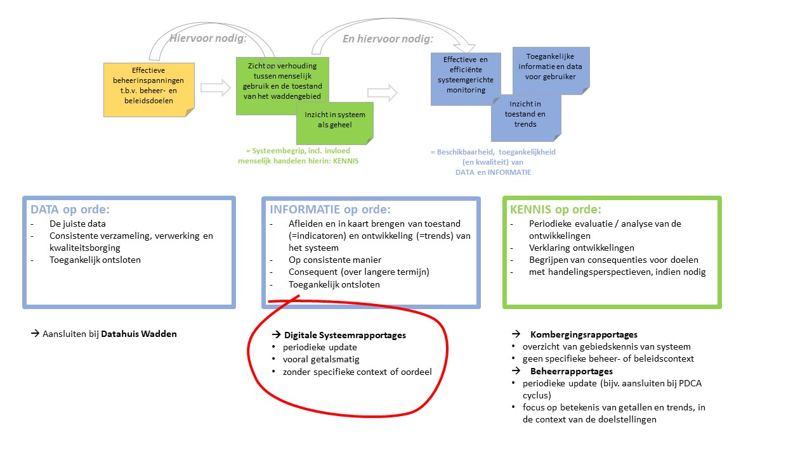

```{r, message=FALSE, warning=FALSE, include=FALSE}

knitr::opts_chunk$set(
	echo = FALSE,
	message = FALSE,
	warning = FALSE
)
source("r/runThisFirst.R")
```

# Disclaimer {-}

De informatie op deze website is nog volop in ontwikkeling en is bedoeld voor een beperkt publiek. Niets van deze website mag worden gebruikt door derden.

This website is a test version. Nothing from this website may be used.

Deze watersysteemrapportage is een initiatief van:

* Rijkswaterstaat

    + Noord-Nederland
    + WVL
    
* Deltares


# Introductie

## Basismonitoring Wadden

Deze digitale systeemrapportage van het Waddengebied wordt gemaakt als onderdeel van het project Natuurmonitoring Wadden - Morfologie. Dit valt vervolgens weer onder de [Basismonitoring Wadden](https://basismonitoringwadden.waddenzee.nl/).

Basismonitoring Wadden houdt de ontwikkelingen in het Waddengebied in de gaten. Doordat beheerders van het Waddengebied verzamelde gegevens en kennis met elkaar delen, kan er effectiever en efficiënter worden gemonitord.

Basismonitoring Wadden richt zich daarbij op bepaalde kernwaarden, te weten: Landschappelijke kwaliteiten; Natuurlijke Waddenzee Abiotisch (niet-levende natuur); Natuurlijke Waddenzee Biotisch (levende natuur); en Menselijk Medegebruik. Aan elk van deze kernwaarden, of thema’s, zijn beleid- en beheerdoelen gekoppeld. Voor meer informatie hierover verwijzen we naar de [Ambitie van Basismonitoring Wadden]( https://basismonitoringwadden.waddenzee.nl/fileadmin/inhoud/pdf/Ambitie_Basismonitoring_Wadden_obw_mrt_2018.pdf) 

De hoofddoelen van Basismonitoring Wadden zijn:

* inzicht te geven in de toestand en trends in het Waddengebied voor de beheerder;
* het komen tot een effectieve en efficiënte systeemgerichte monitoring;
* het toegankelijk maken van alle beschikbare informatie en monitoringgegevens over het Waddengebied, waardoor de gebruiker zicht heeft op het volledige Waddensysteem.

## Doel

Om bij te dragen aan de hierboven genoemde hoofddoelen van Basismonitoring Wadden, werken we voor het onderdeel Natuurmonitoring - Morfologie met drie pijlers (figuur \@ref(fig:driepijlers)):

* Data op orde
* Informatie op orde
* Kennis op orde

Deze systeemrapportage draagt bij aan de pijler *Informatie op orde*. Hierin is een aantal abiotische indicatoren opgenomen, die de toestand en trends van het natuurlijke abiotische systeem beschrijven, en die relevant zijn voor de kernwaarden van Basismonitoring.

Het doel is om te komen tot actuele en consistente reeksen van deze indicatoren, en om deze op een toegankelijke manier te ontsluiten. De digitale rapportage maakt het bovendien mogelijk de om de informatie gemakkelijker te actualiseren en bij te houden.

De huidige systeemrapportage richt zich nog uitsluitend op het abiotische systeem. Maar het is ook mogelijk om in de toekomst de rapportage uit te breiden naar de andere thema’s van Basismonitoring, voor een optimale bundeling van alle relevante informatie van het Waddengebied.

Door het toegankelijk maken van de relevante informatie, kunnen trends en ontwikkelingen sneller worden opgespoord, en verder worden geanalyseerd. Dit kan ook bijdragen aan een efficiëntere en effectievere uitvoering van het beheer, bijvoorbeeld bij het verklaren van bepaalde waargenomen ontwikkelingen in de natuurdoelen, of wanneer men de invloed van bepaalde menselijke activiteiten in beeld wil brengen.

Deze laatste analyses horen bij de pijler *Kennis op orde*. In 2022 zullen hiervoor enkele ‘Beheerrapportages’ worden opgesteld. Deze bevatten, voor enkele beheerdoelen, analyses van de relevante (abiotische) ontwikkelingen, verklaringen van trends en de toetsing van bepaalde indicatoren.

De pijler **Data op Orde**, ten slotte, gaat over het op een consistente manier verzamelen, verwerken en ontsluiten van de benodigde data, en de kwaliteitsborging ervan. Het [Datahuis Wadden](https://basismonitoringwadden.waddenzee.nl/datahuis/datahuis-wadden) werkt hieraan. 

```{r driepijlers, out.width="80%", fig.cap= "De drie pijlers binnen Natuurmonitoring met de positie van deze digitale systeemrapportage rood omcirkeld." }

```

## Afbakening

De ecologische toestand van de Waddenzee is sterk gerelateerd aan de hydro-morfologische ontwikkelingen (zoals waterbeweging, geul- en plaatontwikkeling, sedimentsamenstelling, zoet/zoutgradiënten, troebelheid). Daarom is ‘morfologie’ één van de onderdelen binnen Natuurmonitoring Waddenzee. Morfologie mag in deze context breder worden opgevat dan alleen bodemveranderingen. Het gaat om alle abiotische veranderingen die invloed hebben op de natuurlijkheid van het Waddensysteem, zoals ook sedimentsamenstelling, troebelheid, temperatuur, zoutgehalte, etc. De digitale systeemrapportage richt zich daarom ook op deze abiotische kenmerken van de Waddenzee.

## Proces

Deze systeemrapportage wordt door Deltares in consultatie met stakeholders en experts ontwikkeld. We volgen een iteratieve werkwijze, waarmee toegewerkt wordt naar een bruikbaar en hoogwaardig product voor belanghebbenden in het Waddengebied.

Voor het opstellen van deze systeemrapportage wordt dankbaar gebruik gemaakt van de ervaringen van de Evaluatiemethodiek en de Eerstelijnsrapportages van de Westerschelde en de [(digitale) systeemrapportages](https://www.testsysteemrapportage.nl/) die voor de zuidwestelijke delta (Grevelingen, Oosterschelde, Volkerak-Zoommeer) worden gemaakt.

## Leeswijzer

De systeemrapportage is bedoeld als een naslagwerk, waarin gericht snel bepaalde informatie kan worden opgezocht. De nadruk ligt daarbij in eerste instantie op de gegevens (figuren) zelf, en hoe deze geïnterpreteerd moeten worden. Voor meer uitleg over de indicatoren kunt u eenvoudig doorklikken naar de bijlagen.

Een overzicht van de volledige inhoud is te vinden in de inhoudsopgave links in uw scherm. De rapportage is nog volop in ontwikkeling. Daarom zijn nog niet alle indicatoren opgenomen in deze versie. 

# Wettelijke kaders

Sommige indicatoren zijn gekoppeld aan (al dan niet wettelijke) doelstellingen, vanuit verschillende kaders. Via de koppelingen in tabel \@ref(tab:kadertabel), is het mogelijk om snel de juiste selectie indicatoren te vinden, behorend bij een bepaald kader.

```{r kadertabel}

kadertabel <- readxl::read_excel(file.path(datadir, "RWS/Indicatoren behorend bij kaders_v0.1.xlsx"), skip = 3) %>% replace_na(list(Kader = "", Indicator = "", Snelkoppeling = "")) %>%
  mutate(Snelkoppeling = case_when(
    Snelkoppeling != "<nog niet beschikbaar>" ~ paste0("[", Indicator, "]", "(", Snelkoppeling, ")"),
    Snelkoppeling == "<nog niet beschikbaar>" ~ "nog niet beschikbaar"
  )
  )

# \@ref(sec:FirstSection)

knitr::kable(kadertabel, caption = "Beheerskaders en, waar passend, koppelingen naar de verschillende onderdelen in de systeemrapportage.")

```


